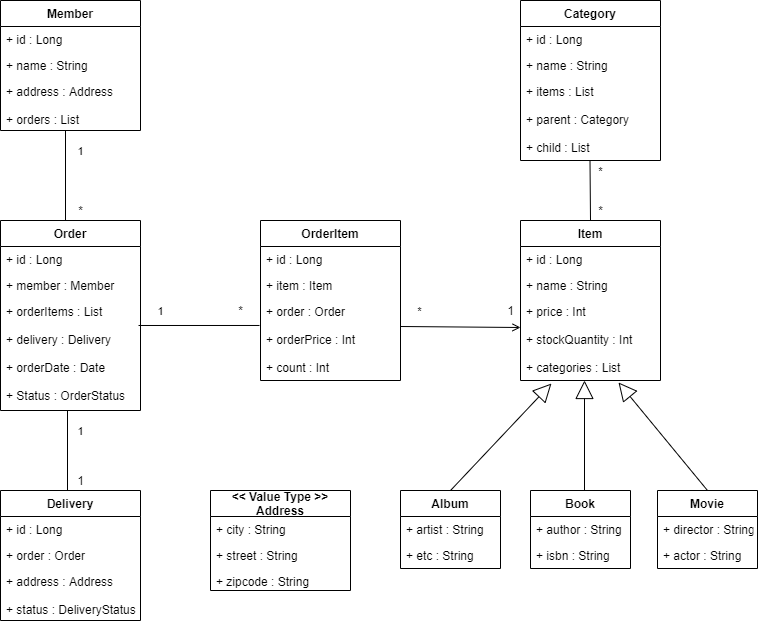

# 챕터 11 웹 애플리케이션 제작

## 세팅

우선 Spring Boot Application을 제작하기 전에 기본적인 세팅을 해주어야 한다.

### build.gradle

```groovy
plugins {
    id 'org.springframework.boot' version '2.5.4'
    id 'io.spring.dependency-management' version '1.0.11.RELEASE'
    id 'java'
}

group = 'com.projectflow'
version = '0.0.1-SNAPSHOT'
sourceCompatibility = '11'

configurations {
    compileOnly {
        extendsFrom annotationProcessor
    }
}

repositories {
    mavenCentral()
}

dependencies {

    implementation 'org.springframework.boot:spring-boot-starter'
    
    implementation 'org.springframework.boot:spring-boot-starter-web'

    // jpa
    implementation 'org.springframework.boot:spring-boot-starter-data-jpa'
    
    // h2
    implementation 'com.h2database:h2'

    // lombok
    compileOnly 'org.projectlombok:lombok'
    annotationProcessor 'org.projectlombok:lombok'

    // test
    testImplementation 'org.springframework.boot:spring-boot-starter-test'
    
}

test {
    useJUnitPlatform()
}

// 최신 Spring Boot일때만 사용
tasks.jar {
    enabled = false
}
```

참고로 여기서는 View 부분은 다루지 않고 JPA에 관련된 부분만 다룰 예정이기 때문에 template은 존재하지 않는다.

### application.yml

``` yaml
spring:
  jpa:
    generate-ddl: true
    hibernate:
      ddl-auto: update
      use-new-id-generator-mappings: true
      use_sql_comment: true
    database-platform: org.hibernate.dialect.MySQLDialect
    show-sql: true
    properties:
      hibernate.format_sql: true
  datasource:
    username: DB 사용자 이름
    password: DB 사용자 비밀
    url: DB URL
```

- **generate-ddl:** DDL 생성을 할지 여부를 선택한다.
- **ddl-auto:** DDL 생성 전략을 설정한다.
  - create: 기존의 테이블을 제거하고 다시 생성한다.
  - create-drop: create와 같지만, Appication을 종료할 때 생성했던 DDL을 다시 지운다.
  - update: 현재 DB와 비교해서 다른곳만 수정한다.
  - validate: 현재 엔티티와 DB 스키마가 같은지 비교하고, 다르면 Application을 실행하지 않는다.
- **show-sql:** 실행하는 SQL들을 콘솔에 출력해 준다.
- **format_sql:** SQL을 좀 더 보기 좋게 출력해준다.
- **use_sql_comment:** SQL을 출력할 때 어떻게 실행되었고, 사용자가 설정한 코멘트나 파라미터 값을 출력한다.
- **use-new-id-generator-mappings:** JPA에 맞춘 새로운 ID 생성 방법을 사용한다.

### 도메인 모델과 테이블 설계



- **회원, 주문, 상품간의 관계:** 회원은 여러 상품을 주문할 수 있고, 한번 주문할 때 여러 상품을 선택할 수 있기 때문에 주문과 상품은 다대다 관계이다.
- **상품 분류:** 상품은 도서, 음반, 영화로 구분되는데 상품 이라는 슈퍼타입 서브타입으로 만들었다.

### 엔티티 클래스

#### 회원 엔티티

``` java
@Getter
@NoArgsConstructor
@AllArgsConstructor
@Builder
@Entity
public class Member {
    @Id @GeneratedValue(stategy = GenerationType.IDENTITY)
    private Long id;
    
    private String name;
    
    private Address address;
    
    @OneToMany(mappedBy="member")
    private List<Order> orders;
    
}
```

#### 주문 엔티티

``` java
@Getter
@NoArgsConstructor
@AllArgsConstructor
@Entity
public class Order {
    @Id @GeneratedValue(stategy = GenerationType.IDENTITY)
    private Long id;
    
    @ManyToOne(fetch = FetchType.LAZY)
    @JoinColumn(name = "member_id")
    private Member member;
    
    @OneToMany(mappedBy = "order", cascade = CascadeType.ALL)
    private List<OrderItem> orderItems;
    
    @OneToOne(cascade = CascadeType.ALL, fetch = FetchType.ALL)
    @JoinColumn(name = "deliverty_id")
    private Delivery delivery;
    
    private LocalDate orderDate;
    
    @Enumerated(EnumType.STRING)
    private OrderStatus status;
    
    public void addMember(Member member) {
        this.member = member;
        member.getOrders().add(this);
    }
    public void addOrderItem(OrderItem orderItem) {
        orderItems.add(orderItem);
        orderItem.setOrder(this);
    }
    
    public void setDelivery(Delivery delivery) {
        this.delivery = delivery;
        delivery.setOrder(this);
    }
    
}
```

### 주문상품 엔티티

``` java
@Getter
@NoArgsConstructor
@AllArgsConstructor
@Entity
public class OrderItem {
    
    @Id @GeneratedValue(strategy = GenerationType.IDENTITY)
    private Long id;
    
    @ManyToOne(fetch = FetchType.LAZY)
    @JoinColumn(name = "item_id")
    private Item item;
    
    @ManyToOne(fetch = FetchType.LAZY)
    @JoinColumn(name = "order_id")
    private Order order;
    
    private int orderPrice;
    
    private int count;
    
}
```

### 상품 엔티티

``` java
@Getter
@NoArgsConstructor
@AllArgsConstructor
@Entity
@Inheritance(strategy = InheritanceType.SINGLE_TABLE)
@DiscriminatorColumn(name="DTYPE")		// 자식 테이블을 구분하는 컬럼
public abstract class Item {
    @Id @GeneratedValue(strategy = GenerationType.IDENTITY)
    private Long id;
    
    private String name;
    
    private int price;
    
    private int stockQuantity;
    
    @ManyToMany(mappedBy = "items")
    private List<Category> categories;
}
```

### 상품 - 도서 엔티티

``` java
@Getter
@NoArgsConstructor
@AllArgsConstructor
@Entity
@DiscriminatorValue("B")
public class Book extends Item {
    private String author;
    private String isbn;
}
```

### 상품 - 음반 엔티티

``` java
@Getter
@NoArgsConstructor
@AllArgsConstructor
@Entity
@DiscriminatorValue("A")
public class Book extends Item {
    private String artist;
    private String etc;
}
```

### 상품 - 영화 엔티티

``` java
@Getter
@NoArgsConstructor
@AllArgsConstructor
@Entity
@DiscriminatorValue("M")
public class Book extends Item {
    private String director;
    private String actor;
}
```

### 배송 엔티티

``` java
@Getter
@NoArgsConstructor
@AllArgsConstructor
@Entity
public class Delivery {
    @Id @GeneratedValue(strategy = GenerationType.IDENTITY)
    private Long id;
    
    @OneToOne(mappedBy = "delivery")
    private Order order;
    
    @Embedded
    private Address address;
    
    @Enumerated(EnumType.STRING)
    private DeliveryStatus status;
}
```

### 카테고리 엔티티

``` java
@Getter
@NoArgsConstructor
@AllArgsConstructor
@Entity
public class Category {
    @Id @GeneratedValue(strategy = GenerationType.IDENTITY)
    private Long id;
    
    @ManyToMany
    @JoinTable(name = "category_item",
              joinColumns = @JoinColumn(name = "category_id"),
              inverseJoinColumns = @JoinColumn(name = "item_id"))
    private List<Item> items;
    
    @Embedded
    private Address address;
    
    @Enumerated(EnumType.STRING)
    private DeliveryStatus status;
    
    @ManyToOne(fetch = FetchType.LAZY)
    @JoinColumn(name = "parent_id")
    private Category parent;		// 상위 카테고리
    
    @OneToMany(mappedBy = "parent")
    private List<Category> child;
    
    public void addChildCategory(Category child) {
        this.child.add(child);
        child.setParent(this);
    }
}
```

### 주소 Embedded타입

``` java
@Getter
@NoArgsConstructor
@AllArgsConstructor
@Embeddable
public class Address {
    private String city;
    
    private String street;
    
    private String zipcode;
}
```

### 회원 레포지토리

``` java
@Repository
public class MemberRepository {
    @PersistenceContext
    private EntityManager em;
    
    public void save(Member member) {
        em.persist(member);
    }
    
    public Member findById(Long id) {
        return em.find(Member.class, id);
    }
    
    public List<Member> findAll() {
        return em.createQuery("SELECT m FROM Member m", Member)
            .getResultList();
    }
    
    public List<Member> findAllByName(String name) {
        return em.createQuery("SELECT m FROM Member m where m.name = :name", Member.class)
            .setParameter("name", name)
            .getResultList();
    }
    
}
```

- @Repository는 빈 등록을 해주는 어노테이션이다. 추가적으로 @Repository 어노테이션은 JPA의 예외를 spring의 예외로 변환해 준다.
- 기존에는 엔티티 매니저 팩토리에서 엔티티 매니저를 만들어야 했지만 스프링에서는 컨테이너에서 가지고 있는 엔티티 매니저를 주입받을 수 있기 때문에 @PersistenceContext주입받아서 사용해야 한다.
- 사용할 일은 자주 없지만 @PersistenceUnit 어노테이션을 통해 엔티티 매니저 팩토리를 직접 주입받아서 사용할 수도 있다.

### 상품 레포지토리

``` java
@Repository
public class ItemRepository {
    
    @PersistenceContext
    private EntityManger em;
    
    public void save(Item item) {
        if (item.getId() == null) {
        	em.persist(item);
        } else {
            em.merge(item);
        }
    }
    
}
```

여기서 item의 id가 null일 때는 persist, null이 아닐때는 merge를 하는 이유는 **만약 id가 없으면 저장, 있으면 수정**을 한다는 의미이다.

이 이후에는 단순한 비니지스 로직의 차이만 있기 때문에 생략한다.