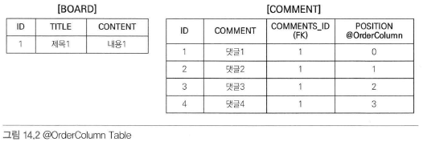
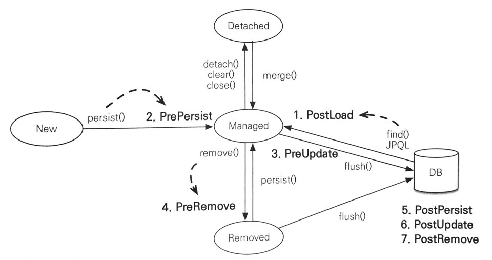

# 챕터 14 컬렉션과 부가 기능

JPA가 지원하는 컬렉션의 종류와 기능들을 알아본다.

## 컬렉션

JPA에서는 Collection, List, Set, Map을 지원한다.

`@OneToMany` 또는 `@ManyToMany`어노테이션을 사용하거나 `@ElementCollection`을 사용할 때 컬렉션을 사용할 수 있다.

<br>

여기서 Map은 활용도가 떨어지기 때문에 설명에서 제외했다.

또한 JPA Specification에서는 컬렉션에 대한 언급이 없기 때문에 JPA 구현체마다 다를수도 있다.

여기서는 Hibernate 구현체를 기준으로 한다.

- **Collection:** 자바가 제공하는 최상위 컬렉션으로, Collection은 중복을 허용하고 순서롤 보장하지 않는다고 가정한다.
- **Set:** 중복을 허용하지 않는 컬렉션으로, 순서를 보장하지 않는다.
- **List:** 순서가 있는 컬렉션으로, 중복을 허용한다.
- **Map:** Key, Value로 되어있는 특수한 컬렉션이다.

### JPA와 컬렉션

우선 예제 엔티티를 확인하자

```java
@Entity
public class Item {
    
    @Id
    private String id;
    
    @OneToMany
    @JoinColumn
    private Collection<Member> members = new ArrayList<Member>();
    
}
```

위 엔티티를 영속상태로 만들 때, Collection을 Hibernate가 준비한 특수한 컬렉션으로 바꿔준다.

<br>

만약 위 엔티티를 영속 상태로 만든 뒤 클래스를 출력하면 `PersistentBag` 이라고 출력되게 된다.

다른 컬렉션도 살펴보면 다음과 같다.

| 컬렉션                | 클래스         |
| --------------------- | -------------- |
| Collection            | PersistentBag  |
| List                  | PersistentBag  |
| Set                   | PersistentSet  |
| List + `@OrderColumn` | PersistentList |

이렇기 때문에 보통 **컬렉션을 즉시 초기화 하는것을 권장** 한다.

<br>

### Collection과 List

Collection과 List는 중복을 허용하는 컬렉션으로, `PersistentBag` 을 Wrapper 컬레게션으로 사용한다.

이러한 인터페이스는 `ArrayList` 로 초기화하면 된다.

**중복을 허용**하기 때문에 `add()` 를 할 때 항상 true를 반환한다.

하지만 반대로 `contain()` 이나 `remove()` 등을 할때에는 **Lazy Loading으로 엔티티를 조회**하게 된다.

### Set

Set은 중복을 허용하지 않는 컬렉션으로, `PersistentSet` 으로 사용한다.

이 인터페이스는 `HashSet` 으로 초기화하면 된다.

`HashSet`은 **중복을 허용하지 않기** 때문에 새로운 객체를 `add()` 할때마다 `equals()` 와 `hashcode()` 로 같은 객체가 있는지 검사한다.

즉 **매번마다 Collection이 초기화 된다.**

같은 객체가 이미 있다면 false, 없어서 저장에 성공했다면 true를 반환한다.

### List + @OrderColumn

List 인터페이스에 `@OrderColumn` 을 추가하면 특수한 컬렉션으로 인식한다.

`@OrderColumn` 은 DB에 저장할 때 순서도 함께 저장한다는 의미로, `PersistentList` 타입으로 저장한다.

``` java
@Entity
public class Board {
    @Id @GeneratedValue
    private Long id;
    
    private String title;
    
    @OneToMany(mappedBy = "board")
    @OrderColumn(name = "position")
    private List<Comment> comments = new ArrayList<>();
    
}
```

순서를 함께 저장했기 때문에 List의 위치 값을 사용할 수 있다.

``` java
comments.add(1, comment);	// 첫번째 위치에 comment를 저장하는게 가능
list.get(10);				// 10번째 위치에 있는 값만 조회하는게 가능
```

실제 DB에는 다음과 같이 저장된다.



이렇게 하면 편해보이지만 다음 문제들 때문에 실무에선 사용되기 힘들다.

- Comment에서는 position을 알수도 없는기 때문에 Comment를 저장할 때에는 Position이 저장되지 않는다. 따라서 comments의 위치 값으로 이 값을 update하는 쿼리가 추가로 발생한다.
- List를 변경하면 연관된 많은 위치 값들을 변경해야 한다. 예를 들어 댓글2를 지우면 댓글 3,4의 position을 하나 낮추는 update 쿼리를 날려야 한다.
- 만약 DB에서 강제로 댓글1을 지우게 되면 중간에 빈 position이 생기게 되는데, 그러면 Null pointer Exception이 발생할 수 있다.

이러한 문제들 때문에 `@OrderBy` 를 주로 사용한다.

### @OrderBy

`@OrderBy` 어노테이션은 DB의 OrderBy를 사용해서 컬렉션을 정렬한다.

```java
@OneToMany(mappedBy = "team")
@OrderBy("username desc, id desc")
private Set<Member> members = new HashSet<>();
```

위와 같이 사용하면 컬렉션을 가져올 때 `order by username desc, id desc` 으로 정렬을 한다.

> 참고로 그냥 Set은 순서가 없기 때문에 알아서 LinkedHashSet으로 변경해서 사용한다.

`team.getMembers().size()` 로 member를 초기화 시키면 OrderBy 쿼리가 날아가게 된다.

## @Converter

Converter를 사용하면 엔티티의 데이터를 변환해서 저장할 수 있다.

예를 들어 데이터의 삭제 여부를 우리는 당연히 `true/false` 를 사용하지만, DBMS에선 주로 `1/0` 으로 저장된다.

만약 `y/n` 과 같이 다른 방식으로 저장하고 싶을 때 Converter를 사용할 수 있다.

``` java
@Converter(converter = BooleanToYNConverter.class)
private boolean vip;
```

위와 같이 Entity의 필드에 Converter를 등록해 두면 DB에 저장되기 직전에 해당 Converter가 동작한다.

```java
@Converter
public class BooleanToYNConverter implements AttributeConverter<Boolean, String> {
    @Override
    public String covertToDatabaseColumn(Boolean attribute) {
        return (attribute != null && attribute) ? "Y" : "N";
    }
    
    @Override
    public Boolean convertToEntityAttribute(String dbData) {
        return "Y".equals(dbData);
    }
}
```

`@Converter` 어노테이션을 붙여주고 `AttributeConverter<엔티티타입, DB타입>` 과 같은 형태의 인터페이스를 구현하면 된다.

`covertToDatabaseColumn()` 은 엔티티를 저장하기 직전에 요소를 DB 타입에 맞게 변환하도록 하는 로직이다.

`convertToEntityAttribute()` 은 DB에서 조회를 헀을 때 요소를 엔티티 타입에 맞게 변환하도록 하는 로직이다.

<br>

만약 어떤 특정 타입에 Global하게 설정해주고 싶다면 다음과 같이 `autoApply = true` 로 설정해 주면 된다.

``` java
@Converter(autoApply = true)
public class BooleanToYNConverter implements AttributeConverter<Boolean, String> {
    @Override
    public String covertToDatabaseColumn(Boolean attribute) {
        return (attribute != null && attribute) ? "Y" : "N";
    }
    
    @Override
    public Boolean convertToEntityAttribute(String dbData) {
        return "Y".equals(dbData);
    }
}
```

이렇게 하면 모든 엔티티의 Boolean 타입에게 적용된다.

`@Converter(distableConversion = true)`처럼 설정해서 global converter를 사용하지 않을수도 있다.

## 리스너

모든 엔티티를 대상으로 어떤 사용자가 어떤 요청을 했는지 로깅해야 하는 요구사항이 있다고 할 때 필요한 서비스마다 로그를 남기는건 비효율적이다.

그래서 JPA Listener를 사용하면 엔티티 생명주기에 따라 이벤트를 처리할 수 있다.

### 이벤트 종류



1. **PostLoad:** 엔티티가 조회된 직후에 호출된다.
2. **PrePersist:** 엔티티를 영속성 컨텍스트에서 관리하기 직전에 호출된다. 새로운 인스턴스를 merge할때도 수행된다.
3. **PreUpdate:** flush나 트랜잭션 commit으로 엔티티 수정 쿼리를 보내기 직전에 호출된다.
4. **PreRemove:** `remove()` 메소드로 엔티티를 영속성 컨텍스트에서 제거하기 직전에 호출된다. 영속성 전이가 발생할때도 호출된다. `orphanRemoval` 를 켜놨다면 flush나 commit시에 호출된다.
5. **PostPersist:** DB에 저장 쿼리를 보낸 직후에 호출된다. `@Id` 필드는 항상 값이 있다.
6. **PostUpdate:** flush나 commit으로 엔티티를 수정한 직후에 호출된다.
7. **PostRemove:** flush나 commit으로 엔티티를 삭제한 직후에 호출된다.

### 이벤트 적용 위치

### 엔티티에 직접 적용

``` java
@Entity
public class Duck {
    @Id @GeneratedValue
    private Long id;
    
    private String name;
    
    @PrePersist
    public void prePersist() {
        System.out.println("PrePersist: id=" + id);	// null
    }
    
    @PostPersist
    public void postPersist() {
        System.out.println("PostPersist: id=" + id);	// 값이 존재
    }
    
    @PostLoad
    public void postLoad() {
        System.out.println("preLoad");
    }
    
    @PreRemove
    public void preRemove() {
        System.out.println("PreRemove");
    }
    
    @PostRemove
    public void postRemove() {
        System.out.println("PostRemove");
    }
    
}
```

위와 같이 설정해주면 알아서 메소드에 맞게 호출된다.

### 별도의 리스너 등록

``` java
@Entity
@EntityListeners(DuckListener.class)
public class Duck {}

public class DuckListener {
    @PrePersist
    public void prePersist(Object obj) {
        System.out.println("DuckListener.prePersist = " obj);
    }
    
    @PostPersist
    public void postPersist(Object obj) {
        System.out.println("DuckListener.postPersist = " obj);
    }
}
```

### 기본 리스너 사용

모든 엔티티에 대한 이벤트를 처리할수도 있다.

Spring Boot에서 어떤 방식으로 처리해야 하는지 찾지 못해서 따로 정리하진 않았다.

### 더욱 세밀한 설정

더 세밀한 설정을 위한 어노테이션도 존재한다.

- **ExcludeDefaultListeners:** Default Listener 무시
- **ExcludeSuperclassListeners:** 상위 클래스의 EventListener 무시

## Entity Graph

엔티티를 조회할 때 연관된 엔티티를 조회하는 방식은 Global Fetch 옵션을 설정해줄 수 있다.

Global Fetch 옵션은 **Application 전체에 영향** 을 줄수도 있기 때문에 변경하기 힘들다.

그래서 보통 LAZY로 설정해 두고, 엔티티를 조회할 때 EAGER로 조회할 필요가 있으면 JPQL의 fetch join을 사용한다.

<br>

하지만 같은 엔티티를 조회하는데 쿼리를 여러개 만들어야 할수도 있다.

그래서 JPA 2.1이후로 등장한게 **Entity Graph** 이다.

엔티티 그래프는 **엔티티 조회시점에 엔티티들을 함께 조회하는 기능** 으로, 정적으로 정의하는 Named Entity Graph와 동적으로 정의하는 Entity Graph가 있다.

### Named Entity Graph

``` java
@NamedEntityGraph(name = "Order.withMember", attributeNodes = {@NamedAttributeNode("member")})
@Entity
public class Order {
    @Id @GeneratedValue
    private Long id;
    
    @ManyToOne(fetch = FetchType.LAZY, optional = false)
    @JoinColumn(name = "member_id")
    private Member member;
}
```

- **name:** 엔티티 그래프의 이름
- **attributeNodes:** 함께 조회할 속성을 선택한다. `@NamedAttributeNode` 를 받으며 그 값으로 함께 조회할 필드의 이름을 적어주면 된다.

#### 사용하기

다음과 같이 사용할 수 있다.

``` java
EntityGraph graph = em.getEntityGraph("Order.withMember");
Map hints = new HashMap();
hints.put("javax.persistence.fetchgraph", graph);
Order order = em.find(Order.class, orderId, hints);
```

위에서 볼 수 있다싶이 EntityGraph는 **JPA Hint를 통해 동작** 한다.

hint의 key로 `javax.persistence.fetchgraph` 를 넣어주고, EntityGraph를 넣어주면 된다.

#### SubGraph

이번에는 Order에서 OrderItem, Item까지 모두 함께 조회해 보자

Item은 Order가 관리하는 필드가 아니기 때문에 SubGraph라는 것을 사용해야 한다.

``` java
@NamedEntityGraph(name = "Order.withAll", attributeNodes = {
	    @NamedAttributeNode("member"),
    	@NamedAttributeNode(value = "orderItems", subgraph = orderItems)
	},
	subgraphs = @NamedSubgraph(name = "orderItems", attributeNodes = {@NamedAttributeNode("item")}))
@Entity
public class Order {
    @Id @GeneratedValue
    private Long id;
    
    @ManyToOne(fetch = FetchType.LAZY, optional = false)
    @JoinColumn(name = "member_id")
    private Member member;
    
    @OneToMany(cascade = CascadeType.ALL, mappedBy = "order")
    private List<OrderItem> orderItems = new ArrayList<>();
}

@Entity
public class OrderItem {
    
    @Id @GeneratedValue
    private Long id;
    
    @ManyToOne(fetch = FetchType.LAZY)
    @JoinColumn(name = "item_id")
    private Item item;
}
```

위와 같이 설정해 주면 Order이 Member와 OrderItems를, OrderItem이 Item을 조회하게 된다.

#### JPQL에서 사용

JPQL에서는 다음과 같이 사용하면 된다.

``` java
List<Order> result = em.createQuery("select o from Order o where o.id = :orderId", Order.class)
    .setParameter("orderId", orderId)
    .setHint("javax.persistence.fetchgraph", em.getEntityGraph("Order.withAll"))
    .getResultList();
```

#### Spring Data JPA에서 사용

Spring Data JPA에서는 다음과 같이 사용하면 된다.

``` java
public interface TestRepository extends JpaRepository<Test, Long> {
    @EntityGraph(value = "Order.withAll")
    Test findById(Long id);
}
```

### 동적 EntityGraph

EntityGraph를 동적으로 구성하기 위해선 `createEntityGraph()` 메소드를 사용하면 된다.

아까 전에 정적으로 만들었던 EntityGraph를 동적으로 다시 만들어 보자

``` java
EntityGraph<Order> graph = em.crateEntityGraph(Order.class);
graph.addAttributeNodes("member");
SubGraph<OrderItem> orderItems = graph.addSubgraph("orderItems");
orderItesm.addAttributeNodes("item");

Map hints = new HashMap();
hints.put("javax.persistence.fetchgraph", graph);
Order order = em.find(Order.class, orderId, hints);
```

#### QueryDSL에서 동적 EntityGraph

QueryDSL에서는 다음과 같이 사용할 수 있다.

``` java
private final JPAQueryFactory query;

public Member findById(Long id) {
    EntityGraph<Order> graph = em.crateEntityGraph(Order.class);
    graph.addAttributeNodes("member");
    SubGraph<OrderItem> orderItems = graph.addSubgraph("orderItems");
    orderItesm.addAttributeNodes("item");
    
    return query.selectFrom(member).where(member.id.eq(id))
        .setHint("javax.persistence.fetchgraph", graph)
        .fetchOne();
}
```

### 정리

1. 항상 ROOT에서 시작해야 한다.
2. ROOT가 Member라고 가정했을 때, 해당 멤버가 이미 로딩되어 있으면 엔티티 그래프는 동작하지 않는다.
3. Fetchgraph 외에도 loadgraph가 있는데, 이는 EntityGraph에서 설정한 필드 외에도 글로벌 fetch 모드가 EAGER인 엔티티들도 함께 조회한다.

