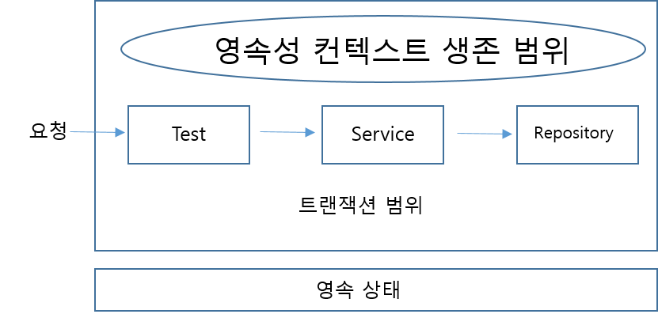
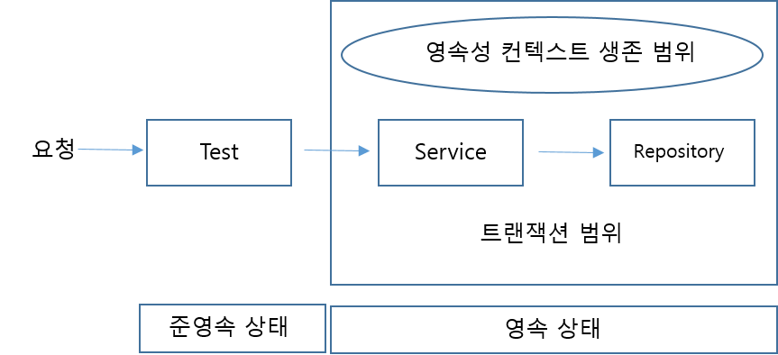
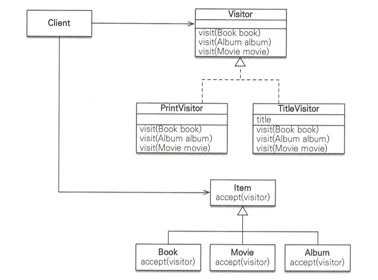

# 챕터 15 고급 주제와 성능 최적화

## 예외 처리

### JPA 표준

JPA 표준 예외들은 RuntimeException을 상속받은 `PersistenceException`이다.

따라서 **모든 JPA의 Exception은 UnCheck 예외**이다.

<br>

JPA의 Exception들은 트랜잭션 롤백을 표시하는 예외와 표시하지 않는 예외로 나뉘게 된다.

롤백을 표시하는 예외는 정말 심각한 예외이기 때문에 **트랜잭션을 강제로 커밋하려고 해도 RollbackException이 발생** 한다.

반대로 표시하지 않는 예외는 그렇게 심각한건 아니기 때문에 커밋 여부을 개발자가 판단하면 된다.

#### 롤백을 표시하는 예외

| 예외                         | 설명                                                         |
| ---------------------------- | ------------------------------------------------------------ |
| EntityExistsException        | 저장하려는 엔티티가 이미 존재할 때 발생한다.                 |
| EntityNotFoundException      | `getReference`(LAZY)을 사용했는데, 실제 엔티티를 조회할 때 없으면 발생 |
| OptimisticLockException      | 낙관적 Lock 충돌 시 발생                                     |
| PessimisticLockException     | 비관적 Lock 충돌 시 발생                                     |
| RollbackException            | 롤백 표시된 트랜잭션을 커밋할 때 발생                        |
| TransactionRequiredException | 트랜잭션이 필요할 때 트랜잭션이 없으면 발생. 주로 트랜잭션 없이 엔티티 수정 시 발생 |

#### 롤백을 표시하지 않는 예외

| 예외                     | 설명                                                      |
| ------------------------ | --------------------------------------------------------- |
| NoResultException        | `getSingleResult()`를 호출했는데 결과가 없을 때 발생      |
| NonUniqueResultException | `getSingleResult()`를 호출했는데 결과가 둘 이상일 때 발생 |
| LockTimeoutException     | 비관적 Lock에서 Timeout 발생 시 발생                      |
| QueryTimeoutException    | 쿼리 실행 시간 초과 시 발생                               |

### Spring에서의 JPA 예외 변환

서비스 계층에서 데이터 접근 계층의 구현 기술에 의존하는 것은 좋은 설계가 아니다.

예외 면에서도 마찬기지인데, 따라서 서비스 계층에서 JPA의 예외를 직접 사용하면 안된다.

Spring은 이러한 문제를 해결하기 위해 예외를 추상화 해서 제공한다.

| 예외                            | 변환                                   |
| ------------------------------- | -------------------------------------- |
| PersistenceException            | JpaSystemException                     |
| NoResultException               | EmptyResultDataAccessException         |
| NonUniqueResultException        | IncorrectResultSizeDataAccessException |
| LockTimeoutException            | CannotAcquireLockException             |
| QueryTimeoutException           | QueryTimeoutException                  |
| EntityExistsException           | DataIntegrityViolationException        |
| EntityNotFoundException         | JpaObjectRetrievalFailureException     |
| OptimisticLockException         | JpaOptimisticLockingFailureException   |
| PessimisticLockException        | PessimisticLockingFailureException     |
| RollbackException               | TransactionSystemException             |
| TransactionRequiredExceptionApi | InvalidDataAccessApiUsageException     |

또한 다음 예외도 추가로 추상화해준다.

| 예외                     | 변환                               |
| ------------------------ | ---------------------------------- |
| IllegalStateException    | InvalidDataAccessApiUsageException |
| IllegalArgumentException | InvalidDataAccessApiUsageException |

JPA 예외를 Spring 예외로 변경하려면 `PersistenceExceptionTranslationPostProcessor`를 Spring Bean으로 등록하면 된다.

`PersistenceExceptionTranslationPostProcessor`는 **Spring AOP로 `@Repository`의 메소드를 사용할 때 추상화한 예외로 변환**해 준다.

``` java
@Configuration
public class ExceptionTranslationConfig {
    @Bean
    public PersistenceExceptionTranslationPostProcessor exceptionTranslation() {
        return new PersistenceExceptionTranslationPostProcessor();
    }
}
```

### 트랜잭션 롤백 주의사항

트랜잭션을 롤백할 때 주의할 점은 **자바 객체는 복구하지 않는다**는 것이다.

엔티티를 조회하던 도중 문제가 발생해서 트랜잭션을 롤백하면 데이터는 롤백되겠지만 **수정된 객체는 그대로 영속성 컨텍스트에 남아있다**.

따라서 이럴땐 새로운 영속성 컨텍스트를 사용하거나 `clear()` 메소드로 초기화를 해줘야 한다.

<br>

Spring에선 이러한 문제를 해결하기 위해 상황에 따라 다른 전략을 사용하게 된다.

기본 전략인 트랜잭션마다 영속성 컨텍스트는 영속성 컨텍스트를 함께 종료하기 때문에 문제가 발생하지 않는다.

하지만 OSIV처럼 영속성 컨텍스트의 범위를 넓게 사용하게 되면 **다른 트랜잭션에서 롤백으로 인해 영속성 컨텍스트에 이상이 생겼을 때 해당 영속성 컨텍스트를 사용하는 또다른 트랜잭션 에서는 이상이 발생**한다.

따라서 `EntityManager.clear()` 메소드를 사용해 주어야 한다.

## 엔티티 비교

영속성 컨텍스트 내부에는 엔티티의 인스턴스를 보관하는 1차 캐시가 있다.

1차 캐시는 **영속성 컨텍스트와 생명 주기를 같이 한다.**

영속성 컨텍스트로 데이터를 저장/조회하면 1차 캐시에 엔티티가 저장된다.

이 1차 캐시 덕분에 변경 감지, 성능 최적화 등을 이룰 수 있다.

<br>

영속성 컨텍스트를 이해하기 위해선 1차 캐시의 최대 장점인 **반복 가능한 읽기**를 이해해야 한다.

같은 영속성 컨텍스트에서 엔티티를 조회하게 되면 **항상 같은 인스턴스를 반환**한다.

값만 같은게 아니라 주소 값까지 같은 인스턴스를 반환한다.

### 영속성 컨텍스트가 같을 때 엔티티의 비교



만약 우리가 테스트에서 `@Transactional` 어노테이션을 붙이게 되면 다음과 같은 트랜잭션 범위를 가진다.

> 참고로 테스트에서 `@Transactional` 어노테이션을 붙이게 되면 테스트가 끝날 때 **모두 롤백한다.**
>
> DB에 결과를 반환하지 않기 위함이다.

만약 우리가 먼저 Member를 저장하고, `findById()`메소드로 조회했을 때, 두 엔티티는 **완전히 같은 인스턴스**이다.

따라서 영속성 컨텍스트가 같으면 다음 3가지 조건을 모두 만족하게 된다.

- == 비교
- `equals()` 비교
- DB 식별자 동일

### 영속성 컨텍스트가 다를 때 비교

만약 서비스에스에만 `@Transactional` 다음과 같은 영속성 컨텍스트 범위를 갖는다.



이렇게 하면 Service에서 save한 엔티티와 테스트에서 조회한 엔티티는 서로 다른 엔티티가 된다.

이유는 **Service에서 트랜잭션을 커밋하고, 테스트에서 조회하려고 할 때 새로운 트랜잭션과 영속성 컨텍스트가 시작**되기 때문에 기존의 엔티티는 준영속 상태고, 테스트에서 조회한 엔티티는 **또 다시 DB에서 직접 조회한 영속 상태의 객체**이기 때문이다.

물론 동등성과 DB 동등성은 여전히 정상적으로 동작한다.

<br>

보다싶이 같은 영속성 컨텍스트에서는 동일성 비교로 충분하다.

따라서 OSIV처럼 하면 동일성 비교만으로 충분하다.

하지만 영속성 컨텍스트가 달라지게 되면 동등성/PK 필드 비교를 해야한다.

이중에서 **자연 키를 이용한 동등성 비교를 추천**한다.

> `equals()`를 오버라이딩해서 자연 키 비교를 하도록 수정하면 된다.

기본 키만큼 딱딱하게 정하지 않아도 되기 때문이다

## 프록시 심화

프록시는 원본 엔티티를 상속받아서 만들기 때문에 **엔티티를 사용하는 쪽은 원본 엔티티인지 구분하지 않아도 된다.**

하지만 Proxy의 기술적 한계로 인해 문제가 생길수도 있다.

### 영속성 컨텍스트와 프록시

영속성 컨텍스트는 영속 엔티티의 동일성을 보장한다.

하지만 과연 Proxy와 일반 엔티티에서도 동일성을 비교할까?

``` java
Member proxyMember = em.getReference(Member.class, "member1");
Member member = em.find(Member.class, "member1");

System.out.println(proxyMember == member);	// true
```

위에서 true가 나온 이유는 영속성 컨텍스트가 **한번 Proxy로 조회된 엔티티를 다시 조회하면 다시 Proxy 반환**한다.

다음과 같이 class를 출력하면 Proxy인것을 확인할 수 있다.

``` java
System.out.println(proxyMember.getClass());		// class this.is.pack.Member_$$_jvst843_0
System.out.println(member.getClass());			// class this.is.pack.Member_$$_jvst843_0
```

<br>

그렇다면 원본 엔티티를 조회한 후에 프록시로 조회하면 어떻게 될까?

``` java
Member member = em.find(Member.class, "member1");
Member proxyMember = em.getReference(Member.class, "member1");

System.out.println(proxyMember == member);	// true
```

이번에도 true가 나오게 되는데, 당연히 원본 엔티티가 이미 영속성 컨텍스트에 있기 때문에 proxy를 사용할 필요가 없어서 원본 엔티티를 반환하게 된다.

### Proxy 타입 비교

Proxy의 타입을 비교하려면 기존 엔티티를 상속하기 때문에 `instanceof`를 사용해야 한다.

``` java
Member proxyMember = em.getReference(Member.class, "member1");

System.out.println(proxyMember.getClass() == Member.class);		// false
System.out.println(proxyMember instanceof Member.class);		// true
```

### Proxy 동등성 비교

엔티티의 동등성을 비교하려면 `equals()`를 비지니스 키를 사용하도록 오버라이딩하면 된다.

하지만 커스텀한 `equals()`로 Proxy 엔티티와 원본 엔티티를 비교하면 문제가 생길 수 있다.

``` java
@Entity
@Getter
public class Member {
    @Id
    private String id;
    
    private String name;
    
    @Override
    public boolean equals(Object obj) {
        if(this == obj) return true;
        if(obj == null || this.getClass() != obj.getClass()) return false;
        Member member = (Member) obj;
        
        if(name != null ? name.equals(member.name) : member.name != null) return false;
        return true;
    }
    
    @Override
    public int hashCode() {
        return name != null ? name.hashCode() : 0;
    }
    
}
```

위 코드는 name 이라는 자연 키를 통해 `equals()`를 오버라이딩한 예제이다.

하지만 해당 메소드로 Proxy 엔티티와 원본 엔티티를 비교하게 되면 false가 나오게 된다.

이유는 `equals()` 메소드에서 사용한 `this.getClass() != obj.getClass()`때문이다.

엔티티의 클래스와 파라미터로 온 Object의 클래스를 동일성 비교하는데, 아까 말했듯 Proxy는 자식 타입이기 때문에 `instanceof`를 사용해야 한다.

<br>

또 다른 문제는 name을 비교하는데에서 생기게 된다.

**Proxy 객체는 실제 데이터를 가지고있지 않기 때문에 항상 null**이다.

일반적으로 Proxy 객체의 필드는 private이기 때문에 직접 접근할 일이 없지만, 자기 자신이기 때문에 접근할 수 있게 되어버린다.

따라서 **필드에 직접 접근하지 않고 getter 메소드를 이용**해야 한다.

<br>

문제를 모두 고친 코드는 다음과 같다.

``` java
@Entity
@Getter
public class Member {
    @Id
    private String id;
    
    private String name;
    
    @Override
    public boolean equals(Object obj) {
        if(this == obj) return true;
        if(obj == null || !(this.getClass() instanceof obj.getClass())) return false;
        Member member = (Member) obj;
        
        if(name != null ? name.equals(member.getName()) : member.getName() != null) return false;
        return true;
    }
    
    @Override
    public int hashCode() {
        return name != null ? name.hashCode() : 0;
    }
    
}
```

### 상속 관계와 Proxy

엔티티들 간의 상속관계를 가질 때, 발생할 수 있는 문제점이 또 있다.

우선 Item이 Book, Movie, Album의 부모 클래스이라고 가정하고 다음 코드를 보자.

``` java
Book book = Book.builder()
    .name("jpabook")
    .author("kim")
    .build();
bookRepository.saveAndFlush(book);
em.clear();

Item proxyItem = em.getReference(Item.class, book.getId());
if(proxyItem instanceof Book) {
    Book book = (Book) proxyItem;
    System.out.println("ProxyItem is Book");
}

System.out.println(proxyItem.getClass() == Book.class);
System.out.println(proxyItem instanceof Book);
System.out.println(proxyItem instanceof Item);
```

여기서 proxyItem의 타입은 **Item을 상속받은 Proxy 객체**가 되어버린다.

Book의 부모타입도 아니기 때문에 `instanceof`도 false가 되어버린다.

<br>

이러한 문제는 보통 Item과 같은 상속 관계를 가진 엔티티를 연관 관계 매핑에서 LAZY로 설정했을 때 발생한다.

#### 해결법1. JPQL로 직접 대상 조회

JPQL으로 **직접 자식타입을 조회**하면 된다.

하지만 이러한 방법은 다형성을 활용할 수 없다.

#### 해결법2. 원본 엔티티로 가져오기

hibernate에는 다음과 같이 프록시에서 원본 엔티티를 가져오는 메소드를 지원한다.

``` java
if(entity instanceof HibernateProxy) {
   entity = ((HibernateProxy) entity)
       .getHibernateLazyInitializer()
       .getImplementation();
}
```

하지만 이러한 방법을 사용하는것은 위험하다.

원래 영속성 컨텍스트는 객체의 동일성을 지키기 위해 프록시 객체와 원본 엔티티를 동일성 비교하게 되면 false가 반환되게 된다.

따라서 **꼭 필요한 곳에서만 사용**해야 한다.

#### 별도의 인터페이스 제공

Item을 위한 별도의 인터페이스를 제공하면 된다.

``` java
public interface TitleView {
    String getTitle();
}
```

``` java
@Entity
@Inheritance(strategy = InheritanceType.SINGLE_TABLE)
@DiscriminatorColumn(name = "DTYPE")
public abstract class Item implements TitleView {
    @Id @GeneratedValue
    private Long id;
    
    private String name;
    
    private int price;
}
```

``` java
@Entity
@DiscriminatorValue("B")
public class Book extends Item {
    private String author;
    private String isbn;
    
    @Override
    public String getTitle() {
        return getName() + this.author;
    }
}
```

``` java
@Entity
@DiscriminatorValue("M")
public class Movie extends Item {
    private String director;
    private String actor;
    
    @Override
    public String getTitle() {
        return getName() + this.director;
    }
}
```

이제 Item과 관계를 갖는 엔티티를 만들어준다.

``` java
@Entity
public class OrderItem {
    
    @Id @GeneratedValue
    private Long id;
    
    @ManyToOne(fetch = FetchType.LAZY)
    @JoinColumn(name = "item_id")
    private Item item;
    
    public void printItem() {
        System.out.println(item.getTitle());
    }
}
```

이렇게 하면 Item의 구현체에 따라 각기 다른 `getTitle()`이 호출되게 된다.

#### Visitor 패턴 사용

> Visitor 패턴이란 방문자/방문 공간을 분리해서 방문자에 따라 행동을 달리 해서 개방-폐쇄 원칙을 지켜주는 디자인 패턴이다.



위 그림과 같이 Visitor와 Visitor와 Visitor를 받아들이는 클래스로 구성된다.

여기서는 Item이 단순히 `accept(visitor)` 메소드로 Visitor를 받아들이는 역할만 한다.

``` java
public interface Visitor {
    void visit(Book book);
    void visit(Album album);
    void visit(Movie movie);
}
```

``` java
public class PrintVisitor implements Visitor {
    @Override
    public void visit(Book book) {
        // 원본 엔티티가 넘어오게 된다.
        System.out.println(book.getClass());
        System.out.println(book.getAuthor() + book.getName());
    }

    @Override
    public void visit(Album album) {
        // print
    }

    @Override
    public void visit(Movie movie) {
        // print
    }
}
```

``` java
@Getter
public class TitleVisitor implements Visitor {
    private String title;
    
    @Override
    public void visit(Book book) {
        // 원본 엔티티가 넘어오게 된다.
        title = book.getAuthor() + book.getName();
    }

    @Override
    public void visit(Album album) {
        // codes
    }

    @Override
    public void visit(Movie movie) {
        // codes
    }
}
```

위와 같이 내용을 출력하는 Visitor와 제목을 보관하는 TitleVisitor를 만들었다.

이제 Item 클래스를 수정해 주자

``` java
public abstract class Item {
    // codes
    
    public abstract void accept(Visitor visitor);
}
```

마지막으로 상속 받은 엔티티들을 수정해준다.

``` java
public class Book extends Item {
    // codes
    
    @Override
    public void accept(Visitor visitor) {
        visitor.visit(this);
    }
}
```

``` java
public class Movie extends Item {
    // codes
    
    @Override
    public void accept(Visitor visitor) {
        visitor.visit(this);
    }
}
```

``` java
public class Album extends Item {
    // codes
    
    @Override
    public void accept(Visitor visitor) {
        visitor.visit(this);
    }
}
```

이렇게 **모든 비지니스 로직을 Visitor에게 위임**한다.

<br>

proxyItem이 Proxy 객체일 때 다음과 같이 사용하면 된다.

``` java
item.accept(new PrintVisitor());
```

이렇게 Visitor 패턴을 사용하면 타입 캐스팅 없이, 프록시 걱정 없이 개발할 수 있지만 너무 복잡하고 객체 구조 변경에 취약하다는 단점이 있다.

## 성능 최적화

### N+1 **문제**

JPA에서 가장 기피해야할 문제인 N+1 문제에 대해 알아보자

### Eager에서의 N+1

우선 예제 상황을 만들어보자

``` java
@Entity
public class Member {
    @Id @GeneratedValue
    private Long id;
    
    @OneToMany(mappedBy = "member", fetch = FetchType.EAGER)
    private List<Order> orders = new ArrayList();
}
```

``` java
@Entity
public class Order {
    
    @Id @GeneratedValue
    private Long id;
    
    @ManyToOne
    private Member member;
    
}
```

<br>

여기서 Member를 조회하면 즉시 Order들도 함께 JOIN해서 가져온다.

이렇게 보면 한번의 SQL로 회원과 주문정보를 함께 조회하게 된다.

이렇게 보면 즉시 로딩이 상당히 좋아보인다.

하지만 JPQL을 사용할 때 문제는 발생하는데, JPQL은 FetchType을 고려하지 않고 쿼리에서 지정한 엔티티만 조회한다.

따라서 Member를 조회하는데, 문제는 **Eager로 설정된 Order들은 초기화 되어야 한다는 것**이다.

따라서 각각의 Order들은 Member 조회 직후 각각 SQL을 실행해서 가져온다.

> 여기서 말하는 `각각 가져온다`는 말은 정말 한 쿼리에서 하나의 Order를 조회하게 된다는 것이다.

이런 상황에서 한 Member가 10개의 Order를 가지고있다면 쿼리는 10 + 1개가 발생하게 된다.

### LAZY에서의 N+1

회원과 주문을 지연 로딩으로 설정한다면 N+1에서 자유로울 수 있을까?

아까 전 엔티티에서 FetchType만 LAZY로 바꾸고 테스트해보자

지연 로딩으로 설정하면 JPQL에서는 N+1 문제가 발생하지 않는다.

**하지만 실제 비지니스 로직상에서 발생하게 된다**

만약 우리가 모든 Order엔티티가 필요하거나 Order 컬렉션의 size를 알고싶다면 결국 각각의 Order를 조회해야 한다.

## N+1 해결법

### N+1 해결법1. FetchJoin

N+1을 해결하는 가장 보편적인 방법은 fetch join을 사용하는 것이다.

JPQL으로 조회할 때 JOIN으로 한번에 결과를 가져오기 때문에 N+1 문제의 근본적인 해결책이 될 수 있다.

### N+1 해결법2. @BatchSize

hibernate가 지원하는 `@BatchSize` 어노테이션을 사용하면 관계매핑에서 size만큼 함께 조회하게 된다.

따라서 5개를 단위로 쿼리가 한번씩 나간다.

``` sql
SELECT * FROM order
	WHERE member_id IN (?, ?, ?, ?, ?)
```


### @Fetch(FetchMode.SUBSELECT)

`@Fetch` 어노테이션을 사용하면 연관된 데이터를 조회할 때 서브쿼리를 사용해서 다음과 같은 쿼리가 발생한다.

``` sql
SELECT o FROM Order o
    WHERE o.member_id IN (
    	SELECT
    		m.id
    	FROM
    		member m
    	WHERE
    		m.id > 10
	)
```

따라서 한번에 Order 엔티티를 모두 조회하게 된다.

### 정리

우선 즉시 로딩과 지연 로딩 중 **지연 로딩을 추천한다**

즉시 로딩 전략은 좋아보이지만 로직에 따라서 필요하지 않은 엔티티를 로딩하게 되고, 반복되다보면 성능이 크게 하락되게 된다.

### 읽기 전용 쿼리 성능 최적화

엔티티가 영속성 컨텍스트에서 관리됨으로써 얻는 이점은 많다.

하지만 스냅샷을 보관해야 하기 때문에 메모리를 더 사용하게 된다는 단점이 있다.

조회한 엔티티를 다시 조회할 일이 없을 때 영속성 컨텍스트를 사용하지 않는게 더 효율적이다.

이럴때는 **읽기 전용으로 엔티티를 조회함으로써 메모리 사용량을 최적화**할 수 있다.

#### 스칼라 타입으로 조회

가장 확실한 방법은 스칼라 타입으로 조회하는 것이다.

스칼라 타입으로 조회하면 애초에 영속성 컨텍스트에서 관리하지 않는다.

#### 읽기 전용 쿼리 힌트 사용

Hibernate 전용 힌트인 `readOnly`을 사용하면 엔티티를 읽기 전용으로 조회할 수 있다.

읽기 전용으로 사용하면 **영속성 컨텍스트는 스냅샷을 저장하지 않는다.**

단, 스냅샷이 없기 때문에 **DB에 수정사항이 반영되지 않는다.**

``` java
TypedQuery<Order> query = em.createQuery("select o from Order o", Order.class);
query.setHint("org.hibernate.readOnly", true);
```

#### 읽기 전용 트랜잭션 사용

Spring을 사용하게 되면 트랜잭션을 읽기 전용 모드로 설정할 수 있다.

``` java
@Transactional(readOnly = true)
```

트랜잭션을 readOnly로 설정하게 되면 Spring이 Session의 FlushMode를 MANUAL로 설정한다.

즉 **강제로 flush를 호출해야지만 flush가 호출된다.**

따라서 트랜잭션을 커밋해도 영속성 컨텍스트는 플러시되지 않는다.

#### 트랜잭션 밖에서 READ

트랜잭션 밖에서 읽는다는 것은 절대 수정을 할 수 없다는 의미이기 때문에 정말 READ만 할 때 사용해야 한다.

다음과 같이 설정해주면 된다.

``` java
@Transactional(propagation = Propagation.NOT_SUPPORTED)
```

이렇게 트랜잭션을 사용하면 애초에 Flush가 일어나지 않기 때문에 조회 성능이 향상된다.

좀 더 자세히 말하자면, 기본적으로 FlushMode는 AUTO로 되어있어서 트랜잭션 커밋 혹은 flush 메소드 를 호출하면 flush된다.

하지만 여기서는 트랜잭션 자체가 존재하지 않기 때문에 커밋이 발생하지 않는다.

<br>

#### 정리

정리하자면 엔티티가 저장되는 **메모리를 최적화 하려면 스칼라 타입/읽기 전용 쿼리 힌트를 사용**하면 되고,

**flush 호출을 막아 속도를 최적화 하려면 읽기 전용 트랜잭션을 사용하거나 트랜잭션 밖에서 조회**하면 된다.

따라서 둘 다 사용하는게 가장 효율적이다.

### 배치 처리

수백만에 달하는 데이터를 배치 처리해야 할때, 일반적인 방법으로 하면 영속성 컨텍스트에 많은 엔티티가 쌓이면서 메모리 부족을 초래할 수 있다.

이러한 배치 처리를 위해 적절한 단위로 영속성 컨텍스트를  초기화 해야한다.

또한 2차 캐시를 사용하지 않도록 미리 설정해 주어야 한다.

#### JPA 등록 배치

수많은 엔티티를 등록할 때 영속성 컨텍스트에 모든 엔티티가 쌓이게 되지 않도록 **일정 단위마다 엔티티를 flush하고 초기화** 해야한다.

일정 단위마다 엔티티를 초기화 하는 방법은 보통 2가지를 사용한다.

##### JPA 페이징 배치 처리

다음 코드로 이해해 보자

``` java
private final EntityManager em;
EntityTransaction tx = em.getTransaction();

tx.start();
int pageSize = 100;			// 한번에 100개씩 영속성 컨텍스트에 올림

for(int i = 0; i < 10; i++) {
    List<Product> resultList = em.createQuery("select p from Product p", Product.class)
        .setFirstResult(i * pageSize)
        .setMaxResult(pageSize);
    for(Product product : resultList) {
        product.setPrice(product.getPrice() + 100);
    }
    em.flush();
    em.clear();
}
tx.commit();
em.close();
```

위 로직은 한 번에 100개씩 페이징으로 조회해서 100원씩 증가시키는 것이다.

하지만 이러한 방법은 비효율적이기 때문에 JDBC Cursor를 이용하는게 성능상 좋지만 JPA는 JDBC Cursor를 지원하지 않기 때문에 Hibernate scroll이나 Hibernate Stateless Session을 사용해야 한다.

> Cursor란 현재 위치를 저장하는 것이다.
>
> 매번마다 테이블을 순회하면서 100개만큼 찾는것보다 이전에 조회했던 위치를 기억하고, 거기서부터 100개를 조회하는게 훨씬 효율적이기 때문에 사용한다.

<br>

Hibernate Scroll을 사용하려면 다음과 같이 하면 된다.

``` java
private final EntityManager em;
EntityTransaction tx = em.getTransaction();
Session session = em.unwrap(Session.class);
tx.start();
ScrollableResults scroll = session.createQuery("select p from Product p")
    .setCacheMode(CacheMode.IGNORE)			// 2차 캐시 기능을 꺼준다.
    .scroll(ScrollMode.FORWARD_ONLY);

int count = 0;

while(scroll.next()) {
    Product p = (Product) scroll.get(0);
    p.setPrice(p.getPrice() + 100);
    count ++;
    if(count % 100 == 0) {		// 100마다
        session.flush();
        session.clear();		// 초기화
    }
}
tx.commit();
em.close();
```

위와 같이 `scroll()` 메소드로 ScrollableResults 객체를 받을 수 있다.

ScrollableResults 객체는 `next()` 메소드로 계속 다음 엔티티를 조회할 수 있다.

<br>

Hibernate scroll 대신 Hibernate Stateless Session을 사용할 수 있다.

무상태 세션은 **영속성 컨텍스트와 2차 캐시를 사용하지 않는다.**

그리고 엔티티를 수정하려면 **무상태 세션의 `update()` 메소드를 직접 호출**하면 된다.

``` java
SessionFactory sessionFactory = entityManagerFactory.unwrap(SessionFactory.class);	// SessionFactory를 주입
StatelessSession session = sessionFactory.openStatelessSession();	// statelessSession 시작
Transaction ex = session.beginTransaction();
ScrollableResults scroll = session.createQuery("select p from Product p").scroll();

while(scroll.next()) {
    Product p = (Product) scroll.get(0);
    p.setPrice(p.getPrice());
    session.upate(p);				// 직접 update 메소드를 호출해 준다.
}
tx.commit();
session.close();
```

**영속성 컨텍스트가 따로 없기때문에 `flush()`나 `clear()`가 없다.**

### SQL 쿼리 힌트 사용

JPA는 SQL 힌트 기능을 제공하지 않는다.

따라서 SQL 힌트는 Hibernate를 직접 사용해야 한다.

> 이 힌트는 JPA 힌트가 아니라 DB에게 제공하는 SQL 힌트이다.

### 트랜잭션을 지원하는 쓰기 지연과 성능 최적화

쓰기 지연으로 Application의 성능을 최적화 하는 방법에 대해 알아보자

#### 트랜잭션을 지원하는 쓰기 지연과 JDBC 배치

SQL을 직접 사용했을 때를 생각해보자.

매 쿼리마다 네트워크를 호출하는 것은 비용면에서 굉장히 좋지 않는데, **네트워크 호출 한 번은 단순한 메소드 수만번을 호출하는 것보다 비싸다.**

따라서 DB에 접근하는것은 최소한으로 하는게 좋다.

<br>

JDBC의 SQL 배치 기능을 사용하면 되는데 복잡하기 때문에 적용이 어렵다.

그래서 보통 수백 수천건 이상을 한번에 사용하는 특수한 상황에서만 한다.

JPA는 SQL 배치 기능을 효과적으로 사용할 수 있다.

<br>

SQL 배치 최적화 전략은 구현체마다 다르기 때문에 Hibernate를 기준으로 한다.

> PK 생성 전략 중 IDENTITY는 DB에 저장되어야 식별자가 생기기 때문에 성능 최적화를 할 수 없다.

다음과 같이 설정하면 된다.

```yaml
spring:
  jpa:
    properties:
      hibernate:
        jdbc:
          batch_size: 100
```

위와 같이 설정하게 되면 최대 100건 까지 모아서 SQL 배치를 실행한다.

하지만 **같은 SQL일때만 유효하다**는걸 기억해야 한다.

즉 Member를 save하는 쿼리를 batch로 처리하고 있던 도중 Order를 저장하게 되면 모두 flush한 후에 다시 batch를 시작한다.

#### 트랜잭션을 지원하는 쓰기 지연과 Application

트랜잭션의 쓰기 지연과 변경 감지 덕에 개발은 훨씬 편해졌다.

하지만 가장 좋은 이점은 **DB Lock에 걸리는 시간을 최소화**한다는 것이다.

이 기능은 트랜잭션을 커밋해서 영속성 컨텍스트를 플러시 하기 전까진 DB를 수정하지 않는다.

따라서 **트랜잭션 커밋 직전까진 DB에 락을 걸지 않는다.**

<br>

우선 SQL을 직접적으로 사용하는 상황을 보자

``` java
update(memberA);
update(memberB);
update(memberC);
commit();
```

위 로직에선 A, B, C가 각각 매번마다 쿼리를 발생시킨다.

따라서 각각의 쿼리마다 A, B, C에 Lock을 걸게 된다.

해당 Lock은 **트랜잭션이 커밋될때까지 유지**된다.

트랜잭션의 격리 수준마다 다르겠지만 ReadCommitted 격리 이상이면 현재 수정중인 로우는 락이 걸려서 다른 트랜잭션은 접근할 수 없다.

하지만 JPA는 **트랜잭션 커밋을 해야 flush를 호출**하고 **DB에 수정 쿼리를 전달**한다,

따라서 **트랜잭션이 커밋될 때 ABC 모두 잠깐 락이 걸리고 풀리게 된다.**

DB Lock이 걸리는 시간은 서버를 증설한다거나 사양을높이는 등으로는 해결할 수 없는 문제다.

JPA는 이를 통해 한번에 더 많은 트랜잭션을 처리할 수 있다.

