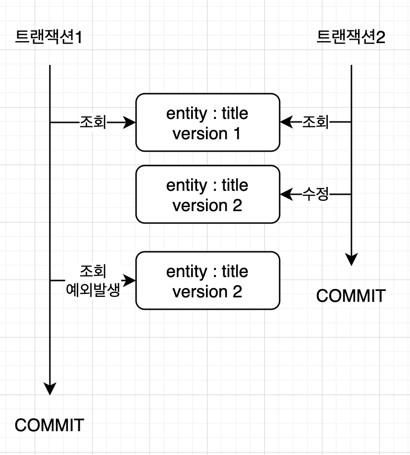
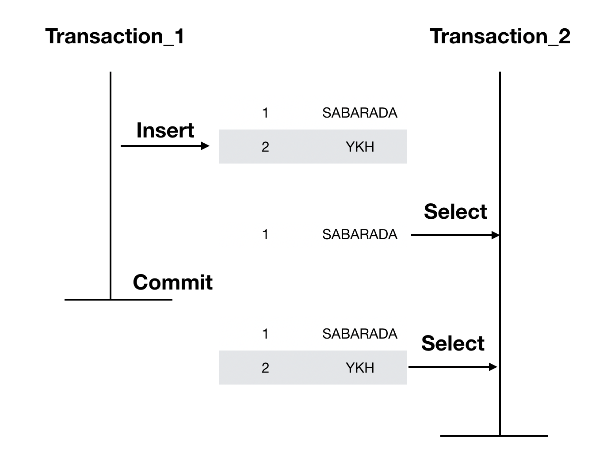
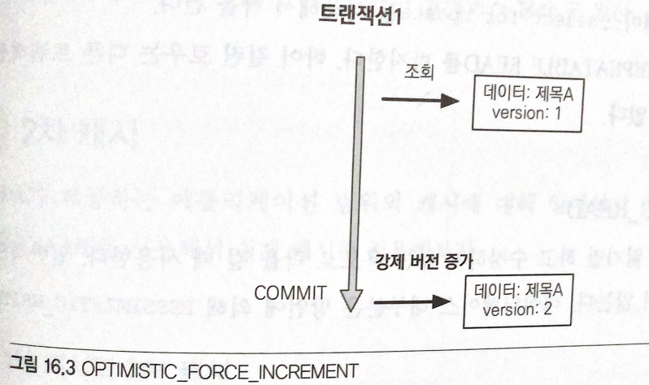
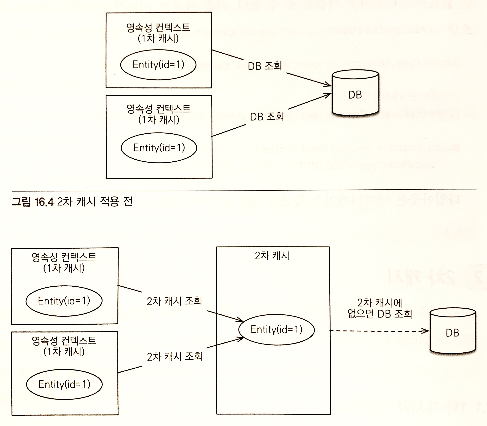

# 챕터 16 트랜잭션과 락

## 트랜잭션과 격리 수준

트랜잭션은 다음 원칙을 보장해야 한다.

- **Atomicity(원자성):** 트랜잭션 내에서 실행한 작업들은 모두 성공하거나 모두 실패해야 한다.

- **Consistency(일관성):** 모든 트랜잭션은 일관성 있는 DB 상태를 유지해야 한다.

  무결성 제약 조건을 항상 만족해야 한다거나 varchar에 int가 저장되면 안된다는 등 항상 올바른 상태여야 한다는걸 의미한다.

- **Isolation(격리성):** 동시에 실행되는 트랜잭션들이 서로 영향을 미치지 않도록 격리해야 한다.

  예를 들어 하나의 row를 여러 트랜잭션이 접근해서 수정하면 안된다.

- **Durability(지속성):** 트랜잭션을 성공적으로 끝내면 그 결과가 항상 기록되어야 한다.

  중간에 시스템에 문제가 발생해도 DB 로그 등을 사용해서 마지막으로 성공한 트랜잭션 내용을 복구해야 한다.

> 이를 앞글자만 따서 ACID라고 부른다.

이중에서 격리성을 완전히 지키려면 모든 트랜잭션이 순차적으로 실행되어야 한다.

하지만 그렇게 하면 성능이 너무 나쁘기 때문에 ANSI 표준에서는 트랜잭션의 격리 수준을 4단계로 나누어 어느정도 타협했다.

종류를 짧게 정리하면 다음과 같다.

| 격리 수준        | DIRTY READ    | NON-REPEATABLE READ | PHANTOM READ  |
| ---------------- | ------------- | ------------------- | ------------- |
| READ UNCOMMITTED | 발생          | 발생                | 발생          |
| READ COMMITTED   | 발생하지 않음 | 발생                | 발생          |
| REPEATABLE READ  | 발생하지 않음 | 발생하지 않음       | 발생          |
| SERIALIZABLE     | 발생하지 않음 | 발생하지 않음       | 발생하지 않음 |

아래로 갈수록 높은 수준의 Isolation을 지원하지만, 그 대신 성능이 안좋아진다.

이제 각각의 격리 수준에 대해 자세히 알아보자

### READ UNCOMMITTED

**다른 트랜잭션이 커밋하지 않은 데이터도 읽을 수 있다.**

예를 들면 트랜잭션1이 A를 B로 수정하고 있는데 트랜잭션2는 A를 조회할 수 있다.

이것을 DIRTY READ라고 부르는데, 트랜잭션2는 A를 조회했는데 트랜잭션1이 롤백하게 되면 **트랜잭션2는 비정상적인 데이터를 가지고 비지니스 로직을 처리하게 된다.**



그러므로 **데이터 정합성을 크게 위반**한 것이다.

> 데이터 정합성이란 **DB에서 데이터가 항상 모순없이 유지되어야 한다**라는 의미이다.

이러한 트랜잭션 격리 수준을 **READ UNCOMMITTED**라고 부른다.

### READ COMMITTED

**다른 트랜잭션이 커밋한 데이터만 읽을 수 있다.**

따라서 DIRTY READ가 발생하지 않는다.

하지만 NON-REPEATABLE READ는 발생할 수 있다.

예를 들어 트랜잭션1이 A를 조회중인데 트랜잭션 2가 A를 B로 수정하고 트랜잭션을 커밋하게 되었을 때, 트랜잭션1이 다시 해당 row 를 조회하게 되면 B가 된다.


이처럼 **한 트랜잭션에서 하나의 row를 조회했을 때 항상 일관된 값을 조회하도록 보장하지 못한다.**

이러한 트랜잭션 격리 수준을 **READ COMMITTED**라고 한다.

###  REPEATABLE READ

**한 번 조회한 데이터는 반복해서 조회해도 같은 데이터가 조회된다.**

하지만 PHANTOM READ는 발생할 수 있다.

에를 들어 트랜잭션1이 나이가 10 이상인 회원을 조회했을 때 트랜잭션2가 15살의 회원을 추가하면 회원 하나가 추가해서 조회되게 된다.

이처럼 반복 조회 시 결과 집합이 달라지는 것을 PHANTOM READ 라고 한다.



이렇듯 PHANTOM READ는 허용하지만 NON-REPEATABLE READ는 허용하지 않는 격리 수준을 **REPEABLE READ**라고 한다.

### SERIALIZABLE

가장 엄격한 트랜잭션 격리 수준으로 PHANTOM READ가 발생하지 않는다.

하지만 **동시성 처리 성능이 급격히 떨어지게 된다.**

<br>

따라서 잘 사용되진 않고, 보통 READ COMMITTED나 REPEATABLE READ 수준의 격리를 기본으로 한다.

일부 중요한 비니지스 로직에서 필요하다면 따로 Lock을 걸어줄 수 있다.

> 트랜잭션 격리 수준마다 동작 방식은 DB마다 조금 다를 수 있다.
>
> 최근 Lock 대신 MVVC를 사용하기 때문에 약간 다를 수 있다.
>
> MVCC란 동시성의 제어를 위해 사용되는 방법으로, **사용자가 DB의 스냅샷을 읽도록 한다.**
>
> 이 스냅샷은 다른 사용자가 수정을 커밋 전에 조회를 하려 하면 **이전 버전의 스냅샷**을 보여주게 된다.
>
> 이후 업데이트를 완료하게 되면 **이전의 데이터를 남겨두고 새로운 버전의 데이터를 UNDO 영역에 생성**하고 **변경 사항을 기록**한다.
>
> 사용자는 **가장 최근 버전의 스냅샷을 조회**하게 된다.

### 비관적 Lock과 낙관적 Lock

JPA에선 1차 캐시를 적절히 사용하면 DB가 READ COMMITTED 격리 수준이어도 REPEATABLE READ가 가능하다.

> 물론 스칼라 타입을 사용하면 불가능하다.

JPA는 READ COMMITTED 정도의 격리 수준이라고 생한다.

만약 더 높은 수준의 격리 수준이 필요하다면 낙관적 Lock/비관적 Lock중 하나를 사용하면 된다.

#### 낙관적 Lock

낙관적 Lock은 **트랜잭션 대부분에서 충돌이 발생하지 않는다고 가정**하는 방법이다.

DB의 Lock기능이 아니라 JPA의 버전 관리 기능을 이용한다.

쉽게 말해서 **Application이 제공하는 Lock**이다.

낙관적 Lock은 **트랜잭션을 커밋하기 전에는 충돌을 감지할 수 없다**라는 특징을 가진다.

#### 비관적 Lock

이름에서 알 수 있다싶이 비관적으로 생각하는 Lock이다.

즉 **트랜잭션의 충돌이 발생한다고 가정하고 우선 Lock을 걸고 보는 방법**이다.

여기서는 DB가 제공하는 Lock 기능을 사용하는데, 대표적으로 `SELECT FOR UPDATE`구문이다.

<br>

추가적으로 트랜잭션 외부적인 문제도 있는데, 예를 들어 같은 게시글의 내용을 두명의 사용자가 동시에 수정했다고 가정해보자.

우선 사용자1이 아주 조금 먼저 내용을 A로 수정해서 *수정이 완료되었습니다*라는 메세지를 보았고, 사용자2도 잇달아 내용을 B로 바꾸고 *수정이 완료되었습니다*라는 메세지를 받았다.

하지만 사용자1은 분명 수정 완료 메세지를 받았음에도 내용이 자신이 원하는대로 수정이 되지 않게 되는 **Second lost update problem(두 번 갱신 문제)**를 겪게된다.

선택지는 3가지가 있다.

- **마지막 수정만 인정**

- **최초 수정만 인정**

- **충돌 내용 병합**

  충돌 내용 병합만 조금 설명하자면 마치 git처럼 여러 사람들의 변경사항을 병합하게 된다.

  하지만 개발자가 방법을 제공해야 하는 번거로움이 있다.

### @Version

먼저 `@Version`는 JPA가 제공하는 낙관적 락을 이용하기 위한 어노테이션 이다.

해당 어노테이션을 붙이게 되면 **버전 관리 기능**이 추가된다.

`@Version`은 Long, Integer, Short, Timestamp에서 적용될 수 있다.

``` java
@Entity
public class Board {
    @Id
    private String id;
    
    private String title;
    
    @Version
    private Integer version;
}
```

버전 관리 기능을 적용하기 위해 버전 관리용 필드에 `@Version`은 **엔티티를 수정할때마다 하나씩 증가**하게 된다.

그리고 **엔티티를 수정할 때 조회 시점의 버전과 수정 시점의 버전이 다르면 예외**가 발생하게 된다.

예를 들면 트랜잭션1이 version이 1인 EntityA를 B로 수정하고 있는데 트랜잭션2도 EntityA를 C로 수정해서 같은 버전의 수정 2개가 들어오게 되면 예외를 발생시킨다.

``` java
// 트랜잭션 1
Board board = em.find(Board.class, id);
board.setTitle("제목AA");
```

트랜잭션 1에서 위와 같은 동작을 수행하고 있다고 가정하자.

``` java
// 트랜잭션 2
Board board = em.find(Board.class, id);
board.setTitle("제목B");
```

하지만 동시에 동작하던 트랜잭션 2에서 이미 제목을 B로 수정하고 커밋해버렸다.

그렇게 되면 board의 version은 2로 증가하게 되는데, 트랜잭션1에서 Board는 아직 version이 1이다.

따라서 트랜잭션1은 수정에 실패하게 된다.


즉 **최초 커밋만 인정하게 된다.**

#### 버전 정보를 비교하는 방법

JPA에서 버전 정보를 비교하는 방법은 단지 **트랜잭션을 커밋할 때 VERSION을 수정하는 업데이트 쿼리를 포함해서 실행**한다.

또한 엔티티를 검색할 때 **검색 조건에 VERSION을 추가**한다.

``` sql
UPDATE BOARD
SET
	TITLE=?,
	VERSION=?
WHERE
	ID=?
	AND VERSION=?
```

만약 여기서 VERSION이 다르게 되면 수정할 대상을 찾지 못한다.

이 때 **이미 버전이 증가한 것으로 판단하고 예외를 발생시킨다.**

<br>

`@Version`이 사용하는 필드는 **ㅎ개발자가 수정하면 안된다.**

> Bulk 연산은 Version을 무시하고 때려박기 때문에 강제로 version을 올려줘야 한다.

만약 강제로 증가시키려 하면 따로 Lock 옵션을 선택해야 한다.

### JPA Lock

> JPA가 추천하는 전략은 READ COMMITTED에 낙관적 Lock을 조합해서 사용하는 것이다.

다음 위치에서 사용할 수 있다.

- EntityManager
  - `lock()`
  - `find()`
  - `refresh()`
- Query(TypedQuery)
  - `setLockMode()`
- @NamedQuery

예를 들면 다음과 같이 사용할 수 있다.

``` java
Board board = em.find(Board.class, id, LockModeType.OPTIMISTIC);
```

| 락 모드   | 타입                       | 설명                                                 |
| --------- | -------------------------- | ---------------------------------------------------- |
| 낙관적 락 | OPTIMISTIC                 | 낙관적 락을 사용                                     |
| 낙관적 락 | OPTIMISTIC_FORCE_INCREMENT | 낙관적 락을 사용하는데 버전 정보를 강제로 올린다.    |
| 비관적 락 | PESSMISTIC_READ            | 비관적 락, 읽기 Lock을 사용한다.                     |
| 비관적 락 | PESSMISTIC_WRITE           | 비관적 락, 쓰기 Lock을 사용한다.                     |
| 비관적 락 | PESSMISTIC_FORCE_INCREMENT | 비관적 락 + 버전 정보 강제 증가                      |
| 기타      | NONE                       | 락을 걸지 않는다.                                    |
| 기타      | READ                       | JPA1.0에서 호환이 가능한 OPTIMISTIC                  |
| 기타      | WRITE                      | JPA1.0에서 호환 이 가능한 OPTIMISTIC_FORCE_INCREMENT |

### JPA 낙관적 락

JPA가 사용하는 낙관적 락은 Version을 사용한다.

참고로 락을 설정하지 않아도 알아서 낙관적 락이 동작한다.

하지만 락 옵션을 통해 더욱 세밀한 제어가 가능하다.

#### NONE

`@Version`이 붙어있을 때 자동으로 실행되는 Lock이다.

조회한 엔티티를 수정할 때 다른 트랜잭션에 의해 수정되면 안되므로 조회에서 수정까지 보장된다.

엔티티를 수정할 때 버전을 체크해서 버전을 증가시킨다.

**Second Lost Update Problem을 예방**한다.

> 먼저 수정된쪽으로 된다.

#### OPTIMISTIC

`@Version`만 적용했을 때에는 수정해야지만 버전을 체크하지만 이 옵션을 사용하면 **조회만 해도 버전을 체크한다.**

좀 더 자세히 말하면 **트랜잭션이 종료될때까지 다른 트랜잭션에서 변경할 수 없음을 보장**한다.

조회된 엔티티가 다른 트랜잭션에게 수정되지 않음을 보장한다.

트랜잭션을 커밋할 때 처음에 조회했을때와 엔티티 버전과 같은지 검증한다.

DIRTY READ와 NON-REPEATABLE READ를 방지한다.


#### OPTIMISTIC_FORCE_INCREMENT

낙관적 락을 사용하면서 버전을 강제로 올리고싶을 때 사용한다.

논리적인 단위의 엔티티 묶음을 관리할 수 있다.

예를 들어 하나의 게시물에 여러 파일이 있을 때, 파일이 추가된다고 해도 게시물의 Version은 변하지 않는다.

하지만 게시물의 논리적인 버전은 변하는게 맞기 때문에 해당 옵션으로 강제로 버전을 올리면 된다.

엔티티를 수정하지 않아도 트랜잭션을 커밋할 때 버전을 강제로 수정한다

만약 엔티티의 버전이 DB의 버전과 다르면 오류가 발생하게 된다.



### JPA 비관적 락

JPA가 제공하는 비관적 락은 **DB 트랜잭션의 락 Mechanism에 의존**하는 방법이다.

주로 쿼리에 `select for update` 쿼리를 통해 락을 시작하고 버전 정보가 필요없다.

비관적 락은 주로 PESSIMISTIC_WRITE 모드를 사용한다.

<br>

비관적 락의 특징은 다음과 같다.

- 엔티티가 아닌 스칼라 타입에도 적용될 수 있다.
- 데이터를 수정하는 즉시 트랜잭션 충돌을 감지할 수 있다.

#### PESSIMISTIC_WRTIE

비관적 락의 일반적인 옵션으로, DB에 `select for update`를 통해 쓰기 락을 건다.

> `select for update`란 수정을 위해서 트랜잭션에 락을 걸어주는 쿼리다.

NON-REPEATABLE READ를 방지해 준다.

#### PESSIMISTIC_READ

데이터를 반복 읽기만 하고 수정하지 않고 싶을 때 사용한다.

일반적으로 잘 사용하지 않는다.

#### PESSIMISTIC_FORCE_INCREMENT

비관적 락 중에 유일하게 버전 정보를 사용한다.

비관적 락이지만 버전 정보를 강제로 증가시키는 특징이 있다.

`for update nowait`이 동작한다.

### 비관적 락과 타임아웃

비관적 락을 사용하면 **락을 획득할때까지 트랜잭션이 대기**한다.

## 2차 캐시

### 1차 캐시와 2차 캐시

네트워크를 통해 DB에 접근하는 시간은 생각보다 훨씬 더 크다.

따라서 조회한 데이터는 메모리에 캐시해서 접근 횟수를 최대한 줄여야 한다.

영속성 컨텍스트 내부에는 엔티티를 보관하는 저장소가 있는데, 이게 1차캐시 이다.

여러가지 이점이 있지만 결국 하나의 요청에서만 유효하기 때문에 전체적으로 보면 DB접근을 그리 획기적으로 줄이지는 못한다.

그래서 대부분의 JPA 구현체가 지원하는게 **2차 캐시** 이다.

<br>

2차 캐시를 통해 Application 전체에 캐시를 적용해서 **DB 접근 횟수를 획기적으로 줄일 수 있다.**



### 1차 캐시

1차 캐시는 영속성 컨텍스트 내부에서 엔티티 매니저로 조회/변경하는 모든 엔티티를 저장한다.

트랜잭션을 commit/flush 하게되면 변경 사항을 DB에 동기화하고 없어진다.

**1차 캐시는 켜고 끌 수 있는 옵션이 아니다.** 사실 영속성 컨텍스트 그 자체라고도 할 수 있을만큼 중요하다

<br>

다음과 같은 순서로 사용된다.

1. 1차 캐시에서 식별자로 찾는다.
2. 없으므로 DB에 접근해서 데이터를 조회한다.
3. 1차 캐시에 엔티티를 저장한다.
4. 1차 캐시에 저장한 엔티티를 반환한다.
5. 이후 해당 엔티티를 조회하면 1차 캐시에서 가져온다.

<br>

1차 캐시는 영속성 컨텍스트 범위의 캐시이고, 엔티티의 동일성을 보장한다.

### 2차 캐시

**애플리케이션에서 공유하는 캐시는 Shared Cache(공유 캐시)**라고 하는데, 보통 **Second Level Cache, L2 cache(2차 캐시)**라고 부른다.

2차 캐시는 **Application 전역에서 사용할 수 있고, Application이 종료될때까지 유지된다.**

혹은 분산 캐시나 클러스터링 환경에서는 **오히려 Application보다 오래 유지될수도 있다.**

<br>

2차 캐시는 다음 순서로 동작한다.

1. 1차 캐시에서 식별자로 찾는다.
2. 없으면 2차 캐시에서 식별자로 찾는다.
3. 2차 캐시에도 없으면 DB에서 엔티티를 조회한다.
4. 결과를 2차 캐시에 저장한다.
5. 저장한 엔티티를 복사해서 1차 캐시에게 반환한다.

<br>

2차 캐시는 동시성을 극대화하기 위해서 **엔티티를 복사해서 반환**한다.

만약 그대로 반환하게 되면 한 엔티티를 여러곳에서 수정하는 일이 발생할 수 있다.

이 문제를 해결하려면 2차 캐시의 객체에 락을 걸어야 하는데, 이는 동시성 측면에서 엄청난 손해이기 때문에 객체를 복사해서 반환하게 된다.

<br>

2차 캐시의 특징은 다음과 같다.

- 2차 캐시는 Persistence Unit 범위의 캐시이다.
- 2차 캐시는 복사본을 만들어서 반환한다.
- DB 기본키를 기준으로 캐시하지만, 영속성 컨텍스트가 다르면 동일성을 보장하지 않는다.

### JPA 2차 캐시 기능

JPA 구현체 대부분은 2차 캐시를 따로따로 지원했는데, JPA 2.0이 되어서야 표준이 생겼다.

JPA 캐시 표준은 이미 여러 구현체가 공통으로 사용하는 부분만 표준화 했기 때문에 세밀한 설정을 하려면 구현체마다 각기 다른 기능을 설정해야 한다.

#### 캐시 모드 설정

2차 캐시를 사용하려면 다음과 같이 `@Cacheable` 어노테이션을 붙이면 된다.

``` java
@Cacheable
@Entity
public class Member {
    @Id @GeneratedValue
    private Long id;
}
```

`@Cacheable(false)`처럼 사용해서 캐시하지 않겠다고 설정할수도 있다.

> 원래 책에서는 캐시 모드를 설정하는 예제가 나오지만, 밑에 Hibernate 구현체 를 설정할 때 한번에 보여줄 것이다.

#### 캐시 조회/저장 방식 설정

만약 캐시를 무시하고 DB를 직접 조회하거나 캐시를 갱신하고 싶으면 각각 캐시 조회/보관 모드를 사용하면 된다.

``` java
em.setProperty("javax.persistence.cache.retrieveMode", CacheRetrieveMode.BYPASS)
```

상황에 따라서 프로퍼티와 옵션이 다르다.

먼저 프로퍼티는 다음과 같다.

- **retrieveMode:** 캐시 조회 모드
- **storeMode:** 캐시 보관 모드

<br>

캐시 조회 모드의 옵션은 다음과 같이 생겼다.

``` java
public enum CacheRetrieveMode {
    USE,		// 캐시에서 조회(기본값)
    BYPASS		// DB에 직접 접근해서 조회
}
```

캐시 보관 모드의 옵션은 다음과 같이 생겼다.

```java
public enum CacheStoreMode {
    USE,		// 조회한 데이터를 캐시에 저장. 해당 데이터가 이미 있어도 수정하진 않고 트랜잭션을 커밋하면 등록/수정된 엔티티가 저장.
    BYPASS,		// DB에 직접 접근해서 조회
    REFRESH		// USE 전략에 추가로 DB에서 엔티티를 조회했을 때 이미 존재하는 엔티티면 2차 캐시를 업데이트 한다.
}
```

<br>

이러한 캐시 모드는 `EntityManager.setProperty()`로 엔티티 매니저 단위로 설정하거나 `EntityManager.find()`나 `EntityManger.refresh()`에 설정해줄 수 있다.

마지막으로 `query.setHint()` 메소드로 설정해줄 수 있다.

<br>

#### JPA 캐시 관리 API

JPA는 캐시를 관리하기 윈한 Cache인터페이스를 제공한다.

다음과 같이 EntityMangerFactory에서 꺼내올 수 있다.

``` java
Cache cache = emf.getCache();
boolean contains = cache.contians(TestEntity.class, testEntity.getId());
System.out.println(contains);
```

Cache 인터페이스는 자세한 기능은 다음을 참고하자

``` java
public interface Cache {
    // Cache 에 엔티티가 있는지 확인하는 메소드
    public boolean contains(Class cls, Object primaryKey);
    
    // 엔티티중 특정 식별
    public void evict(Class cls, Object primaryKey);
    
    // 엔티티 전체를 캐시에서 제거
    public void evic(Class cls);
    
    // 모든 캐시 데이터 제거
    public void evictAll();
    
    // JPA Cache 구현체 조회
    public <T> T unwrap(Class<T> cls);
}
```

JPA가 정의한 표준 캐시는 여기까지이고, 이제 Hibernate와 EHCACHE로 실질적으로 적용해보자

### 하이버네이트 EHCACHE 적용

하이버네이트와 EHCACHE로 2차 캐시를 적용할 수 있다.

Hibernate가 지원하는 캐시는 크게 3가지가 있다.

1. **엔티티 캐시:** 엔티티 단위로 캐시하게 된다.

   식별자로 엔티티를 조회하거나 컬렉션이 아닌 관계 매핑을 로딩할 때 사용한다.

2. **컬렉션 캐시:** 엔티티와 연관된 컬렉션을 캐시한다. 컬렉션이 엔티티를 담고있으면 PK 필드 값만 캐시한다.

3. **쿼리 캐시:** 쿼리와 파라미터 정보를 키로 캐시한다. 결과가 엔티티면 식별자 값만 캐시한다. 즉 같은 쿼리가 발생했을 때 같은 결과를 반환해 준다.

#### 설정

Hibernate에서 EHCACHE를 사용하려면 우선 다음 의존성을 추가해야 한다.

``` java
implementation 'org.hibernate:hibernate-ehcache'
implementation 'org.ehcache:ehcache'
```

> Hibernate 5.2 버전 이후로는 위 의존성 2개를 추가해 주어야 한다.

그리고 application.yml을 다음과 같이 설정하면 된다.

```yaml
spring:
  datasource:
    url: jdbc:h2:mem:test
    driver-class-name: org.h2.Driver
  jpa:
    properties:
      hibernate:
        format_sql: true
        generate_statistics:  true
        cache:
          use_second_level_cache: true
          use_query_cache: true
          region:
            factory_class: org.hibernate.cache.ehcache.EhCacheRegionFactory
      javax:
        persistence:
          sharedCache:
            mode: ENABLE_SELECTIVE
    hibernate:
      ddl-auto: create
    show-sql: true
    database: h2
```

- **`use_second_level_cache: true`:** 2차 캐시를 사용한다는 설정
- **`use_query_cache: true`:**  쿼리 캐시를 활성화한다는 설정
- **`jabax.persistence.sharedCache.mode`:** 캐시 모드
- **`factory_class`:** 캐시를 위한 구현체를 설정한다.

여기서 캐시 모드는 다음과 같은 종류가 있다.

| 모드              | 설명                                                     |
| ----------------- | -------------------------------------------------------- |
| ALL               | 모든 엔티티를 캐시                                       |
| NONE              | 모든 엔티티를 캐시하지 않음                              |
| ENABLE_SELECTIVE  | `@Cacheable`로 설정된 엔티티만 캐시                      |
| DISABLE_SELECTIVE | `@Cacheable(false`)로 설정된 엔티티만 캐시하지 않고 다함 |
| UNSPECIFIED       | JPA 구현체의 설정을 따름                                 |

<br>

캐시에 대한 자세한 설정은 다음과 같이 할 수 있다.

```java
@Configuration
public class CacheConfig {

    @Bean
    public org.springframework.cache.CacheManager cacheManager() {
        return new EhCacheCacheManager(ehCacheManager());
    }
    
    @Bean
    public CacheManager ehCacheManager() {
        net.sf.ehcache.config.Configuration configuration = new net.sf.ehcache.config.Configuration();
        CacheConfiguration cfg = new CacheConfiguration();
        cfg.setName("secondLevelCache");
        cfg.timeToLiveSeconds(1200);            // 다음 갱신 전까지 캐시가 유지될 시간. 20분동안 수정되지 않으면 삭제
        cfg.setTimeToIdleSeconds(1200);         // 몇초 놀고 갱신할지 설정
        cfg.eternal(false);                     // 이게 true면 모든 timeout 설정 무시
        cfg.diskExpiryThreadIntervalSeconds(1200);      // 캐시를 지우기 위한 쓰레드를 실행할 주기
        cfg.memoryStoreEvictionPolicy(MemoryStoreEvictionPolicy.LFU);    // 최대 갯수에 도달했을 때에 삭제할 알고리즘. FIFO, LFU, LRU 가 있다.
        cfg.maxEntriesLocalHeap(10000);                 // 최대 저장할 Element 의 개수
        configuration.addCache(cfg);
        return CacheManager.newInstance(configuration);
    }

}
```

> 위 코드가 제대로 동작하는지는 모르겠지만, 자료가 부족해서 포기했다.

<br>

엔티티에서는 다음과 같이 설정해주면 된다.

``` java
@Cacheable
@Cache(usage = CacheConcurrencyStrategy.READ_WRTIE, region="member_region_1")
@Entity
public class Member {
    @Id @GeneratedValue
    private Long id;
    
    @Cache(usage = CacheConcurrencyStrategy.READ_WRTIE)
    @OneToMany(mappedBy = 'member', cascade CascadeType.ALL)
    private List<Child> childs = new ArrayList<>();
}
```

1. `@Cacheable` 어노테이션은 엔티티를 캐시하기 위해 붙이는 어노테이션이다.
2. `@Cache(usage = CacheConcurrencyStrategy.READ_WRTIE)` 어노테이션은 Hibernate 전용으로 좀 더 자세한 설정을 할 때 사용한다.

#### @Cache

Hibernate 전용 어노테이션을 통해 세밀한 설정이 가능하다.

| 속성    | 설명                                                        |
| ------- | ----------------------------------------------------------- |
| usage   | CacheConcurrencyStrategy로 캐시 동시성 전략을 설정          |
| region  | 캐시 지역 설정                                              |
| include | 연관 객체를 캐시에 포함한다. all, non-lazy 옵션중 선택 가능 |

여기서 가장 중요한건 usage이다.

CacheConcurrencyStrategy의 종류를 보자

| 속성                 | 설명                                                         |
| -------------------- | ------------------------------------------------------------ |
| NONE                 | 캐시를 설정하지않음                                          |
| READ_ONLY            | 읽기 전용으로 설정. 등록 삭제는 가능하지만 수정은 불가능.    |
| NONSTRICT_READ_WRTIE | 엄격하지 않은 READ WRITE 전략. 동시에 같은 엔티티를 수정하면 데이터 일관성이 깨질 수 있다. |
| READ_WRITE           | 읽기 쓰기가 가능하고 READ COMMITTED 수준의 격리 수준을 보장<br />EHCACHE는 데이터를 수정하면 캐시 데이터도 수정 |
| TRANSACTIONAL        | 컨테이너 관리 환경에서 사용 가능                             |

#### 캐시 region

위 엔티티는 **엔티티 캐시 영역**에, List타입인 Child는 **컬렉션 캐시 영역**에 저장된다.

엔티티 캐시 영역은 기본적으로 `패키지명+클래스명`으로 사용된다.

혹은 `region` 속성을 사용해서 직접 지정해줄수도 있다.

<br>

또한 다음과 같이 region별로 설정할 수 있다.

``` xml
<ehcache>
    <defaultCache
          maxElementsInMemory="10000"
          eternal="false"
          timeToIdleSeconds="1200"
          timeToLiveSeconds="1200"
          diskExpiryThreadIntervalSeconds="1200"
          memoryStoreEvictionPolicy="LRU" />
    <cache
           name="member_region_1"
           maxElementsInMemory="10000"
           eternal="false"
           timeToIdleSeconds="600"
           timeToLiveSeconds="600"
           overflowToDisk="false"/>
    
</ehcache>
```

#### 쿼리 캐시

쿼리 캐시는 쿼리 파라미터와 쿼리를 키로 쿼리 결과를 캐시하는 방법이다.

쿼리 캐시를 사용하려면 위 설정에서 했다싶이 `use_query_cache: true`로 설정해야 한다.

그리고 다음과 같이 캐시를 적용하려는 쿼리마다 cacheable을 true로 설정하는 hint를 주면 된다.

``` java
em.createQuery("select i from Item i", Item.class)
    .setHint("org.hibernate.cacheable", true)
    .getResultList();
```

#### 쿼리 캐시 영역

`use_query_cache` 옵션을 사용하면 두가지 캐시 영역이 추가된다.

- **`org.hibernate.cache.internal.StandardQueryCache`:** 쿼리 캐시를 저장하는 영역. 쿼리, 쿼리 집합, 쿼리 실행 타입스탬프를 보관

- **`org.hibernate.cache.spi.UpdateTimestampsCache`:** 쿼리 캐시가 유효한지 확인하기 위해 쿼리 대상 테이블의 변경 시간을 저장한다.

  이곳에는 테이블 명, 테이블의 변경 시간을 저장한다.

쿼리 캐시는 **테이블이 조금이라도 변경되었다면 DB에서 데이터를 조회**한다.

따라서 쿼리 캐시는 변화가 적고 조회가 잦은 테이블에서 사용하면 성능을 극적으로 끌어올릴 수 있겠지만, 변경이 빈번한 테이블에 대해서는 성능이 저하된다.

#### 쿼리 캐시와 컬렉션 캐시 주의점

쿼리 캐시와 컬렉션 캐시는 **식별자 값만 저장**한다.

따라서 다음과 같은 상황에선 문제가 발생할 수 있다.

1. Member를 조회하고, 쿼리 캐시가 적용되어 있다.
2. 결과 집합에는 식별자만 있을 수 있으므로 한 건씩 엔티티 캐시에서 조회한다.
3. Member는 엔티티 캐시를 사용하지 않기 때문에 한 건씩 DB에서 조회한다.
4. 결국 100개의 쿼리가 실행된다.

즉 식별자만 저장한다는건 **꼭 쿼리 캐시나 컬렉션 캐시는 엔티티 캐시를 기본으로 하고 사용해야 한다**는 의미이다.