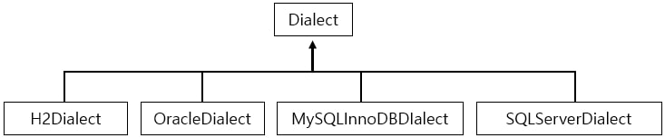

# 챕터2 JPA 시작

기본적인 Entity 객체에 관한 설명 [Entity](../../spring_boot_sole_web/codes/DTOs_and_Entity.md)

Database의 이름 규칙 [NameRule](../../../database/column_name_rule.md)

### JPA 표준 속성

JPA에 db 드라이버, id와 비밀번호 등을 지정해 주어야 하는데 우리는 그것을 **application.yml**을 통해 한다.

> 책에서는 xml을 사용하지만, 나는 주로 yaml 형식을 사용하기 때문에 yaml을 사용한다.
>
> xml을 가져온 것 이기 때문에 문제가 있을 수 있다.

``` yaml
spring:
  datasource:
    driver-class-name: com.mysql.cj.jdbc.Driver # jdbc 드라이버
    url: jdbc:mysql://localhost:3306/db이름?serverTimezone=UTC&characterEncoding=UTF-8 #db url
    username: root # 계정
    passowrd: root # 비밀번호
  jpa:
    generate-ddl: true # ddl 생성 여부. true면 자동으로 ddl을 생성해 준다.
    database: mysql # 사용을 원하는 데이터베이스
    hibernate:
      ddl-auto: update # ddl을 어떻게 실행할 것인가. create는 항상 새로 정의, update는 변경 사항만 적용, none은 안함
    properties:
      hibernate:
        dialect: org.hibernate.dialect.MySQL5InnoDBDialect # 방언을 MySQL5 InnoDB로 바꿈
```

### 데이터베이스 방언이란?

JPA는 **특정 데이터베이스에 종속적이지 않다.**

> 계속 나오지만, JPA는 데이터베이스의 종류와, 해당 데이터베이스의 문법에 관계 없이 항상 동일한 코드를 작성해도 작동한다.
>
> 그러므로 특정 데이터베이스에 종속적이지 않다는 의미는 **데이터베이스의 종류**에 상관 없이 **JPA는 작동**한다는 의미이다.

그런데 SQL에 표준이 있긴 하지만, 여러 데이터베이스는 표준을 따르고 있지 않다.

> ##### 예제
>
> - 데이터 타입
>   - MySQL의 가변 문자 타입은 VARCHAR
>   - ORACLE의 가변 문자 타입은 VARCHAR2이다.
> - 함수 명
>   - SQL 표준은 문자열 자르기 함수를 SUBSTRING()으로 지원한다.
>   - ORACLE은 SUBSTR()로 지원한다.

위 예제처럼 큰 차이는 없어보이지만, 분명히 차이가 존재한다.

> 차이가 없어보여도 쿼리를 작성할 때 함수 이름이나 데이터 타입 이름을 작성해야 하는데, 그런 상황에서 데이터베이스에 따라 각각 다른 쿼리를 작성해야 한다.

이렇게 SQL 표준을 지키지 않거나, **특정 데이터베이스의 고유한 기능**을 JPA에서 **방언(Dialect)** 이라고 한다.

특정 데이터베이스의 함수를 사용하면, 다른 데이터베이스로 변경하기 어렵다.

즉, 데이터베이스에 종속적이게 되는 것이다.

그렇기 때문에 **특정 데이터베이스에 의존적인 SQL은 방언이 해결해 준다.**

나중에 데이터베이스를 변경할 일이 생긴다면, 단순히 방언만 교체해 주면 된다.

> [yaml 파일](#JPA-표준-속성) 에서 dialect 부분이다.



위 사진과 같이 원하는 데이터베이스의 Dialect를 설정해 주면 Dialect는 그에 맞는 SQL 쿼리를 생성해 준다.

> Dialect를 잘 못 설정하게 되면 문제가 발생할 수 있다.
>
> 예를 들어, DATETIME을 저장하는데 MySQL은 일정 버전 위 부터 ms 단위를 저장할 수 있기 때문에 저장할 때 오류가 발생할 수 있다.

참고로, Dialect를 custom 해줄 수 있다.

[JPQL이란](../what_is_jpql.md)

