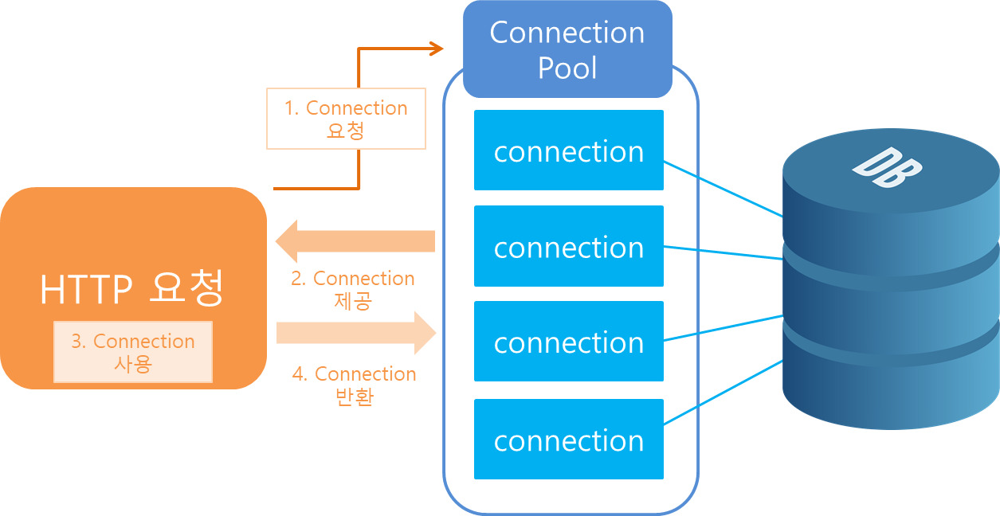
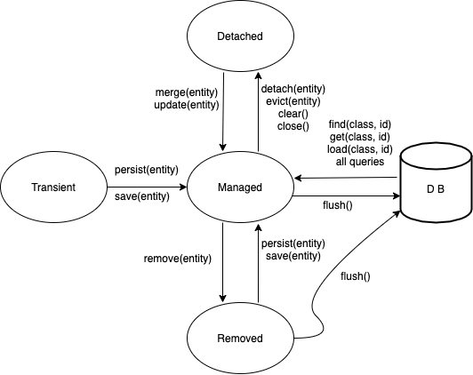
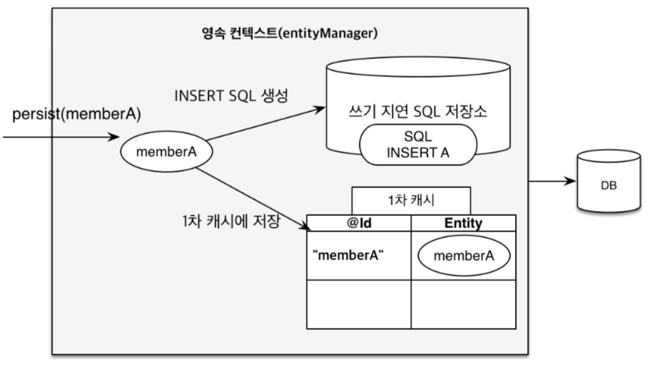
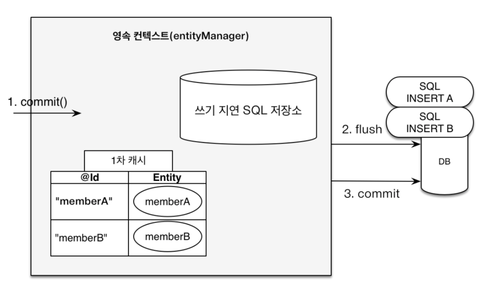
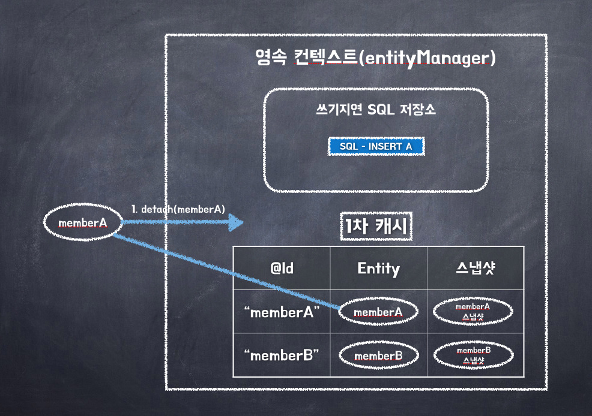
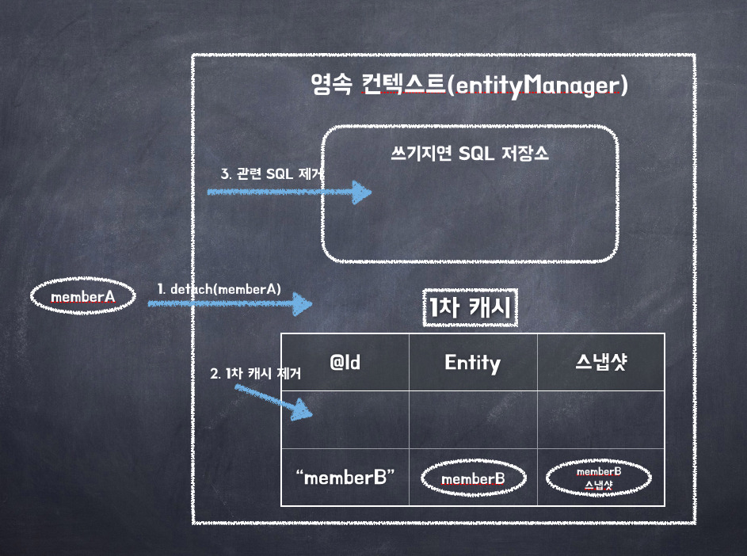
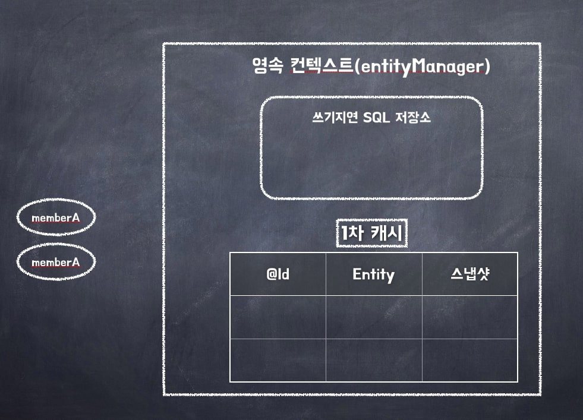
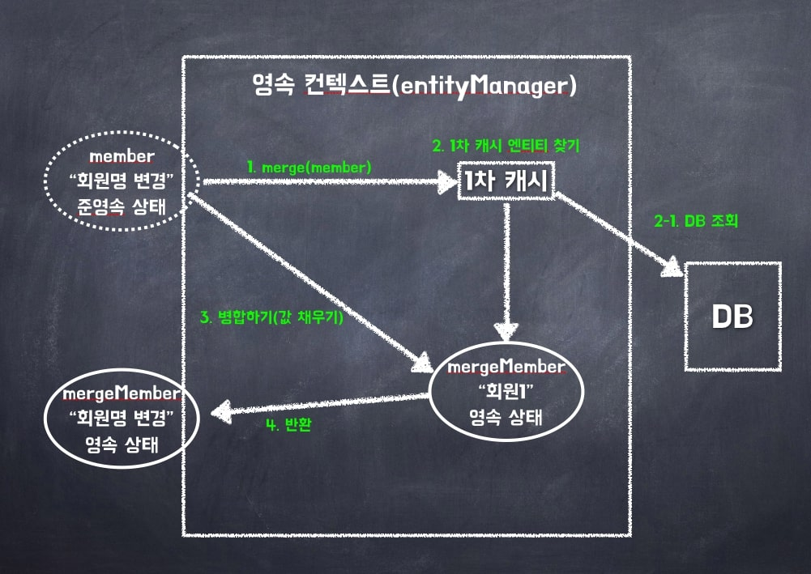

# 챕터3 영속성 관리

> JPA의 기능은 크게 두가지로 나뉜다.
>
> - 엔티티 - 테이블 매핑
> - 매핑한 엔티티를 사용
>
> 이 장에서는 매핑된 엔티티를 어떻게 사용하는지에 관한 내용이다.

### 엔티티 매니저란?

> spring boot는 yaml 파일에서 설정을 해 두면 yaml의 값을 기반으로 EntityManagerFactory를 생성하는 것 같다.

엔티티 매니저란 엔티티를 수정, 삭제, 조회 등 엔티티 관련 일들을 처리한다.

> 가상의 데이터베이스로 생각하면 편하다.

보통 EntityManagerFactory를 하나 생성해서, 해당 Factory에서 다른 엔티티 매니저를 생성한다.

> DB를 여러개 사용한다면 EntityManagerFactory를 여러개 생성해야 한다.
>
> 말 그대로 EntityManager를 찍어내는 공장이고, 이 곳에서 해당 데이터베이스에서 필요한 엔티티들을 찍어낸다.

EntityManagerFactory를 생성할 때에는 비용 즉 서버의 자원을 엄청 먹는다.

> 그렇기 때문에 한개만 만들어 애플리케이션 전체에서 공유되어야 한다.

하지만 반대로 EntityManager를 생성할 때에는 별로  자원이 필요하지 않다.

> 동시성 문제로 인해 여러 스레드에서 접근하면 안된다.

EntityManager는 하나의 트랜잭션마다 생성되고, 작업이 끝나면 사라진다.

EntityManager를 닫으면 DB Connection을 Connection Pool에 반환한다.

### 커넥션풀

우리가 DB에 연결할 때마다 DB와 연결하는 과정을 전부 새로 수행하기엔 힘들다.

그렇기 때문에 우리는 미리 Connection을 Connection pool 이란 곳에 **저장**해 두었다가, 필요할때마다 꺼내서 사용한다.

필요할때는 꺼내서 **사용**하고, 사용한 후에는 다시 **Connection pool에 넣어둔다.**



보통 JPA의 구현체들은 **EntityManagerFactory를 생성**할 때 커넥션 풀을 생성한다.

> 우리가 미리 만들어둔 DB 접속 정보를 통해 접속한다.

# 영속성 컨텍스트

영속성 컨텍스트는 Persistence Context의 약자로, 굳이 번역하자면 **엔티티 영구 저장 환경**이다.

JPA를 이해하기 위해 **필수**적으로 알아야 할 것 이며, 이 챕터에서 가장 중요한 내용이다.

> 영속성 컨텍스트는 논리적 개념에 가깝기 때문에 실제로 이해하기 어렵고, 지금까지 본적도 없을 것이다.

영속성 컨텍스트는 엔티티 매니저를 생성할 때 한 개 만들어진다.

> Spring Boot에서 Application.yml을 설정해 두면 알아서 EntityManager를 생성하는 것 같다.
>
> 따라서, 영속성 컨텍스트는 Spring Boot 애플리케이션을 **구동할 때 생성**된다.

#### 엔티티 생명주기



##### 비영속(new/transient)

영속성 컨텍스트와 **관계가 없는** 상태.

순수한 엔티티 객체 상태고, 아직 저장되지 않았다.

DB와 관련이 없다.

##### 영속(managed)

영어 그대로, 영속성 컨텍스트에 **저장(관리)**된 상태

해당 엔티티를 엔티티 매니저를 통해 영속성 컨텍스트에 저장한 상태.

영속성 컨텍스트에 의해 관리받는 사태를 영속 상태 라고 말한다.

> EntityManger.find()나 JPQL을 통해 조회한 엔티티는 여기에 속한다.

##### 준영속(detached)

영속성 컨텍스트에 저장되었다 **분리**된 상태

영속 상태의 엔티티를 영속성 컨텍스트가 **관리하지 않는 상태**이다.

> EntityManager.depatch() 메소드를 통해 할 수 있다.

clear() 메소드를 호출하면 영속성 컨텍스트가 관리하던 모든 영속 상태의 엔티티가 준영속 상태가 된다.

##### 삭제(removed)

**삭제**된 상태

엔티티를 영속성 컨텍스트와 DB에서 삭제한다.

#### 영속성 컨텍스트의 특징

##### 영속성 컨텍스트와 식별자

영속성 컨텍스트는 각각의 엔티티를 **식별자(기본키와 매핑된 필드)**를 통해 구분한다.

그렇기 때문에, 영속 상태의 객체는 식별자가 꼭 있어야 한다.

> 없으면 예외가 발생한다.

##### DB 저장

영속성 컨텍스트는 보통 **트랜잭션을 커밋**하는 순간 영속성 컨텍스트에서 변경된 데이터를 DB에 반영한다.

> 트랜잭션의 커밋은 저장되지 않은 모든 데이터를 저장하고 트랜잭션을 저장하라는 의미이다.

이것을 **Flush** 라고 한다.

> Flush는 flush() 메소드 호출시, 트랜잭션 종료시, JPQL 쿼리 실행시에 일어난다.
>
> JPQL 쿼리 실행 전 flush가 발생하는 이유는 JPQL이 실제 Database에서 값을 가져오기 때문에 저장 후 검색해야 하기 때문이다.

##### 1차 캐시

Map 형태로 엔티티를 저장한다.

우리가 find를 하면 1차 캐시에서 먼저 값을 찾고, 없으면 DB에서 조회한다.

> 없다면 엔티티 매니저가 DB 조회 후 엔티티를 만들고 1차 캐시에 저장한다.
>
> 그 후에야 영속 상태의 엔티티를 반환한다.

구분은 식별자를 통해 하며, key-value 형태에서 key는 PK 필드의 값이 된다.

캐시이기 때문에 DB에 접속하는 것보다 훨씬 빠르다.

##### 동일성 보장

같은 트랜잭션에서 같은 검색을 하면 같은 객체가 반환된다.

> 전에 말했듯이 ==으로 비교하면 true가 반환된다.
>
> 또한, 1차 캐시를 이용하기 때문에 당연히 속도도 빠르다.

##### 변경 감지

객체의 **데이터가 변경되면** 자동으로 update 쿼리를 사용한다.

> EntityManager에서 Flush 된다.

우리가 영속 객체를 수정했다고 가정하자.

해당 트랜잭션이 커밋되면 flush()가 발생할 것이다.

엔티티와 스냅샷(1차 캐시에 해당 트랜잭션이 실행되기 전 객체)을 비교한다.

변경점이 있다면 UPDATE 쿼리를 작성해서 쓰기 지연 SQL 저장소에 저장해 둔다.

그 후에 flush가 일어나서 업데이트 된다.

마지막으로 데이터베이스 트랜잭션을 커밋한다.

> 데이터베이스 트랜잭션과 자바의 트랜잭션은 별개이다.


변경 감지는 영속성 컨텍스트가 관리하는 영속 상태의 엔티티에만 적용된다.

update sql문은 변경된 필드만 업데이트 되는것이 아니라 다른 **모든 필드들을 업데이트** 해준다.

즉 a,b,c,d 라는 컬럼에 a,b,c,d 라는값이 들어있고 a가 f로 수정되었다고 하면 a = f, b = b, c = c, d = d처럼 다른 값들은 기존의 값들로 재설정 된다.

- 장점

  - 모든 항상 수정 쿼리가 같다. 그렇기 때문에 애플리케이션 로딩시에 수정 쿼리를 생성해 두고 **재사용**할 수 있다.

    > 당연히 바인딩되는 데이터는 다르다.

  - 데이터베이스에 동일한 쿼리를 보내면 데이터베이스는 이전에 파싱된 쿼리를 **재사용**할 수 있다.

- 단점

  - DB에 데이터를 전송하는 양이 증가한다.

만약 필드가 많다면(대략 30개 이상) 변경된 데이터만 UPDATE SQL을 작성하도록 하는것이 효율적이다.

Entity 클래스에 `@DynamicUpdate` 어노테이션을 붙여주면 된다.

> `@DynamicInsert` 라는 어노테이션도 있는데, insert 쿼리에서 null이 아닌 값들만 insert 시켜준다.

##### 쓰기 지연

트랜잭션이 끝난 후에 Commit이 일어난다.

persist() 메소드는 아래와 같이 객체를 영속화 해서 영속성 컨텍스트에 저장하는 것이다. **즉시 INSERT를 하는것이 아니다.**




또한 영속성 컨텍스트에 저장된 객체는 당연히 1차 캐시에 저장되고, **쓰기 지연 SQL 저장소 라는 곳에 INSERT 쿼리를 저장**해 둔다.

영속성 컨텍스트에 올라간 객체는 **트랜잭션이 끝날 때 까지 기다렸다가 아래와 같이 쓰기 flush가 발생해서 지연 SQL 저장소의 INSERT 쿼리를 실행**한다.



> 기본적으로 DB는 트랜잭션이 커밋되지 않으면 매 persist() 메소드마다 SQL을 보내든 commit 직전에 보내든 상관 없이, 하나의 트랜잭션에서 실행되기 때문에 SQL을 어떻게 보내든 상관 없이 **DB의 트랜잭션이 커밋되지 않으면 의미 없다.**
>
> 그렇기 때문에 쓰기 지연이 가능하다.

#### 삭제

엔티티를 삭제하기 위해선 우선 대상 엔티티를 조회해야 한다.

엔티티 삭제는 다음과 같이 진행된다.

1. 엔티티 조회

2. remove() 메소드 사용

3. 쓰기 지연 SQL 저장소에 DELETE 쿼리 저장

4. 영속성 컨텍스트에서 해당 엔티티 삭제

5. 트랜잭션 커밋

6. 플러시 호출

7. DB에 쿼리 전달

8. 가비지 컬렉션이 엔티티 정리

   > 가비지 컬렉션의 대상이 되기 위해 삭제된 객체는 재사용하지 않는것이 좋다.

### 플러시

flush()는 영속성 컨텍스트의 **변경 내용**을 DB에 반영하는 것이다.

플러시는 다음과 같은 일이 일어난다.

1. 변경 감지(영속성 컨텍스트의 모든 엔티티를 스냅샷과 비교)
2. 변경된 엔티티는 거기에 맞는 쿼리를 SQL 저장소에 등록
3. SQL을 DB에 전송

이러한 플러시를 작동시키는 방법은 3가지 이다.

- 직접 호출

  메소드를 **직접 호출**해서 강제로 플러시 한다.

  거의 사용되지 않는다.

- 트랜잭션 커밋

  트랜잭션을 커밋하기 전에 플러시를 호출하지 않으면 어떤 변경사항도 반영되지 않는다.

  따라서 **트랜잭션 커밋 전 플러시를 자동으로 호출**하다.

- JPQL 쿼리 실행시

  JPQL같은 객체지향 쿼리를 호출하면 이전에 수정된 영속성 컨텍스트들이 반영되지 않은 결과가 나온다.

  > 쉽게 말하면 A라는 엔티티를 persist() 메소드를 통해 영속성 컨텍스트에 저장했고, 트랜잭션이 커밋되면 DB에 저장될 것이다.
  >
  > 하지만 트랜잭션이 커밋되기 전에 검색 쿼리가 작동하면 A라는 엔티티는 찾을 수 없다.

  그렇기 때문에 JPA는 **객체지향 쿼리 실행 전 자동으로 플러시를 호출**한다.

##### 플러시 모드 옵션

플러시 모드를 EntityManager에 직접 지정하려면 아래와 같이 사용할 수 있다.

``` java
em.setFlushMode(FlushModeType.COMMIT);
```

FlushModeType은 AUTO와 COMMIT이 있다.

기본값은 AUTO로, **커밋이나 쿼리 실행 시**에 플러시 된다.

COMMIT은 **커밋할때만** 플러시가 된다.

### 준영속

영속성 컨텍스트가 관리하던 영속 상태의 엔티티가 영속성 컨텍스트에서 분리된 상태를 준영속 상태라고 한다.

그렇기 때문에 준영속 엔티티는 영속성 컨텍스트의 기능을 이용할 수 없다.

엔티티를 준영속 상태로 만드는 방법은 3가지 이다.

> 개발자가 따로 준영속 상태로 만드는 일은 드물다.

##### em.detach(entity)

특정 엔티티를 준영속 상태로 만든다.

준영속 상태가 되면, 1차 캐시에서 해당 객체가 모두 삭제된다.





또한  쓰기지연 SQL 저장소에서도 해당 객체 관련 SQL이 삭제된다.

##### clear()

detach()  메소드는 하나의 엔티티를 준영속 상태로 만들어 준다.

하지만 clear() 메소드는 영속성 컨텍스트의 모든 엔티티를 준영속 상태로 만들어 준다.`



detach() 메소드와 비교했을 때, detach() 메소드는 지정한 특정 객체만 날렸지만 clear() 메소드는 모든 영속 객체를 지웠다.

##### close()

close() 메소드는 해당 영속성 컨텍스트를 종료시키는 메소드 이다.

영속성 컨텍스트가 종료되면 자동으로 모든 영속 객체는 준영속 상태가 된다.

##### 준영속 상태 특징

- 비영속 상태에 가깝다.

  1차 캐시, 쓰기지연, 변경감지 등 어떤 기능도 동작하지 않는다.

- 식별자 값을 가지고 있다.

  비영속 상태의 객체는 식별자 값이 없을 수 있지만, 준영속 객체는 한번 영속 객체였기 때문에 반드시 식별자 값을 가진다.

  > 영속 객체는 `@Id`로 지정된 필드의 변수값을 식별자로 갖는다.
  
- 지연로딩이 불가능하다.

  > 준영속 객체는 지연 로딩이 불가능 하다.
  >
  > 자세한건 8장에 나온다고 한다.

##### 병합

준영속 상태의 엔티티를 다시 영속 상태로 바꾸는 과정이다.

merge() 메소드는 준영속 상태의 엔티티를 메소드로 받아서 그 정보를 통해 새로운 영속 상태의 엔티티를 반환한다.

``` java
Member member = em.merge(member);
```

위 메소드는 아래와 같은 순서로 작동한다.



1. merge 메소드 실행

2. 1차 캐시에서 식별자로 엔티티 검색

3. 없다면 DB 조회

4. DB의 조회 결과를 다른 엔티티에 저장

   > DB에 없으면 새로운 엔티티를 생성해서 병합

5. 변경사항이 알아서 변경되어 영속 상태의 객체 반환

   > 트랜잭션 커밋시, 영속 상태의 mergeMember 라는 엔티티가 수정되어 있기 때문에 DB에 변경사항이 반영됨.

> merge() 메소드는 엔티티가 없다면 새로 생성해서 만들기 때문에 비영속 엔티티도 영속상태로 만들어 줄 수 있다.

한마디로 save or update 기능을 제공한다.
