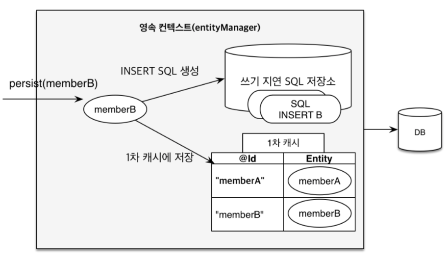

# 챕터3 영속성 관리

> JPA의 기능은 크게 두가지로 나뉜다.
>
> - 엔티티 - 테이블 매핑
> - 매핑한 엔티티를 사용
>
> 이 장에서는 매핑된 엔티티를 어떻게 사용하는지에 관한 내용이다.

### 엔티티 매니저란?

> spring boot는 yaml 파일에서 설정을 해 두면 yaml의 값을 기반으로 EntityManagerFactory를 생성하는 것 같다.

엔티티 매니저란 엔티티를 수정, 삭제, 조회 등 엔티티 관련 일들을 처리한다.

> 가상의 데이터베이스로 생각하면 편하다.

보통 EntityManagerFactory를 하나 생성해서, 해당 Factory에서 다른 엔티티 매니저를 생성한다.

> DB를 여러개 사용한다면 EntityManagerFactory를 여러개 생성해야 한다.
>
> 말 그대로 EntityManager를 찍어내는 공장이고, 이 곳에서 해당 데이터베이스에서 필요한 엔티티들을 찍어낸다.

EntityManagerFactory를 생성할 때에는 비용 즉 서버의 자원을 엄청 먹는다.

> 그렇기 때문에 한개만 만들어 애플리케이션 전체에서 공유되어야 한다.

하지만 반대로 EntityManager를 생성할 때에는 별로  자원이 필요하지 않다.

> 동시성 문제로 인해 여러 스레드에서 접근하면 안된다.

EntityManager는 하나의 트랜잭션마다 생성되고, 작업이 끝나면 사라진다.

EntityManager를 닫으면 DB Connection을 Connection Pool에 반환한다.

### 커넥션풀

우리가 DB에 연결할 때마다 DB와 연결하는 과정을 전부 새로 수행하기엔 힘들다.

그렇기 때문에 우리는 미리 Connection을 Connection pool 이란 곳에 **저장**해 두었다가, 필요할때마다 꺼내서 사용한다.

필요할때는 꺼내서 **사용**하고, 사용한 후에는 다시 **Connection pool에 넣어둔다.**

보통 JPA의 구현체들은 **EntityManagerFactory를 생성**할 때 커넥션 풀을 생성한다.

> 우리가 미리 만들어둔 DB 접속 정보를 통해 접속한다.

# 영속성 컨텍스트

영속성 컨텍스트는 Persistence Context의 약자로, 굳이 번역하자면 **엔티티 영구 저장 환경**이다.

JPA를 이해하기 위해 **필수**적으로 알아야 할 것 이며, 이 챕터에서 가장 중요한 내용이다.

> 영속성 컨텍스트는 논리적 개념에 가깝기 때문에 실제로 이해하기 어렵고, 지금까지 본적도 없을 것이다.

영속성 컨텍스트는 엔티티 매니저를 생성할 때 한 개 만들어진다.

> Spring Boot에서 Application.yml을 설정해 두면 알아서 EntityManager를 생성하는 것 같다.
>
> 따라서, 영속성 컨텍스트는 Spring Boot 애플리케이션을 **구동할 때 생성**된다.

#### 엔티티 생명주기

##### 비영속(new/transient)

영속성 컨텍스트와 **관계가 없는** 상태.

순수한 엔티티 객체 상태고, 아직 저장되지 않았다.

DB와 관련이 없다.

##### 영속(managed)

영어 그대로, 영속성 컨텍스트에 **저장(관리)**된 상태

해당 엔티티를 엔티티 매니저를 통해 영속성 컨텍스트에 저장한 상태.

영속성 컨텍스트에 의해 관리받는 사태를 영속 상태 라고 말한다.

> EntityManger.find()나 JPQL을 통해 조회한 엔티티는 여기에 속한다.

##### 준영속(detached)

영속성 컨텍스트에 저장되었다 **분리**된 상태

영속 상태의 엔티티를 영속성 컨텍스트가 **관리하지 않는 상태**이다.

> EntityManager.depatch() 메소드를 통해 할 수 있다.

clear() 메소드를 호출하면 영속성 컨텍스트가 관리하던 모든 영속 상태의 엔티티가 준영속 상태가 된다.

##### 삭제(removed)

**삭제**된 상태

엔티티를 영속성 컨텍스트와 DB에서 삭제한다.

#### 영속성 컨텍스트의 특징

##### 영속성 컨텍스트와 식별자

영속성 컨텍스트는 각각의 엔티티를 **식별자(기본키와 매핑된 필드)**를 통해 구분한다.

그렇기 때문에, 영속 상태의 객체는 식별자가 꼭 있어야 한다.

> 없으면 예외가 발생한다.

##### DB 저장

영속성 컨텍스트는 보통 **트랜잭션을 커밋**하는 순간 영속성 컨텍스트에서 변경된 데이터를 DB에 반영한다.

> 트랜잭션의 커밋은 저장되지 않은 모든 데이터를 저장하고 트랜잭션을 저장하라는 의미이다.

이것을 **Flush** 라고 한다.

> Flush는 flush() 메소드 호출시, 트랜잭션 종료시, JPQL 쿼리 실행시에 일어난다.
>
> JPQL 쿼리 실행 전 flush가 발생하는 이유는 JPQL이 실제 Database에서 값을 가져오기 때문에 저장 후 검색해야 하기 때문이다.

##### 1차 캐시

Map 형태로 엔티티를 저장한다.

우리가 find를 하면 1차 캐시에서 먼저 값을 찾고, 없으면 DB에서 조회한다.

> 없다면 엔티티 매니저가 DB 조회 후 엔티티를 만들고 1차 캐시에 저장한다.
>
> 그 후에야 영속 상태의 엔티티를 반환한다.

구분은 식별자를 통해 하며, key-value 형태에서 key는 @Id의 값이 된다.

캐시이기 때문에 DB에 접속하는 것보다 훨씬 빠르다.

##### 동일성 보장

같은 트랜잭션에서 같은 검색을 하면 같은 객체가 반환된다.

> 전에 말했듯이 ==으로 비교하면 true가 반환된다.
>
> 또한, 1차 캐시를 이용하기 때문에 당연히 속도도 빠르다.

##### 변경 감지

객체의 **데이터가 변경되면** 자동으로 update 쿼리를 사용한다.

> EntityManager에서 Flush 된다.

우리가 영속 객체를 수정했다고 가정하자.

해당 트랜잭션이 커밋되면 flush()가 발생할 것이다.

엔티티와 스냅샷(1차 캐시에 해당 트랜잭션이 실행되기 전 객체)를 비교한다.

변경점이 있다면 UPDATE 쿼리를 작성해서 쓰기 지연 SQL 저장소에 저장해 둔다.

그 후에 flush가 일어나서 업데이트 된다.

마지막으로 데이터베이스 트랜잭션을 커밋한다.

> 데이터베이스 트랜잭션과 자바의 트랜잭션은 다르다.

변경 감지는 영속성 컨텍스트가 관리하는 영속 상태의 엔티티에만 적용된다.

##### 쓰기 지연

트랜잭션이 끝난 후에 Commit이 일어난다.

persist() 메소드는 아래와 같이 객체를 영속화 해서 영속성 컨텍스트에 저장하는 것이다. 즉시 INSERT를 하는것이 아니다.

또한 영속성 컨텍스트에 저장된 객체는 당연히 1차 캐시에 저장되고, **쓰기 지연 SQL 저장소 라는 곳에 INSERT 쿼리를 저장**해 둔다.

영속성 컨텍스트에 올라간 객체는 **트랜잭션이 끝날 때 까지 기다렸다가 아래와 같이 쓰기 flush가 발생해서 지연 SQL 저장소의 INSERT 쿼리를 실행**한다.

> 기본적으로 DB는 트랜잭션이 커밋되지 않으면 매 persist() 메소드마다 SQL을 보내든 commit 직전에 보내든 상관 없이, 하나의 트랜잭션에서 실행되기 때문에 SQL을 어떻게 보내든 상관 없이 트랜잭션이 커밋되지 않으면 의미 없다.
>
> 그렇기 때문에 쓰기 지연이 가능하다.