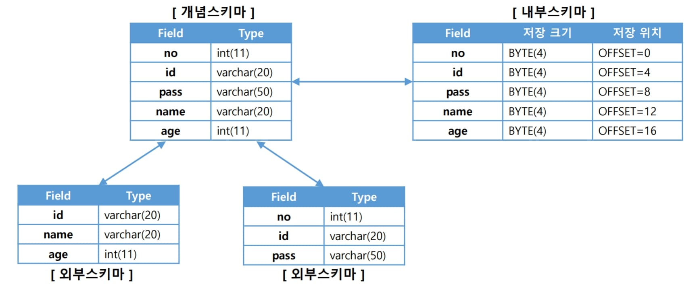

# 챕터4 엔티티 매핑

### @Entity

객체와 테이블 간의 매핑을 해준다.

JPA가 관리한다는 의미 이므로, JPA를 사용한다면 꼭 붙여야 한다.

#### @Entity의 속성

| 속성 | 기능                                                         | 기본값        |
| ---- | ------------------------------------------------------------ | ------------- |
| name | JPA에서 사용할 엔티티의 이름. <br />보통 클래스의 이름을 사용하지만, 다른 패키지라도 같은 이름의 엔티티가 있다면 충돌하지 않도록 해야  한다. | 클래스의 이름 |

#### 주의사항

기본 생성자(pulbic 또는 protected)는 필수이다.

> JPA가 엔티티 객체를 생성할 때 기본 생성자를 이용한다.
>
> 자바는 기본 생성자를 자동으로 생성해 줘서 생각할 일이 잘 없지만, 다른 생성자가 있다면 생성해주지 않아서 따로 만들어야 한다.
>
> > lombok의 `@NoArgsConstructor` 어노테이션을 사용하면 편하다.

final, enum, interface, inner 클래스에선 사용할 수 없다.

필드에 final을 붙이면 안된다.

### @Table

엔티티와 매핑될 테이블을 지정한다.

#### @Table의 속성

| 속성             | 기능                                                         | 기본값                            |
| ---------------- | ------------------------------------------------------------ | --------------------------------- |
| name             | 매핑될 테이블의 이름                                         | 엔티티 이름(스네이크로 자동 변환) |
| catalog          | catalog 기능이 있는 DB에서 catalog 매핑                      |                                   |
| schema           | schema 기능이 있는 DB에서 catalog 매핑                       |                                   |
| uniqueContraints | DDL 생성 시에 2개 이상의 복합 유니크 제약조건을 만들 수 있다.<br />DDL을 만들때만 참고된다. |                                   |

> catalog란, 데이터베이스의 모든 개체들에 대한 정의/명세 이다.
>
> DB의 전체 정보이며, 데이터 사전이라고도 한다.
>
> - 카탈로그 자체가 테이블로 이루어져서 SQL로 조작할 수 있다.
> - DBMS마다 다른 구조를 가지고 있다.
> - 카탈로그는 DBMS가 알아서 생성/유지/갱신한다.
> - 인덱스, 사용자, 릴레이션 관련 정보 뿐만 아니라 위치 투명성 등을 위한 모든 제어 정보를 가진다.

> schema란 데이터베이스의 구조와 제약조건에 대한 전반적인 명세이다.
>
> 속성, 개체, 관계와 그것들의 유지를 위한 제약조건을 담고있다.
>
> 카탈로그(데이터 사전)에 저장되며, 3가지로 구분된다.
>
> - 외부 스키마
>
>   프로그래머가 개인의 입장에서 필요한 DB
>
>   여러개가 존재할 수 있다.
>
>   프로그램이나 사용자에게 공유될 수 있다.
>
> - 개념 스키마
>
>   DB 전체에 대한 논리 구조
>
>   단 하나만 존재한다.
>
>   DBA에 의해 작성된다.
>
> - 내부 스키마
>
>   DB의 물리적 구조 정의
>
>   물리 저장장치 관점에서의 DB명세로, 하나만 존재한다.
>
>   개념 스키마의 물리적 저장 구조를 정의한다.
>
> 

### 스키마 자동 생성

JPA는 스키마를 자동으로 생성하는 기능을 지원한다.

클래스의 매핑 정보를 통해 어떤 테이블이 어떤 컬럼을 포함하고 사용하는지 알 수 있는데, 해당 정보를 토대로 JPA는 스키마를 자동으로 생성해 준다.

> 테이블이 이미 존재한다면 DROP 한 후에 다시 생성한다.

애플리케이션 실행 시점에서 생성하게 된다.

하지만 개발자가 직접 테이블을 만드는 것 보다는 부정확할 수 있기 때문에 개발 환경에서만 사용하는게 좋다.

#### ddl-auto 속성

``` yaml
spring:
  jpa:
    hibernate:
      ddl-auto: 속성
```

| 속성        | 설명                                                         |
| ----------- | ------------------------------------------------------------ |
| create      | 기존 테이블 삭제 후 새로 생성                                |
| create-drop | create와 같고, 애플리케이션 종료시 생성한 스키마 삭제        |
| update      | DB 테이블 정보와 엔티티들의 정보를 비교해서 수정사항만 변경  |
| validate    | DB 테이블 정보와 엔티티를 비교해서 다르면 애플리케이션 실행 X<br />스키마를 수정하지 않는다. |
| none        | 자동 생성 기능 off                                           |

### @Column

DB의 컬럼과 매핑될 필드임을 명시한다.

기본적으로 `@Entity` 밑의 모든 필드들은 매핑된다.

> `@Column` 속성의 기본값이 적용된다.

int와 같이 자바의 기본 타입은 NULL이 오는게 불가능 하기 때문에 자동으로 Not Null로 설정한다.

> int 타입에 `@Column` 어노테이션을 추가했을 때 nullable을 설정하지 않으면 기본값인 true이기 때문에 조심해야 한다.

int 대신 Integer처럼 객체 타입을 사용하면 Not Null이 기본값으로 오지 않는다.

#### @Column 속성

| 속성             | 설명                                                         | 기본값                                |
| ---------------- | ------------------------------------------------------------ | ------------------------------------- |
| name             | 매핑할 컬럼 이름을 지정한다.                                 | 필드 이름을 스네이크 기법으로 한 이름 |
| insertable       | 엔티티 저장시 해당 필드를 저장할지 여부.<br />읽기 전용일때 사용되며, false면 INSERT 할때 저장되지 않는다. | true                                  |
| updateable       | 엔티티 업데이트 시에 해당 필드를 업데이트 시킬지 여부<br />false면 해당 필드는 업데이트 되지 않는다. | true                                  |
| table            | 해당 필드를 다른 테이블과 매핑시켜 준다.                     |                                       |
| nullable         | Not Null로 설정할건지 여부.<br />true면 null 값 허용, false면 null 값 불허용 | true                                  |
| unique           | 제약 조건. UNIQUE 옵션                                       | false                                 |
| length           | 문자열의 길이 제한 조절                                      | 255                                   |
| columnDefinition | DB 컬럼 정보에 직접적으로 지정할때 사용된다.<br />*실제 DB 컬럼 작성하듯이 사용할 수 있다. |                                       |
| precision        | BigDemical타입과 매핑시킬때 사용된다.<br />소수점을 포함한 전체 자리수를 지정할 수 있다. | 19                                    |
| scale            | BigDemical타입과 매핑시킬때 사용한다.<br />소수 자리수를 지정시킨다. | 2                                     |

> `@Column(columnDefinition="VARCHAR(100) NOT NULL")`과 같이 사용할 수 있다.

### @Enumerated

자바의 ENUM과 DB의 ENUM을 매핑시켜 준다.

| 속성  | 기능                                                         | 기본값           |
| ----- | ------------------------------------------------------------ | ---------------- |
| value | EnumType.ORDINAL을 하면 enum 순서 즉 정수 값을 DB에 저장한다.<br />EnumType.STRING을 하면 enum의 이름 즉 문자열을 DB에 저장한다. | EnumType.ORDINAL |

- ORDINAL

  저장되는 크기가 작다.

  이미 저장되어 있는 ENUM의 순서가 바뀌거나 추가되었을 때 능동적으로 대응할 수 없다.

- STRING

  저장되는 크기가 크다.

  하지만 순서가 바뀌거나 ENUM이 추가되도 안전하다.

> EnumType을 ORDINAL로 했을 때에는 저장이나 필터링 등에서 문제가 발생할 수 있고, 추가되어도 문제가 발생하지 않는 EnumType.STRING으로 바꾸기를 권장한다.

### @Temporal

자바의 날짜타입을 매핑할 때 사용된다.

- java.util.Date

- java.util.Calendar

기본값으론 TIMESTAMP로 매핑된다.

> 즉, LocalDate에서는 사용하지 않는다.

> 위 자바의 날짜 타입은 월 처리, Date 처리에 문제가 있어서 잘 사용되지 않는다.

| 속성  | 기능                                                         | 주의사항                             |
| ----- | ------------------------------------------------------------ | ------------------------------------ |
| value | TemporalType.DATE - 시간을 제외한 년 - 월 - 일 형태. DB의 date 타입과 매핑<br />TemporalType.TIME - 날짜를 제외한 시간:분:초 형태. DB의 time과 매핑<br />TemporalType.TIMESTAMP - 날짜 시간 모두 저장. DB의 timestamp와 매핑 | TemporalType을 필수로 지정해야 한다. |

### LocalDateTime 매핑

JPA는 LocalDateTime을 자동으로 DB의 DATETIME과 매핑시켜 준다.

즉 **따로 설정할 필요가 없다**.

자바의 다른 날짜 타입보다 **LocalDateTime 타입이 권장**된다.

> DATETIME과 TIMESTAMP의 차이
>
> - 최대 날짜 차이
>   - DATETIME은 1000년 ~ 9999년까지 지원한다.
>   - TIMESTAMP는 1970 ~ 2038년 까지 지원한다.
> - 속도 차이
>   - DATETIME보다 TIMESTAMP가 INDEX 생성 속도가 빠르다.
> - TIMEZONE
>   - DATETIME은 TIMEZONE이 바뀌어도 항상 같은 날짜를 유지한다.
>   - TIMESTAMP는 TIMEZONE을 바꾸면 해당 지역에 맞도록 시간을 바꿔준다.
>     - **TIMESTAMP는 TIMEZONE에 종속**된다는 의미이다.

### @Transient

**해당 어노테이션이 붙은 필드는 DB와 매핑되지 않는다.**

조회도, 저장도 하지 않고 객체에 임시로 데이터를 저장할 때 사용된다.

### @Access

**JPA가 DB에 접근하는 방식을 지정**한다.

| 속성                | 기능                                  | 기본값                     |
| ------------------- | ------------------------------------- | -------------------------- |
| AccessType.FIELD    | 접근 방식을 FIELD로 지정시켜 준다.    | @Id가 필드에 붙어있을 때   |
| AccessType.PROPERTY | 접근 방식을 PROPERTY로 지정시켜 준다. | @Id가 Getter에 붙어있을 때 |

Access 어노테이션은 클래스 맨 위에 붙어서 모든 필드를 해당 방식으로 접근하도록 할 수 있다.

하지만 엔티티의 멤버에 붙는다면 해당 메소드 혹은 필드에만 적용할 수 있다.

##### FIELD 접근 방식

FIELD에 접근한다는 의미는 우리가 평소에 사용하던 것 처럼 하나의 필드가 하나의 컬럼과 매핑되고, 메소드는 매핑되지 않고 메소드인 채로 작동하는 것이다.

``` java
@Id
private String email;
```

##### PROPERTY 접근 방식

PROPERTY에 접근한다는 의미는 메소드의 결과 값을 알아서 저장한다는 의미이다.

``` java
private String firstName;

private String lastName;

@Access(AccessType.PROPERTY)
public String getFullName() {
    return firstName + lastName;
}
```

위와 같은 방식을 사용하면 first_name, last_name이라는 속성과 full_name 이라는 속성이 생긴다.

> 기본적으로 get은 제외한 이름으로 매핑된다.

### 기본키 전략

데이터베이스들은 각각 특징적인 기본 키 전략을 갖는다.

> ex) 오라클의 시퀀스 오브젝트나 MySQL의 AUTO_INCREMENT 등

그렇기 때문에 자연스럽게 JPA의 기본 키 생성 방식은 여러가지가 있다.

JPA는 기본적으로 Entity 클래스에 **`@Id` 어노테이션이 붙은 필드를 PK 컬럼으로 인식**한다.

>  식별자는 다음 규칙에 따라야 한다.
>
> 1. **Not Null**
>
> 2. **유일해야 한다.**
>
>    > PK 값은 주민등록번호처럼 중복되면 안된다.
>
> 3. **변해선 안된다.**
>
>    > **PK 필드는 값이 변하면 안된다.**
>    >
>    > 하지만 이름과 같은 필드는 개명 등으로 바뀔 수 있기 때문에 PK가 되면 안된다.

DB 기본키 선택 전략은 2가지로 나뉜다.

- 자연 키

  해당 테이블과 직접적으로 연관된 컬럼중 선택하는 것

  > USER 테이블의 이메일이나 주민등록번호 등

- 대리 키

  해당 테이블과 관련 없이 임의로 만든 필드를 말한다.

  대체 키 라고도 부른다.

  > MySQL의 AUTO_INCREMENT나 ORACLE의 SEQUENCE 등이 포함된다.

  **키 선택 시에는 자연 키 보다는 대리 키가 추천된다.**

  1. 이유는 비지니스 규칙이 생각보다 변하기 쉽기 때문이다.

     >  예를 들어 주민번호는 PK로 사용되었지만, 주민번호를 저장할 수 없도록 법이 바뀌어서 모두 바꾸어야 했다.

  2. 모든 엔티티에서 일관되게 대리 키를 사용하도록 하기를 권장한다.

     > 모든 엔티티에서 자연 키가 있을 것 이라는 보장은 없다.
     >
     > 게다가 자연 키는 타입이나 이름 등이 각각 모두 특색있게 다르기 때문에 일관성이 떨어진다.

기본키 전략에는 2가지 종류가 있다.

- 직접 할당

  기본키를 애플리케이션이 **직접 할당**한다.

- 자동 생성

  대리 키 사용 방식

#### 직접 할당

회원가입 할 때 이메일을 PK로 뒀을때 처럼, 직접 할당시켜 준다.

그냥 `@Id` 어노테이션을 붙여주면 된다.

> `@Id` 필드는 아래 종류의 데이터 타입 위에만 올 수 있다.
>
> - 자바 기본 타입
> - 자바 Wrapper 타입
>   - String
>   - Date
>   - Long
>   - Integer
>   - 등등등..

기본 키 할당 전략은 **엔티티를 저장하기 전에 해당 엔티티에 값을 먼저 삽입**하는 것이다.

> 예를 들어 `@Id`가 String email 필드에 붙었다면 email 값을 엔티티에 저장하고, 해당 엔티티를 persist()하는 것이다.

만약 기본 키 직접 할당을 하는데, **PK 필드가 정의되지 않으면 Exception이 발생한다.**

#### 자동 생성

자동 생성은 말 그대로 **PK를 DBMS가 자동으로 생성**해 준다.

식별자가 자동 생성될 때에는, `@Id` 어노테이션 뿐만 아니라 `@GeneratedValue` 어노테이션도 필요하다.

#### IDENTITY 전략

identity 전략은 주로 MySQL, PostgreSQL 등에서 사용한다.

MySQL의 AUTO_INCREMENT가 대표적이다.

> AUTO_INCREMENT는 INSERT 할 때 PK 값을 저장하지 않아도 DBMS가 알아서 하나씩 값을 올려가며 고유한 key를 생성한다.

즉 IDENTITY 전략은 AUTO_INCREMENT와 같이 **데이터베이스에 값을 저장하기 전엔 PK 값을 알 수 없고 데이터베이스에 저장된 후에 PK 값을 알 수 있을 때** 사용된다.

- 영속 객체 식별자

  IDENTITY 전략은 DB에 저장한 후에 기본 키 값을 알 수 있다.

  하지만 영속 객체는 식별자가 필요한데, 따라서 **JPA는 데이터베이스에 값을 저장한 후에 다시 그 값을 조회**해야 한다.

  > Statement.getGeneratedKeys() 를 사용하면 저장과 동시에 키 값을 가져올 수 있다.

- 쓰기 지연

  위에서 말했듯이 영속 객체는 식별자가 필요하다.

  하지만 IDENTITY 전략은 DB 저장 후에 바로 조회하지 않으면 그동안 해당 객체는 식별자가 없게 되어버린다.

  그렇기 때문에 jpa는 **em.persist()를 호출하는 즉시 INSERT SQL이 전달**되고, 식별자를 가져온다.

  따라서 **IDENTITY 타입은 쓰기 지연이 동작하지 않는다**.

#### SEQUENCE 전략

- SEQUENCE 전략이란?

  > MySQL이나 MariaDB만 사용하던 사람들 에게는 생소할 수 있다.

  SEQUENCE는 직역하면 "수열" 이란 뜻이다.

  번역한 것 처럼 유일한 값을 만들기 위해 수열을 만들어 주는데, 아래와 같이 작동한다.

  
  
  1. 시작값과 증감값, 최솟값과 최댓값을 설정해줄 수 있다.
  2. 시작값부터 증감값만큼 계속해서 숫자가 커지는 수열이 만들어 진다.
  3. 만약 최댓값을 초과한다면, 처음으로 돌아가는 사이클을 돌건지 여부에 따라 다시 처음으로 돌아간다.

  

  SEQUENCE는 **테이블과 독립적**으로 작동하기 때문에, 하나를 만들고 여러개의 테이블에서 사용할 수 있다.

SEQUENCE 전략을 통해 PK를 만들 수 있는데, 당연히 JPA에서 이것을 지원한다.

`@SequenceGenerator` 어노테이션을 통해 SEQUENCE를 구현할 수 있다.

엔티티 클래스 위에 붙으며, 다음과 같이 사용할 수 있다.

> @GeneratedValue에 붙여서 사용해도 된다.

``` java
@SequenceGenerator(
	name="시퀀스 generator 이름",
    sequenceName="DB의 시퀀스 이름",
    initialValue="초깃값",		// DDL 생성 시에만 작동. 기본값 = 1
    allocationSize="증감값"	// 성능 최적화용. 기본값 = 50
)
```

IDENTITY와 비슷하지만, SEQUENCE는 persist() 메소드를 호출할 때 다르게 작동한다.

1. 시퀀스를 통해 식별자 부터 조회한다.
2. 식별자를 엔티티에 할당한다.
3. 해당 엔티티를 영속성 컨텍스트에 저장한다.
4. 트랜잭션이 커밋되어 플러시가 일어난다.
5. DB에 INSERT 쿼리가 전달되어 저장된다.

> IDENTITY는 트랜잭션이 커밋될 때가 아니라 persist() 메소드가 호출되는 즉시 쿼리가 발생했다.

이런 방식은 2번의 연결이 발생한다.

- 식별자를 구하기 위한 데이터베이스 시퀀스 조회

- 조회한 시퀀스를 기본값으로 저장

  > 트랜잭션 종료 시에 저장된다.

즉, (INSERT 쿼리 수) + 1회(트랜잭션 종료시 연결) 만큼 DB와 연결하게 된다.

> IDENTITY 방식은 매 쿼리마다 INSERT, SELECT가 발생했다.
>
> 그렇기 때문에 (INSERT쿼리)*2 회 연결하게 된다.

#### TABLE 전략

**키 생성만을 위한 테이블을 만들어서 키 값을 생성하는 방법**이다.

> 데이터베이스 시퀀스를 흉내내는 방식이다.

테이블을 따로 사용하기 때문에 특정 DBMS에서만 작동하는게 아니라, **모든 DBMS에서 적용**할 수 있다.

- 전반적인 동작 방법

1. 다음 값과 어떤 테이블의 값인지 식별해주는 컬럼이 있다.

   ``` sql
   sequence_name VARCHAR(255) NOT NULL PRIMARY KEY,
   next_val bigint
   ```

2. 해당 테이블에서 다음 값(next_val) 필드를 꺼내온다.

3. next_val을 다음에 주고 싶은 key 값으로 update 해준다.

이러한 방식은 DBMS와 관계없이 작동한다는 장점이 있다.

다음과 같이 사용할 수 있다.

``` java
@Entity
@TableGenerator(
	name = "BOARD_SEQ_GENERATOR",	// 필수로 입력해야 하는 식별자 생성기의 이름
    table = "MY_SEQUENCES",			// 위에서 만든 테이블 이름
    pkColumnValue = "BOARD_SEQ",	// 시퀀스 컬럼의 이름. 즉, sequence_name에 들어갈 값
    valueColumnName = "next_val",	// 시퀀스 값의 컬럼명
    pkColumnName = "sequence_name",	// 키로 사용할 컬럼의 이름. 즉, 위에서 만든 테이블의 PK 컬럼 이름
    initialValue = 0,				// 초깃값
    allocationSize = 1,				// 한번에 증가할 값
    uniqueConstraints = {@UniqueConstraints (	// 유니크 제약 조건
    		name = "UNIQUE_FILED",
        	columnNames = {"column1", "column2"}
    	)
	}
)
public class Board {
    @Id
    @GeneratedValue(strategy = GenerationType.TABLE,
                   generator = "BOARD_SEQ_GENERATOR")
}
```

> 위 엔티티에서 볼 수 있듯이 TABLE 전략을 사용할 때엔 `@GeneratedValue`에서 **generator는 식별자 생성기의 이름**을 넣어준다.

#### AUTO 전략

말 그대로 **JPA가 자동으로 설정**해 준다.

MySQL이면 IDENTITY(AUTO_INCREMENT)를 선택하고, ORACLE이면 SEQUENCE를 선택해 준다.

- 주의사항

  - SEQUENCE나 TABLE 전략이 사용된다면 각각 시퀀스, 키 생성 테이블을 만들어 주어야 한다.

    > 만약 만들어 두지 않고 스키마 자동 생성(generate-ddl: true)을 한다면 기본값을 통해 알아서 만들어 준다.

데이터베이스가 확정되지 않은 개발 초기에 사용하기 좋다.

> DB가 바껴도 GenerationType을 굳이 바꿔줄 필요가 없다.

