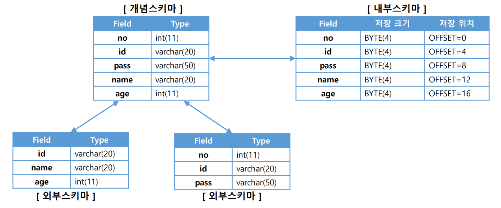

# 챕터4 엔티티 매핑

### @Entity

객체와 테이블 간의 매핑을 해준다.

JPA가 관리한다는 의미 이므로, JPA를 사용한다면 꼭 붙여야 한다.

#### @Entity의 속성

| 속성 | 기능                                                         | 기본값        |
| ---- | ------------------------------------------------------------ | ------------- |
| name | JPA에서 사용할 엔티티의 이름. <br />보통 클래스의 이름을 사용하지만, 다른 패키지라도 같은 이름의 엔티티가 있다면 충돌하지 않도록 해야  한다. | 클래스의 이름 |

#### 주의사항

기본 생성자(pulbic 또는 protected)는 필수이다.

> JPA가 엔티티 객체를 생성할 때 기본 생성자를 이용한다.
>
> 자바는 기본 생성자를 자동으로 생성해 줘서 생각할 일이 잘 없지만, 다른 생성자가 있다면 생성해주지 않아서 따로 만들어야 한다.
>
> > lombok의 @NoArgsConstructor 어노테이션을 사용하면 편하다.

final, enum, interface, inner 클래스에선 사용할 수 없다.

필드에 final을 붙이면 안된다.

### @Table

엔티티와 매핑될 테이블을 지정한다.

#### @Table의 속성

| 속성             | 기능                                                         | 기본값                            |
| ---------------- | ------------------------------------------------------------ | --------------------------------- |
| name             | 매핑될 테이블의 이름                                         | 엔티티 이름(스네이크로 자동 변환) |
| catalog          | catalog 기능이 있는 DB에서 catalog 매핑                      |                                   |
| schema           | schema 기능이 있는 DB에서 catalog 매핑                       |                                   |
| uniqueContraints | DDL 생성 시에 2개 이상의 복합 유니크 제약조건을 만들 수 있다.<br />DDL을 만들때만 참고된다. |                                   |

> catalog란, 데이터베이스의 모든 개체들에 대한 정의/명세 이다.
>
> DB의 전체 정보이며, 데이터 사전이라고도 한다.
>
> - 카탈로그 자체가 테이블로 이루어져서 SQL로 조작할 수 있다.
> - DBMS마다 다른 구조를 가지고 있다.
> - 카탈로그는 DBMS가 알아서 생성/유지/갱신한다.
> - 인덱스, 사용자, 릴레이션 관련 정보 뿐만 아니라 위치 투명성 등을 위한 모든 제어 정보를 가진다.

> schema란 데이터베이스의 구조와 제약조건에 대한 전반적인 명세이다.
>
> 속성, 개체, 관계와 그것들의 유지를 위한 제약조건을 담고있다.
>
> 카탈로그(데이터 사전)에 저장되며, 3가지로 구분된다.
>
> - 외부 스키마
>
>   프로그래머가 개인의 입장에서 필요한 DB
>
>   여러개가 존재할 수 있다.
>
>   프로그램이나 사용자에게 공유될 수 있다.
>
> - 개념 스키마
>
>   DB 전체에 대한 논리 구조
>
>   단 하나만 존재한다.
>
>   DBA에 의해 작성된다.
>
> - 내부 스키마
>
>   DB의 물리적 구조 정의
>
>   물리 저장장치 관점에서의 DB명세로, 하나만 존재한다.
>
>   개념 스키마의 물리적 저장 구조를 정의한다.
>
> 

### 스키마 자동 생성

JPA는 스키마를 자동으로 생성하는 기능을 지원한다.

클래스의 매핑 정보를 통해 어떤 테이블이 어떤 컬럼을 포함하고 사용하는지 알 수 있는데, 해당 정보를 토대로 JPA는 스키마를 자동으로 생성해 준다.

> 테이블이 이미 존재한다면 DROP 한 후에 다시 생성한다.

애플리케이션 실행 시점에서 생성하게 된다.

하지만 개발자가 직접 테이블을 만드는 것 보다는 부정확할 수 있기 때문에 개발 환경에서만 사용하는게 좋다.

#### ddl-auto 속성

``` yaml
spring:
  jpa:
    hibernate:
      ddl-auto: 속성
```

| 속성        | 설명                                                         |
| ----------- | ------------------------------------------------------------ |
| create      | 기존 테이블 삭제 후 새로 생성                                |
| create-drop | create와 같고, 애플리케이션 종료시 생성한 스키마 삭제        |
| update      | DB 테이블 정보와 엔티티들의 정보를 비교해서 수정사항만 변경  |
| validate    | DB 테이블 정보와 엔티티를 비교해서 다르면 애플리케이션 실행 X<br />스키마를 수정하지 않는다. |
| none        | 자동 생성 기능 off                                           |

### @Column

DB의 컬럼과 매핑될 필드임을 명시한다.

> 기본적으로 @Entity 밑의 모든 필드들은 매핑된다.
>
> 하지만 컬럼 길이, 이름 등을 지정해줄 수 있다.

#### @Column 속성

| 속성             | 설명                                                         | 기본값                                |
| ---------------- | ------------------------------------------------------------ | ------------------------------------- |
| name             | 매핑할 컬럼 이름을 지정한다.                                 | 필드 이름을 스네이크 기법으로 한 이름 |
| insertable       | 엔티티 저장시 해당 필드를 저장할지 여부.<br />읽기 전용일때 사용되며, false면 INSERT 할때 저장되지 않는다. | true                                  |
| updateable       | 엔티티 업데이트 시에 해당 필드를 업데이트 시킬지 여부<br />false면 해당 필드는 업데이트 되지 않는다. | true                                  |
| table            | 해당 필드를 다른 테이블과 매핑시켜 준다.                     |                                       |
| nullable         | Not Null로 설정할건지 여부.<br />true면 null 값 허용, false면 null 값 불허용 | true                                  |
| unique           | 제약 조건. UNIQUE 옵션                                       | false                                 |
| length           | 문자열의 길이 제한 조절                                      | 255                                   |
| columnDefinition | DB 컬럼 정보에 직접적으로 지정할때 사용된다.<br />*실제 DB 컬럼 작성하듯이 사용할 수 있다. |                                       |
| precision        | BigDemical타입과 매핑시킬때 사용된다.<br />소수점을 포함한 전체 자리수를 지정할 수 있다. |                                       |
| scale            | BigDemical타입과 매핑시킬때 사용한다.<br />소수 자리수를 지정시킨다. |                                       |

> @Column(columnDefinition="VARCHAR(100) NOT NULL")과 같이 사용할 수 있다.