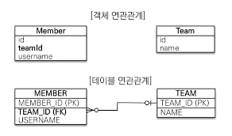

# 챕터5 연관 관계 매핑

> 페러다임 불일치를 설명할 때 말했듯이, 객체와 테이블은 연관 관계의 매핑을 할 때 다른 점이 있다.
>
> 이번 챕터는 객체의 참조와 테이블의 외래 키를 매핑하는 것이 목적이다.

## 단방향 연관 관계

테이블의 구조

- 회원과 팀 테이블이 있다.

- 회원은 하나의 팀에만 속할 수 있다.

- 하나의 팀에는 여러 회원들이 올 수 있다.

  > 일대다 관계



- 객체 연관관계

  회원 객체는 Member의 team 필드로 팀 객체와 관계를 갖는다.

  회원 객체와 팀 객체는 **단방향 관계**다.

  즉, Member가 있으면 Team을 알 수 있지만 Team이 있다고 해서 Member를 알 수 없다.

- 테이블 연관관계

  회원 테이블은 MEMBER의 TEAM_ID를 통해 관계를 갖는다.

  회원 테이블과 팀 테이블은 **양방향 관계**이다.

  > 테이블은 기본적으로 양방향 관계를 갖는다.

  즉, TEAM_ID가 있으면 MEMBER들과 TEAM 모두 찾을 수 있다.

이러한 차이로 인해서 우리는 **객체를 양방향 관계로 만들어 준다.**

> 참조를 통해 연관 관계를 참조하고, 참조하고, 참조할 수 있는데 이걸 **객체 그래프 탐색** 이라고 한다.

Team과 Member 엔티티를 JPA의 Join을 통해 연관관계를 만들어 주면 아래와 같은 형태가 된다.

> 해당 코드는 Member -> Team으로 단방향 매핑이다.

``` java
@Getter
@Builder
@Entity
public class Member {
    @Id
    @Column(name="MEMBER_ID")
    private String id;
    
    private String username;
    
    // 연관관계 부분
    @ManyToOne
    @JoinColumn(name="TEAM_ID")
    private Team team;
}
```

``` java
@Getter
@Builder
@Entity
public class Team {
    @Id
    @Column(name="TEAM_ID")
    private String id;
    
    private String name;
}
```

##### @ManyToOne

다대일 관계라는 뜻 이다.

이렇게 **다중성을 나타내는 어노테이션은 필수**다.

| 속성         | 기능                                                         | 기본값                                               |
| ------------ | ------------------------------------------------------------ | ---------------------------------------------------- |
| optional     | 연관된 엔티티가 없어도 되는지 여부<br />true면 연관된 엔티티가 없어도 된다. | true                                                 |
| fetch        | 글로벌 페치 전략 설정                                        | @ManyToOne 에서는 EAGER,<br />@OneToMany 에서는 LAZY |
| cascade      | 영속성 전이 기능                                             |                                                      |
| targetEntity | 연관된 엔티티 타입 정보 설정. 거의 사용하지 않음.            |                                                      |

##### @JoinColumn

외래 키를 매핑 시킬 때 사용된다.

| 속성                                                         | 설명                                                         | 기본값                             |
| ------------------------------------------------------------ | ------------------------------------------------------------ | ---------------------------------- |
| name                                                         | 매핑할 외래 키의 이름<br />즉, **매핑될 테이블의 PK**        | 필드명_참조테이블의 기본 키 컬럼명 |
| referencedColumnName                                         | 외래 키가 참조하는 대상 테이블의 컬럼명<br />**참조하는 테이블의 PK가 아닌 다른 컬럼과 매핑시키고 싶을 때 사용**한다. | 참조하는 테이블의 기본 키 컬럼명   |
| foreignKey                                                   | 외래 키 제약 조건을 지정한다.                                |                                    |
| unique<br />nullable<br />insertable<br />updatable<br />columnDefinition<br />table | @Column과 같은 효과다.                                       |                                    |

`@JoinColumn` 을 생략하면 기본 전략으로 **자동으로 외래 키를 찾는다.**

> 필드_참조테이블 PK
>
> team_TEAM_ID와 같은 형태이다.

referencedColumnName을 생략하면 **참조 테이블의 PK를 매핑시켜 준다.**

그러므로 다른 컬럼과 매핑시키고 싶다면 꼭 설정해 주어야 한다.

`@JoinColumn`은 생략할 수 있다.

### 연관 관계의 JPQL

연관 관계가 있는 엔티티는 2가지 방법으로 조회할 수 있다

- 객체 그래프 탐색
- 객체지향 쿼리 _(JPQL)_

우선 JPQL에서 연관 관계를 어떤 방식으로 사용하는지 알아본다.

#### 조회

JPQL은 JOIN을 지원하기 때문에 SELECT 시에 JOIN으로 가져온다.

> FetchType.LAZY인 경우에는 SELECT 시에 JOIN을 실행하지 않고 실제 객체가 사용될 때 쿼리가 실행된다.

Member 테이블을 조회하는 경우엔 다음과 같은 JPQL이 발생한다.

``` sql
select m from Member m
	join m.team t
	where t.name=:teamName
```

> :teamName은 파라미터를 바인딩 받는 문법이다.
>
> 쉽게 말해서, 내가 넘겨준 값이 :teamName 대신 들어간다.

#### 삭제

Member 객체의 team을 null로 바꾸면 연관 관계가 끊어지게 된다.

엔티티를 삭제하기 위해선 연관 관계를 먼저 제거하고 삭제해야 한다.

> 외래 키 제약 조건에 의해 DB에 오류가 발생한다.
>
> team_id에 매핑되는 team 테이블이 없기 때문이다.

즉, 연결된 모든 member 객체에서 team을 null로 바꾼 후에 team을 삭제할 수 있다.

``` java
member1.setTeam(null);
member2.setTeam(null);
.
.
.
em.remove(team)
```

## 양방향 연관 관계

지금까진 Member 객체에서 Team 으로만 접근할 수 있는 단방향 매핑을 사용했다.

단방향 연결이기 때문에, **Member는 자신의 Team을 찾을 수 있었지만 Team은 자신에게 속한 Member를 찾을 수 없었다.**

그렇기 때문에 양방향 연관 관계를 사용한다.

> 양방향 연관 관계를 이용한다 해서 DB에 변화가 생기는건 아니다.
>
> 원래 DB는 양방향 연관 관계를 가지기 때문이다.

양방향 연관 관계를 위해 Team 엔티티를 수정해야 한다.

> Member 엔티티는 똑같이 둬도 괜찮다.

``` java
@Getter
@Builder
@Entity
public class Team {
    
    @Id
    @Column(name="TEAM_ID")
    private String id;
    
    private String name;
    
    @OneToMany(mappedBy = "team")
    private List<Member> members = new ArrayList<Member>();
    
}
```

`@OneToMany`는 `@ManyToOne`과 반대로, 일대다 관계를 매핑시키는 어노테이션 이다.

또한 하나의 팀에는 여러 멤버가 올 수 있기 때문에 List\<Member> 를 사용했다.

mappedBy 속성은 반대쪽  매핑의 필드 이름 즉 team을 주면 된다.

#### 연관 관계의 주인

연관 관계에는 규칙이 있는데, 두 연관 관계 중 하나를 주인으로 삼아야 한다.

즉, 연관 관계는 **하나의 master - slave 구조를 가지게 된다.**

**연관 관계의 주인만 DB의 연관 관계와 매핑되고 외래 키를 관리할 수 있다.**

반대로, **slave 쪽은 읽기만 가능하다.**

> FK를 수정/삭제/삽입 하는게 불가능 하다.
>
> 즉, Team은 Member의 team 컬럼을 수정할 수 없다.

- 주인은 mappedBy를 사용하지 않고, slave 쪽에서 사용하게 된다.

- **주인이 아니면 mappedBy 속성을 통해 값으로 연관 관계의 주인을 지정**한다.

  > 자신과 매핑될 주인 테이블을 명시한다.
  >
  > 즉 slave 라는 것을 명시한다.

> 쉽게 말해서 외래 키 관리자를 선택하는 것이다.

**연관 관계의 주인은 외래 키를 가지고 있는 엔티티 이다.**

**`mappedBy`는 주인이 자신을 가르키는 참조 필드의 이름을 명시한다.**

> 즉, 우리의 경우에는 Member 객체에는 Team 이라는 필드가 있고, 스네이크 기법으로 Team을 쓰면 team이 되기 때문에 `mappedBy = "team"`을 쓴다.

`mappedBy`는 연관 관계의 slave 쪽에서 사용하게 되는데, **`@ManyToOne`은 항상 master 이기 때문에 `mappedBy`를 사용할 수 없다.**

#### 양방향 연관 관계 주의점

##### 주인 FK 수정

우선 안좋은 예제를 보자

``` java
team.getMembers().add(member);
team.getMembers().add(member1);
```

위 코드는 team의 member에 member 객체를 추가하는 것이다.

언뜻 보면 가능해 보이지만, member에서 team_id를 보면 null이 입력된다.

이유는 간단하다. 위에서 말했듯이 **연관 관계의 주인만 외래 키의 값을 입력할 수 있다.**

하지만 위 예제에선 team 즉 연관 관계의 자식쪽 에서 member의 team_id를 수정하려 했다.

> 우리는 연관 관계의 slave인 team 에는 members에 값을 저장했다.
>
> 하지만 정작 연관 관계의 주인에게선 변경하지 않았기 때문에 null이 들어간다.

그렇기 때문에 team에서 member를 추가하는 것이 아니라, member에서 team을 참조하도록 해야한다.

``` java
member.setTeam(team);
member1.setTeam(team);
```

##### 양방향 관계 객체

위 문제만 잘 생각하면 다른 문제는 발생하지 않을 것 같지만, 다른 문제도 있다.

우선 아래쪽의 코드를 보고 생각하자

``` java
Team team = new Team("team1", "팀");
Member memeber1 = new Member("Member1", 회원1);
Member memeber2 = new Member("Member2", 회원2);

member1.setTeam(team);
member2.setTeam(team);

System.out.println(team.getMembers.size());
```

위 코드에서 우리가 바라는 결과는 2 였지만, 결과는 0이다.

- JPA를 사용중 이라면 member 객체를 수정한 후에 트랜잭션을 끝낸다.

- JPA를 사용하고 있지 않다면 team 객체 에서도 members에 member 들을 추가한다.

  > 즉, 양방향으로 수정시켜 준다.

만약 team 객체에서 member를 수정한다 하더라도, 객체 그래프 탐색에서만 사용되고 실제로 저장되진 않는다.

> team에서 members 라는 필드는 애초에 저장되지 않는다.

**그냥 Repository를 사용하도록 하자**

> Repository를 사용하면 이런 일을 겪지 않는다.