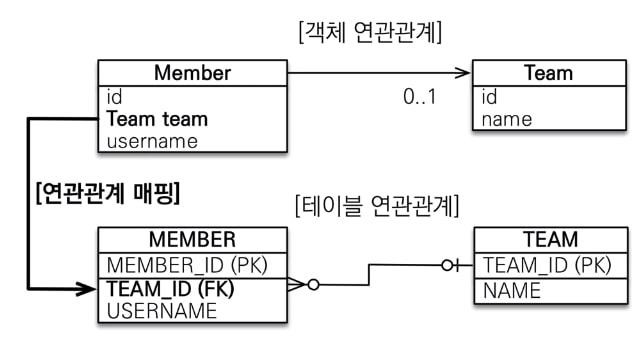
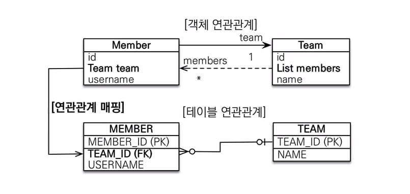
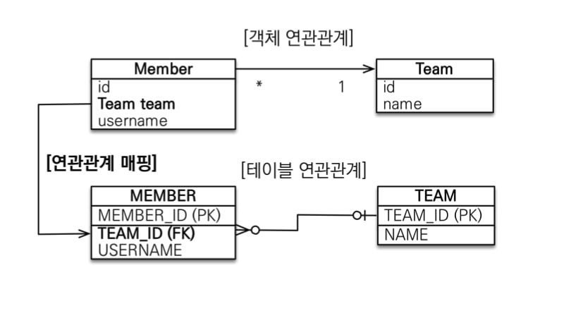
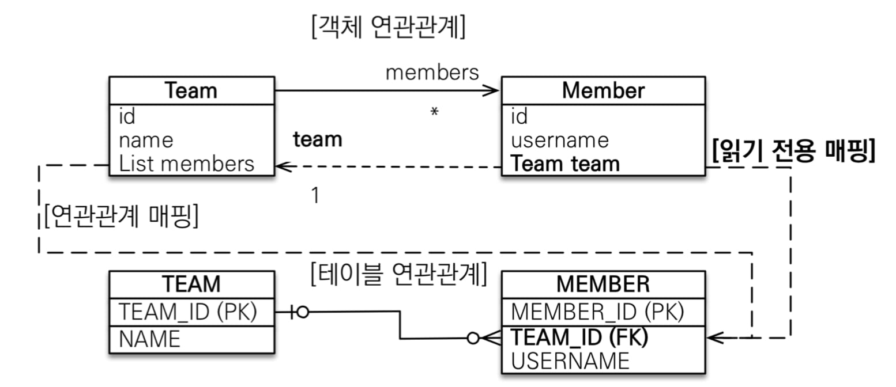
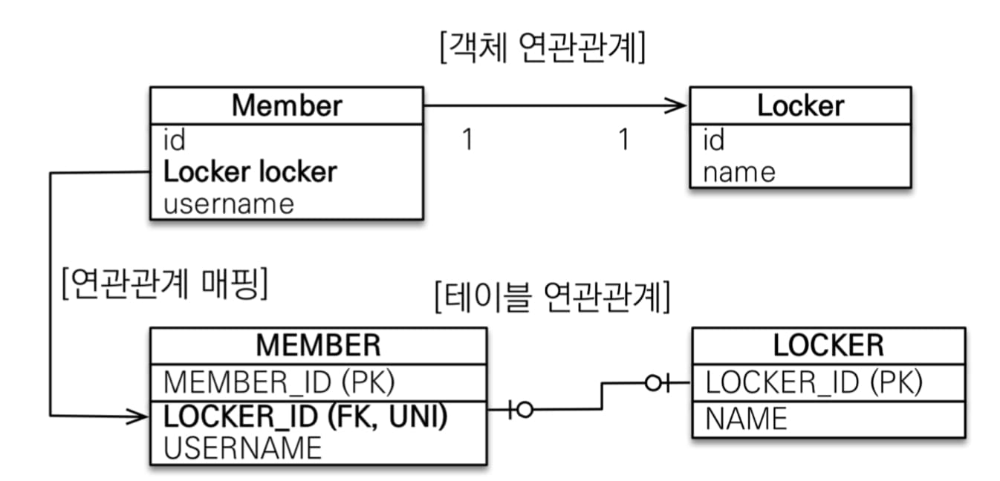
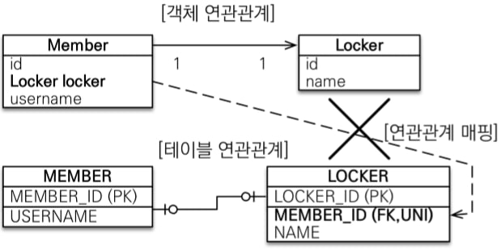
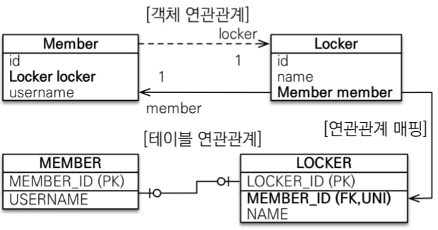
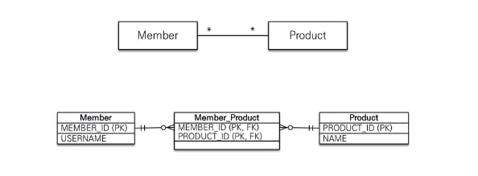

# 챕터6 다양한 연관관계 매핑

### 연관관계 소개

##### 연관관계에서 조심할 것

- 다중성

  어떤 관계를 갖는지에 대해 고민해야 한다.

  > 다대일, 일대일과 같은 관계를 정의한다.

- 단방향, 양방향

  단방향으로 매핑할지, 양방향으로 매핑할 지에 대해 고민해야 한다.

  > 웬만하면 양방향이 추천된다.

- 연관관계의 주인

  연관관계의 **master와 slave를 명확하게** 생각해 두어야 한다.

  > 외래 키를 어느 테이블에서 가지고 있는지 고민해야 한다.

##### 다중성

연관관계에는 일대다/다대일만 있는게 아니다.

- 다대일(`@ManyToOne`)
- 일대다(`@OneToMany`)
- 일대일(`@OneToOne`)
- 다대다(`@ManyToMany`)

> 판단이 어려울 때엔 반대에서 생각하면 된다.

##### 연관관계의 주인

JPA는 두 객체 연관관계 중 하나를 정해서 외래 키를 관리한다.

이 중 외래 키를 관리하는 객체를 **연관 관계의 주인** 이라고 한다.

> master - slave 구조를 가지게 된다

### 다대일

> 다대일 관계에서 반대는 항상 일대다 관계이고, 반대 방향은 항상 다대일 이다.

객체의 양방향 관계에서 연관관계의 주인은 항상 다쪽이다.

즉, **1:N 관계에서 N쪽 객체가 키를 관리**한다는 의미이다.

#### 다대일 단방향

다대일 관계는 아래와 같은 형태를 말한다.



다대일 단방향 관계란 외래 키를 관리하는 객체 즉 **Member쪽에서 team 객체를 참조하는 형태**를 가진다.

> 그렇기 때문에 Team 객체에선 매핑되지 않는다.
>
> 즉, 변화가 없다.

```java
@Entity
public class Member {
    @Id
    @GeneratedValue
    @Column(name="MEMBER_ID")
    private Long id;
    
    private String username;
    
    @ManyToOne
    @JoinColumn(name="team_id")	// 반대쪽 테이블의 PK 필드 이름
    private Team team;
}
```

#### 다대일 양방향

단방향 매핑은 객체 그래프 탐색에서 불리하게 작용한다.



> 실선이 연관관계의 주인, 점선이 자식이다.

실제 코드는 아래와 같다.

``` java
@Entity
public class Member {
    @Id
    @GeneratedValue
    @Column(name="MEMBER_ID")
    private Long id;
    
    private STring username;
    
    @ManyToOne
    @JoinColumn(name="team_id")
    private Team team;
}
```

``` java
@Entity
public class Team {
    @Id
    @GeneratedValue
    @Column(name="TEAM_ID")
    private Long id;
    
    private String name;
    
    @OneToMany(mappedBy="team")
    private List<Member> members = new ArrayList<Member>();
}
```

> Collection 타입을 초기화 해 주었는데, **Collection은 초기화 해주는게 좋다**.
>
> 하지만 만약 `@Builder` 어노테이션을 사용했다면, 초기화 하지 않아도 된다.
>
> - 초기화 한다 해도, 초기화 부분을 무시한다.

여기서 Team. 즉, **연관관계의 주인이 아닌 쪽에서는 객체 그래프 탐색이나 조회 JPQL에서만 사용된다.**

### 일대다

~~**안쓴다.**~~

#### 단방향

일다대 관계는 다대일 관계의 반대 방향이다.

일대다 관계는 엔티티를 여러개를 가지기 때문에 Collection 프레임워크를 사용해야 한다.

> 일대다와 다대일은 같은 것 이라고 말할수도 있다. 하지만 이 책에서는 관계의 주인쪽을 왼쪽에 두었을 때를 가정한다.
>
> 즉 일대다 관계란 **연관관계의 주인이 `일` 쪽인 것을 의미한다.**

> **일대다 매핑은 추천되지 않는다.** 이유는 밑에서 설명한다.

일대다 단방향 관계매핑은 JPA 2.0부터 지원된다. 늦게 추가된 만큼 크게 필요하지 않다는 의미이다.



이렇듯 Team 객체가 MEMBER 테이블을 관리하는 특이한 형태를 가진다.

> DB쪽은 언제나 그렇듯 다 쪽에서 FK를 관리한다.

이렇게 사용하게 되면, Team의 members에 member가 추가되면, **MEMBER 테이블이 저장된 후에 UPDATE가 따로 발생**하게 된다.

아래와 같은 순서로 진행된다.

1. Team과 Member 객체가 생성된다.

2. team 객체에서 add 메소드를 통해 members에 Member 객체를 추가한다.

3. member 객체들을 영속화 한다.

   > SQL 저장소에 INSERT 쿼리가 쌓인다.

4. 그 후에 Team 객체가 영속화 된다.

5. Team 객체가 영속화 될 때, MEMBER 테이블의 TEAM_ID를 UPDATE 하는 쿼리가 발생한다.

UPDATE 쿼리가 발생하는 이유는 Member 엔티티는 Team을 모르기 때문에, INSERT 될 때에 TEAM_ID 컬럼에는 NULL이 저장된다.

그 후에 Team 객체가 INSERT 된 후에야 MEMBER 테이블의 TEAM_ID를 수정해서 관계를 맺게 된다.

**꼭 `@JoinColumn` 어노테이션을 사용해야 한다.**

여기서는 기본적으로 `@JoinColumn`을 사용하지 않으면 `@JoinTable`이 기본값으로 들어가기 때문이다.

> 평소에는 생략해도 된다.
>
> 하지만 생략하지 않는게 좋다.

#### 양방향

**일대다 양방향 매핑은 존재하지 않는다.**
일대다 양방향 매핑에서 @OneToMany는 연관관계의 주인이 될 수 없기 때문에 `mappedBy` 속성이 존재하지 않는다.

> DB의 특성상 항상 다(N)쪽에 외래 키가 있기 때문이다.

방법이 아예 없는 것은 아니다.



위와 같이 Team - Member 객체를 양방향으로 매핑하고, Member는 읽기 전용으로 관계를 맺었다.

양방향 같지만 일대다 관계매핑을 양쪽에서 했을 뿐이다. 그렇기 때문에 **일대다 관계매핑의 단점을 그대로 가진다.**

> 그냥 다대일 양방향 매핑을 사용하자.

### 일대일

일대일 관계는 서로 하나의 관계만 가진다.

일대일 관계는 몇가지 특징을 가진다.

- 일대일 관계의 반대는 일대일 관계다.

- 어느쪽이든 외래 키를 가질 수 있다.

  > 원래는 다(N)쪽에서 가져야 하지만, 일대일 관계이기 때문에 어느쪽에서 가지든 상관 없다.
  >
  > 어차피 테이블은 외래 키 하나로 양쪽을 조회할 수 있기 때문이다.

- 외래 키를 가질 테이블을 정해야 한다.

  > 어느 쪽에서 가지든 상관 없기 때문에, 우리는 어디에서 사용할지 고민해 보아야 한다.

  - 주 테이블에서 FK를 가지기

    주 객체가 대상 객체를 참조하는 것 처럼 사용할 수 있기 때문에, 객체 지향과 비슷하게 사용할 수 있다.

    그렇기 때문에 객체 지향 개발자가 좋아한다.

    주 테이블만 확인해도 대상 테이블과 관계가 있는지 알 수 있다.

  - 대상 테이블에서 FK를 가지기

    1:1 관계에서 1:N 관계로 변경되어도 테이블 구조가 유지된다.

    > 결국 연관 관계의 자식 쪽에서 FK를 가지고 있기 때문이다.

    그렇기 때문에 전통적인 DB 개발자들이 선호한다.

#### 주 테이블에서 외래 키

##### 단방향

일대일 단방향 매핑은 아래와 같은 관계를 가진다.



Member 객체의 Locker가 MEMBER 테이블의 LOCKER_ID와 관계를 가지는 형태이다.

> 일대일 관계이기 때문에 하나의 MEMBER는 하나의 LOCKER만 가지게 되고, 해당 LOCKER는 하나의 MEMBER만 가지게 된다.
>
> 즉, **LOCKER_ID가 UNIQUE 하다**는 의미다.

코드는 아래와 같이 사용할 수 있다.

``` java
@Entity
public class Member {
    @Id
    @GeneratedValue
    @Column(name="MEMBER_ID")
    private Long id;
    
    private String username;
    
    @OneToOne
    @JoinColumn(name="LOCKER_ID")
    private Locker locker;
}
```

``` java
@Entity
public class Locker {
    @Id
    @GeneratedValue
    @Column(name="LOCKER_ID")
    private Long id;
    
    private String name;
}
```

> 다대일 단방향과 매우 비슷하다.

##### 양방향


위와 같이 Member 객체는 Locker와 양방향 관계를 가진다.

여기서는 일대일 관계이기 때문에 연관관계의 주인을 정해야 하는데, 여기서는 MEMBER 테이블이 외래 키를 가지기 때문에 Member 객체가 연관 관계의 주인이다.

그렇기 때문에 Locker 클래스에는 `mappedBy` 속성을 추가해 준다.

코드는 아래와 같다.

``` java
@Entity
public class Member {
    @Id
    @GeneratedValue
    @Column(name="MEMBER_ID")
    private Long id;
    
    private String username;
    
    @OneToOne
    @JoinColumn(name="LOCKER_ID")
    private Locker locker;
}
```

``` java
@Entity
public class Locker {
    @Id
    @GeneratedValue
    @Column(name="LOCKER_ID")
    private Long id;
    
    private String name;
    
    @OneToOne(mappedBy="locker")
    private Member member;
}
```

> 일대일 단방향에서 Locker 클래스에 Member 객체만 추가되었다.

#### 대상 테이블에 외래 키

##### 단방향

결론부터 말하면, **불가능하다.**



일대일 단방향은 이런 모습으로 매핑할수도, 표현할수도 없다.

연관관계의 주인을 바꾸거나 양방향 매핑을 해야 한다.

##### 양방향



주 테이블이 외래 키를 가지는 형태의 양방향 매핑에서 연관관계의 주인만 바꿔주면 된다.

> Locker.member는 지연 로딩으로 설정할 수 있지만, Member.locker는 지연로딩이 불가능 하다.
>
> 프록시의 한계에 의해 발생하는데, 프록시와 지연로딩은 8장을 참고하면 된다.

### 다대다

관계형 데이터베이스는 **정규화된 테이블 두개로 다대다를 표현할 수 없다.**

그래서 보통 다대다 관계를 위한 테이블을 추가해서 해결한다.

`@ManyToMany`를 이용해서 보다 쉽게 해결할 수 있다.

> 참고로 `@ManyToMany`를 이용하는 것 보단 따로 엔티티를 만드는게 추천된다.

#### 단방향

코드를 먼저 보면, 아래와 같은 엔티티가 생긴다.

``` java
@Entity
public class Member {
    @Id
    @Column(name="MEMBER_ID")
    private String id;
    
    private String username;
    
    @ManyToMany
    @JoinTable(name="MEMBER_PRODUCT",
               joinColumns = @JoinColumn(name="MEMBER_ID"),
               inverseJoinColumns = @JoinColumn(name = "PRODUCT_ID"))
    private List<Product> products;
}
```

``` java
@Entity
public class Product {
    @Id
    @Column(name="PRODUCT_ID")
    private String id;
    
    private String name;
}
```

> 참고로 PK 필드가 Long에서 String으로 바뀌었다.

익숙하지 않은 형태의 엔티티인데, 생각보다 단순하다.

##### @JoinTable

JPA에서 JOIN을 하는 방법중 하나이다.

> **`@JoinColumn`은 외래 키 컬럼을 통해 매핑**하고, **`@JoinTable`은 매핑를 위한 테이블을 따로 생성**한다.

| 속성               | 설명                                             |
| ------------------ | ------------------------------------------------ |
| name               | 연결시켜줄 테이블을 지정한다.                    |
| joinColumns        | 현재 방향인 Member와 매핑할 조인 컬럼 정보 지정. |
| inverseJoinColumns | 반대 방향인 Product와 매핑할 조인 컬럼 지정      |

위 엔티티는 아래와 같이 매핑된다.



자동으로 Member_Product 라는 이름의 테이블을 생성해 준다.

예제에서 볼 수 있듯이 **joinColumns와 inverseJoinColumns로 지정한 컬럼들로 테이블이 생성되고, 해당 테이블로 다대다 관계 매핑매핑을 한다.**

이런식으로 하면 다대다 **매핑 테이블을 신경쓰지 않아도 되기 때문에 간편**하다.

이해하기 쉽게 아래 예제를 보자

``` java
Product product = new Product();
product.setId("productA");
productA.setName("상품A");
em.persist(productA);

Member member = new Member();
member.setId("member1");
member.setUsername("회원1");
member.getProducts().add(productA);
em.persist(member);
```

위와 같은 코드를 사용하면 아래와 같은 SQL이 실행된다.

``` sql
INSERT INTO PRODUCT ...;
INSERT INTO MEMBER ...;
INSERT INTO MEMBER_PRODUCT ...;
```

자세한 값은 알 수 없지만, PRODUCT와 MEMBER 뿐만 아니라 MEMBER_PRODUCT 라는 **자동 생성된 테이블에도 자동으로 값이 들어가는 것**을 확인할 수 있다.

만약 member.getProducts();를 호출하면 아래와 같은 SQL이 실행된다.

``` sql
SELECT * FROM MEMBER_PRODUCT MP
	INNER JOIN PRODUCT P ON MP.PRODUCT_ID = P.PRODUCT_ID
	WHERE MP.MEMBER_ID = ?;
```

위와 같이 **자동으로 MEMBER_PRODUCT와 PRODUCT를 JOIN 해서 SELECT 문을 실행**하는 것을 확인할 수 있다.

`@ManyToMany` 어노테이션을 통해 복잡했던 다대다 관계 매핑을 훨씬 편하고 간단하게 사용할 수 있다.

#### 양방향

``` java
@Entity
public class Product {
    
    @Id
    @Column(name = "PRODUCT_ID")
    private String id;
    
    @ManyToMany(mappedBy = "products")
    private List<Member> members;
}
```

> Member 클래스는 같다.

> 연관관계에 객체를 추가할 때 편하게 쓸 메소드를 만들어 두면 편하다.

이렇게 다대다 관계 매핑을 하면 **어느 방향이든 객체 그래프 탐색이 가능하다.**

##### 연결 엔티티 사용

위에서 봤듯이, `@ManyToMany` 어노테이션을 사용하면 훨씬 간편하고 단순해 진다.

하지만 실무에서 사용하기엔 힘들다.

예를 들어, `@ManyToMany` 어노테이션으로 만들어진 MEMBER_PRODUCT 테이블에 컬럼이 FK 외에 ORDERDATE 라는 컬럼이 필요하다면 따로 Entity를 만들어 주어야 한다.

> `@ManyToMany` 에서 생성해 주는 테이블은 따로 컬럼 추가를 할 수 없기 때문이다.

그렇기 때문에 일대다, 다대일 관계로 연결된 MEMBER_PRODUCT 엔티티를 만들어 주어야 한다.

``` java
@Entity
public class Member {
    @Id
    @Column(name="MEMBER_ID")
    private String id;
    
    private String username;
    
    @OneToMany(mappedBy = "member")
    private List<MemberProduct> memberProducts;
}
```

``` java
@Entity
public class Product {
    
    @Id
    @Column(name = "PRODUCT_ID")
    private String id;
    
	@OneToMany(mappedBy = "product")
    private List<MemberProduct> memberProducts;
}
```

> 상품 -> member로 객체 그래프 탐색이 필요하지 않다면 굳이 연관관계를 만들지 않아도 된다.

``` java
@Entity
@IdClass(MemberProductId.class)	// 복합 키를 위한 어노테이션
public class MemberProduct {
    @Id
    @ManyToOne
    @JoinColumn(name = "MEMBER_ID")
    private Member member;
    
    @Id
    @ManyToOne
    @JoinColumn(name = "PRODUCT_ID")
    private Product product;
    
    private int orderAmount;		// 이런식으로 따로 컬럼이 없다면 @ManyToMany를 사용해도 된다.
}
```

``` java
public class MemberProductId implements Serializable {	// 복합 키를 위한 클래스는 Serializable을 implement 해야 한다.
    
    private String member;
    private String product;
    
    // hashCode and equals 메소드
    // Lombok의 @EqualsAndHashCode를 사용해도 좋다.
}
```

외래 키를 가지고 있는 MemberProduct 객체가 연관관계의 주인이다.

MemberProduct 엔티티를 보면 FK이자 PK로 구성되어 있다.

> 복합 키로 구성되어 있는데, 복합 키에 관한 자세한 내용은 뒤에서 나온다.

이렇게 다른 테이블과 관계를 맺으면서, 해당 테이블의 기본 키를 자신의 기본 키로 사용하는 것을 **식별 관계** 라고 한다.

##### 대리 키 사용

복합 키는 너무 복잡하기 때문에, 대리 키를 사용하는걸 추천한다.

그러면 대리 키를 사용한 코드로 엔티티를 고쳐주어야 한다.

``` java
@Entity
public class Order {
    @Id
    @GeneratedValue
    @Column(name = "ORDER_ID")
    private Long id;
    
    @Id
    @ManyToOne
    @JoinColumn(name = "PRODUCT_ID")
    private Product product;
    
    private int orderAmount;
    
}
```

이런 식으로 하면 굳이 id 클래스를 만들 필요도 없어서 **훨씬 간단**하다.