# 챕터7 고급 매핑

### 상속 관계 매핑

관계형 데이터베이스는 상속이라는 개념이 없다.

하지만 비슷한 개념으로 **슈퍼타입 - 서브타입 관계(Super-Type Sub-Type Relationship)** 라는게 있다.

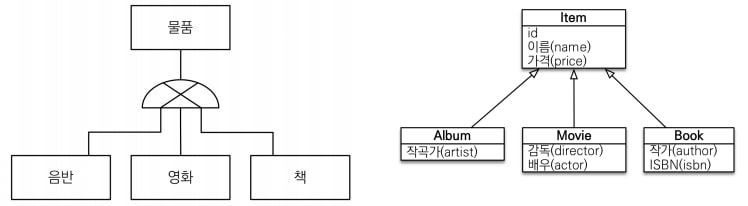

#### 슈퍼타입 서브타입 관계

간단하게 말하자면, 위 그림처럼 **하나의 테이블이 다른 여러 테이블이 공통으로 가지는 속성**을 가지고있을 때, 상속과 비슷하게 **하나의 테이블에서 겹치는 속성을 관리하는 것을 말한다.**

이러한 관계가 객체의 상속과 가장 비슷한 형태인데, 저런 형태의 테이블과 객체는 3가지 방법으로 구현할 수 있다.

#### 조인 전략으로 구현

조인 전략은 위 그림의 엔티티 하나 하나를 **모두 테이블로 만들고**, 자식이 **부모 테이블의 PK를 받아서 PK + 외래 키로 사용하는 전략**이다.

하지만, 객체는 타입으로 구분이 가능하지만 **테이블은 타입의 개념이 없다.**

그렇기 때문에 **타입을 구분하는 컬럼을 추가**하고, 타입에 따라서 다르게 JOIN하면 된다.

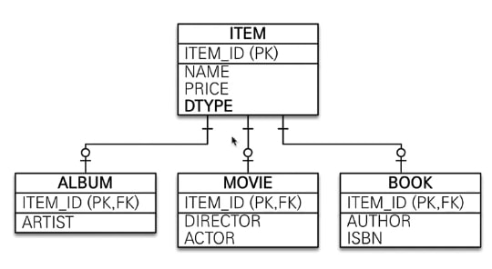

DTYPE이란 컬럼을 통해 어느 테이블과 매핑될지 정하고, 매핑될 테이블과 연결시켜 주는 형태이다.

엔티티 코드로 보면 아래와 같다.

``` java
@Entity
@Inheritance(strategy = InheritanceType.JOINED)
@DiscriminatorColumn(name = "DTYPE")
public abstract class Item {
    @Id
    @GeneratedValue
    @Column(name = "ITEM_ID")
    private Long id;
    
    private String name;
    
    private int price;
}
```

``` java
@Entity
@DiscriminatorValue("A")
public class Album extends Item {
    private String artist;
}
```

``` java
@Entity
@DiscriminatorValue("M")
public class Movie extends Item {
    private String director;
    private String actor;
}
```

우선 코드 설명은 아래와 같다.

- `@Inheritance(strategy = InheritanceType.JOINED)`

  해당 어노테이션은 부모 클래스에 **상속 매핑이라고 명시**하는 어노테이션이다.

  슈퍼타입 - 서브타입 관계를 구현할 때에 부모 클래스에 항상 써 주어야 하는 어노테이션이다.

  > 여기선 JOIN 방법을 사용했기 때문에 JOINED로 설정했다.

- `DiscriminatorColumn(name="DTYPE")`

  부모 클래스에서 자식을 구분할 컬럼을 지정한다.

  이 컬럼으로 **어떤 테이블과 매핑될지 구분**할 수 있다.

  > 아까 말했듯이 테이블은 객체와 달리 타입이 없어서 구분할 수 없다.

  > 기본값은 "DTYPE"이다.

- `@DiscriminatorValue()`

  위 어노테이션은 **DTYPE에 어느 값이 있을 때 자신과 매핑될 것인지 지정**할 수 있다.

  만약 DTYPE에 M이 저장되어 있다면, `@DiscriminatorValue("M")`이라는 어노테이션이 붙어있는 테이블과 매핑된다.

##### JOIN 전략의 장점

- 테이블이 정규화 된다.

- 저장공간을 효율적으로 사용한다.

- 외래 키 참조 무결성 제약 조건을 활용할 수 있다.

  > 참조 무결성이란 **외래 키는 참조할 수 없는 값을 가질 수 없는 것**으로, 데이터베이스의 무결성 제약 조건중 하나이다.
  >
  > 즉, member와 team이 FK로 연결되어 있을 때, member의 FK 값을 team에서 찾았을 때, 꼭 있어야 된다는 의미이다.
  >
  > 다른 무결성 제약 조건은 다음과 같다.
  >
  > - 개체 무결성
  >
  >   **PK는 null값을 가질 수 없다.**
  >
  > - 참조 무결성
  >
  >   위에서 설명했다.
  >
  > - 도메인 무결성
  >
  >   **특정 속성 값은 그 속성이 정의된 도메인에 속한 값 이어야 한다.**
  >
  >   쉽게 말해서, 테이블을 만들 때 원했던 값 외에는 오면 안된다는 의미다.
  >
  >   NULL이면 안되는 속성에 NULL이 오거나, 주민등록번호에 알파벳이 오는 등의 상황이 도메인 무결성이 깨진다고 할 수 있다.
  >
  > - null 무결성
  >
  >   **특정 속성 값에 null을 가질 수 없다는 규칙**
  >
  >   단순히 NOT NULL이 필요한 속성엔 NOT NULL을 붙이라는 의미다.
  >
  > - 고유 무결성
  >
  >   **특정 속성 값은 서로 달라야 한다.**
  >
  >   쉽게 말하면 하나에 저장된 데이터중 완전히 똑같은 데이터가 있으면 안된다는 의미이다.
  >
  >   자기소개나 이름과 같은 경우에는 겹칠수도 있지만, 모두 겹치는 경우는 없어야 한다.

##### JOIN전략의 단점

- 조회할 때 JOIN이 많이 발생하기 때문에 성능이 저하된다.

- 조회 쿼리가 복잡하다.

- 데이터 INSERT 시에 INSERT QUERY가 두번 발생한다.

  > 부모 테이블과 자식 테이블 모두에 저장되기 때문이다.`

#### 단일 테이블 전략

테이블 하나만 사용하는 전략이다.

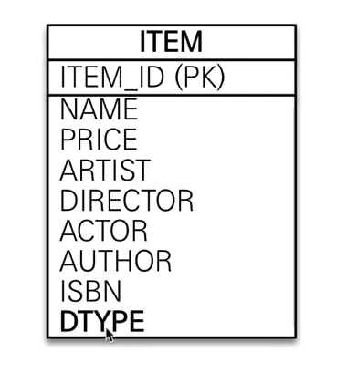

``` java
@Entity
@Inheritance(strategy = InheritanceType.SINGLE_TABLE)
@DiscriminatorColumn(name = "DTYPE")
public abstract class Item {
    @Id
    @GeneratedValue
    @Column(name = "ITEM_ID")
    private Long id;
    
    private String name;
    
    private int price;
}
```

> 다른 엔티티는 건드릴 필요가 없다.

단순히 InheritanceType을 바꾸어 주면 JPA가 알아서 바꿔준다.

이제 JPA는 DDL 생성 시에, ITEM 이란 테이블에서 모든 속성들을 수합해서 하나의 테이블로 만들어 준다.

##### 단일 테이블 전략의 장점

- JOIN이 발생하지 않아서 일반적으로 **가장 빠르다**
- **조회 쿼리가 단순**하다.

##### 단일 테이블 전략의 단점

- **NULL 값을 허용해야 한다.**

  만약 ARTIST로 저장하고 싶다면 다른 DIRECTOR이나 ACTOR과 같은 속성은 NULL이 들어가야 한다.

- 단일 테이블에 모두 저장하기 때문에, 테이블이 커질 수 있다. 따라서 **오히려 느려질 수 있다**.

### 구현 클래스마다 테이블 전략

말 그대로 **구현 클래스마다 테이블을 만든다.**

우선 코드부터 확인하면, InheritanceType 외에도 `@DiscriminatorColumn(name = "DTYPE")`이 사라진걸 확인할 수 있다.

따로 컬럼을 만들어서 구분할 필요가 없기 때문이다.

또한 구분을 위해 사용되던 `@DiscriminatorValue()`도 사라졌다.

``` java
@Entity
@Inheritance(strategy = InheritanceType.TABLE_PER_CLASS)
public abstract class Item {
    @Id
    @GeneratedValue
    @Column(name = "ITEM_ID")
    private Long id;
    
    private String name;
    
    private int price;
}
```

``` java
@Entity
public class Album extends Item {
    private String artist;
}
```

``` java
@Entity
public class Movie extends Item {
    private String name;
    
    private String actor;
}
```


이런식으로 만들면 아래와 같은 테이블 구조를 갖는다.

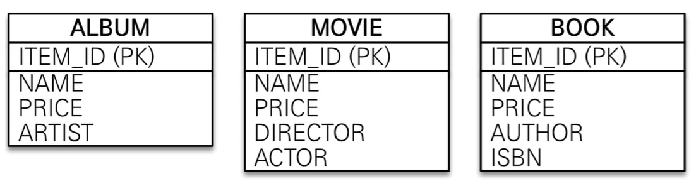

이런 식으로 **Item 테이블는 생성되지 않고, ITEM의 속성들을 가지고 있는 3개의 엔티티가 생긴다.**

##### 구현 클래스마다 테이블 전략 장점

- **NOT NULL 제약 조건을 사용할 수 있다.**
- 서브 타입을 구분하여 처리할 때 좋다.

##### 구현 클래스마다 테이블 전략 단점

- **여러 테이블을 함께 조회할 때 느리다.**

  UNION을 사용해야 한다.

- 자식 테이블을 통합해서 **쿼리를 작성하기 힘들다.**

> 이 전략은 ORM 전문가, 데이터베이스 설계자 **모두 추천하지 않는 방법이다.**
>
> 웬만하면 조인이나 단일 테이블 전략을 사용하자.

### @MappedSuperclass

상속 관계 매핑에선 **부모 클래스와 자식 클래스 모두 DB의 테이블과 매핑되었다.**

하지만 자식 클래스에게 매핑 정보만 제공하고 싶다면 `@MappedSuperclass` 어노테이션을 사용하면 된다.

> **`@MappedSuperclass`는 실제 테이블과 매핑되지 않는다.**
>
> 즉 그냥 필드 선언의 중복을 줄이기 위해 따로 빼내는 것이다.

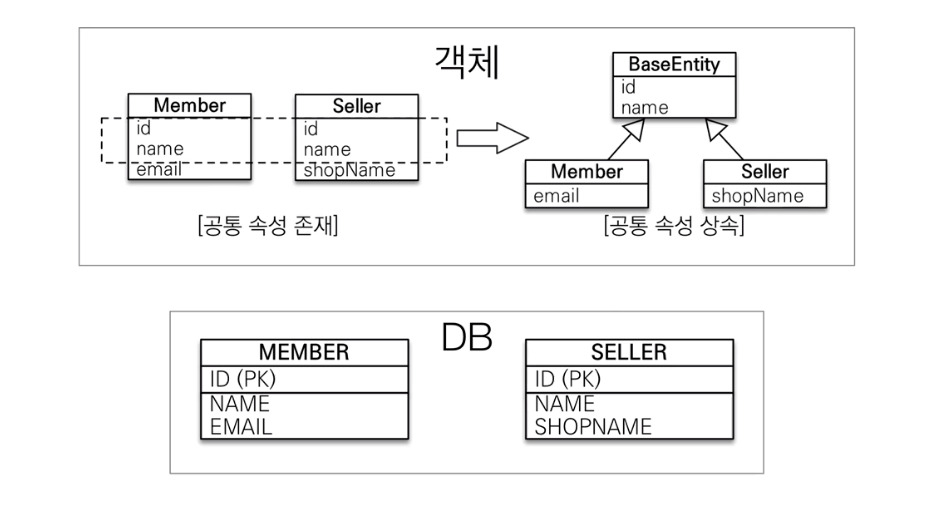

위 그림과 같이 **공통된 속성이 있다면, 계속해서 중복해서 선언해 주어야 한다.**

id나 생성일 같은 경우에는 계속해서 사용될 가능성이 높다. 그렇기 때문에 따로 부모 클래스로 구현하고 상속하는 것이 훨씬 깔끔하다.

``` java
@MappedSuperclass
public abstract class BaseEntity {
    @Id
    @GeneratedValue
    private Long id;
    
    private String name;
}
```

``` java
@Entity
public class Member extends BaseEntity {
    // id와 name이 상속된다.
    private String email;
}
```

``` java
@Entity
public class Seller extends BaseEntity {
    // id와 name이 상속된다.
    private String shopName;
}
```

위와 같은 형태에서 Member 엔티티는 email 밖에 없는듯 하지만, 실제로는 **id, name, email 속성을 갖게 된다.**

> 따로 **BaseEntity 테이블은 생성되지 않고 무시된다.**

#### 부모의 속성 재정의

부모의 속성 재정의는 `@AttributeOverride` 어노테이션을 사용하면 된다.

실제 코드로 보자

``` java
@Entity
@AttributeOverride(name = "name", column = @Column(name = "sirname", nullable = true))
public class Member extends BaseEntity {
    private String email;
}
```

이런 식으로 사용하면 name 이라는 이름의 속성을 sirname 이라는 이름의 nullable 필드로 변경해 준다.

여러개를 재정의 하고 싶다면 `@AttributeOverrides`를 사용하면 딘다.

``` java
@Entity
@AttributeOverrides({
    @AttributeOverride(name = "name", column = @Column(name = "sirname", nullable = true)),
    @AttributeOverride(name = "id", column = @Column(name = "member_id"))
})
public class Member extends BaseEntity {
    private String email;
}
```

@MappedSuperclass는 **자식 클래스에 엔티티 매핑 정보를 상속하기 위해** 사용된다.

그렇기 때문에 JPQL에서 사용될 수  없으며, 클래스를 직접 생성해서 사용할 일은 거의 없으므로 **추상 클래스로 만드는걸 권장한다.**

> 참고로 `@Entity`는 `@Entity` 또는 `@MappedSuperclass`로 지정된 클래스만 상속받을 수 있다.


`@MappedSuperclass`를 사용하면 중복이 최소화 되기 때문에 굉장히 좋아보인다.

하지만 `@MappedSuperclass`를 사용하면 여기서 정의한 속성들에는 접근이 불가능하다.

만약 접근하고 싶다면 setter 메소드로 접근해야 하는데 Entity 에 setter 메소드는 굉장히 비추천되는 방식임으로, 따로 수정이 필요 없는 `@Id`나 수정/작성일 등만 사용하는게 좋다.

> Getter 처럼 조회는 가능하다.

### 복합 키와 식별 관계 매핑

#### 식별 관계

식별 관계란 **부모 테이블의 기본 키를 내려받아서 자식 테이블의 기본 키이자 외래 키로 사용하는 관계를 말한다.**

즉, PARENT_ID가 CHILD 테이블의 PK가 된다는 의미이다.

#### 비식별 관계

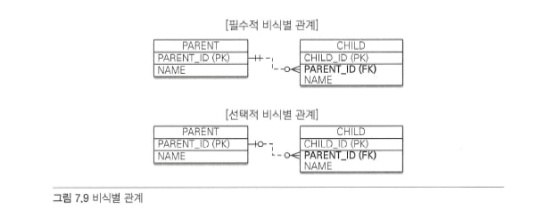

비식별 관계란, **부모의 PK를 단순 외래 키로만 사용하는 것을 의미한다.**

외래 키가 NULL을 허용하는지 여부에 따라 필수적 비식별 관계와 선택적 비식별 관계로 나뉜다.

- 필수적 비식별 관계

  필수적 비식별 관계란, **외래 키에 NULL을 허용하지 않는 관계를 의미한다.**

  연관관계를 필수적으로 맺어야 한다.

  > DB 명세에서 동그라미가 없고 선만 있는 형태로 표현된다.

- 선택적 비식별 관계

  선택적 비식별 관계란, **외래 키에 NULL을 허용하는 형태이다.**

  즉, 자식과 연결된 부모가 있을수도 있고 없을수도 있는다는 의미다.

테이블 생성 시에 식별 관계와 비식별 관계중 선택해서 만들게 된다.

하지만 **최대한 비식별 관계로 만들고, 식별 관계를 최소화 하는 추세이다.**

#### 복합키 비식별 관계 매핑

둘 이상의 컬럼으로 구성된 복합 PK는 단순히 `@Id`를 여러 필드에 사용하면 될 것 같지만, 오류가 발생한다.

``` java
@Entity
public class Test {
    @Id
    private String pk1;
    
    @Id
    private String pk2;	// 오류
}
```

JPA에서 Entity의 PK로 영속성 컨텍스트에서 키를 설정한다.

식별자를 찾을 때, 식별자를 비교해 주어야 하는데 기본적으로 Java는 **equals와 hashCode를 통해 동등성 비교**를 한다.

하지만 식별자가 2개 이상이 되면 **별도의 식별자 클래스를 만들어서 따로 equals와 hashCode를 만들어 비교해야 한다.**


JPA는 복합 키를 위해 `@IdClass`와 `@EmbeddedId`를 제공한다.

**`@IdClass`는 관계형 데이터베이스**에 가깝고, **`@EmbeddedId`는 객체지향**에 가까운 방법이다.

`@IdClass`를 사용하면 Entity에서 `@Id` 필드를 여러개 만들고, 미리 만들어둔 **id 클래스와 해당 필드를 매핑**시켜 준다.

반대로 `@EmbeddedId`는 엔티티에서 식별자 클래스를 필드에 직접 추가하고, **식별자 클래스에서 직접 PK를 매핑한다.**


##### 식별자 클래스

식별자 클래스는 `@IdClass`와 `@EmbeddedId`로 나뉜다.

- `@IdClass`

  ``` java
  @NoArgsConstructor
  @AllArgsContructor
  public class ParentId implements Serializable {
      private String pk1;
      private String pk2;
      .
      .
      .
  //  equals and hashCode
  }
  ```

  특징을 정리하면 다음과 같다.

  1. **Serializable 인터페이스를 구현**해야 한다.
  2. **equals와 hashCode를 구현**해야 한다.
  3. **기본 생성자**가 필요하다
  4. **접근 제한자가 public** 이어야 한다.
  5. **식별자 클래스의 속성관 엔티티에서 사용하는 속성의 속성 이름이 같아야 한다.**

- `@EmbeddedId`

  ``` java
  @NoArgsConstructor
  @AllArgsContructor
  @Embeddable
  public class ParentId implements Serializable {
      
      @Column(name = "ID1")
      private String pk1;
      
      
      @Column(name = "ID2")
      private String pk2;
      .
      .
      .
  //  equals and hashCode
  }
  ```

  > `@IdClass`와 다르게 식별자 클래스가 **엔티티에 직접 매핑된다.**

  특징은 아래와 같다.

  1. `@Embeddable` 어노테이션을 붙여야 한다.
  2. **equals와 hashCode를 구현**해야 한다.
  3. **기본 생성자**가 필요하다
  4. 접근 제한자가 **public** 이어야 한다.

  > 각각 식별자 클래스는 거의 비슷한 특징을 갖는다.

##### equals()와 hashCode()

복합 키는 equals()와 hashCode()를 필수적으로 구현해야 한다.

자바 클래스는 기본적으로 Object를 상속받는데, 여기서 제공하는 equals() 메소드는 동일성 비교. 즉, **==비교**를 하기 때문에

키를 찾을 수 없다.

> 각각의 엔티티에서 어떠한 **식별자를 가진 객체를 찾고 싶을 때, equals() 메소드로 키를 비교**해야 하기 때문에 ==비교라면 찾을 수 없다.

hashCode()도 마찬가지다.

> lombok에선 아래와 같이 사용하면 equals 와 hashCode를 구현해 준다.
>
> `@EqualsAndHashCode(exclude = {"id", "paymentMethod", "price"})`
>
> 이런 어노테이션을 붙이게 되면 id, paymentMethod, price를 제외한 값들을 비교하는 equals 메소드와 hashCode 메소드를 생성한다.

##### 단점

- `@IdClass`

  - 컬럼 선언이 중복된다.

    > 식별자 클래스와 엔티티 클래스 모두에서 작성되어야 한다.

  - `@MapsId` 사용이 불가능하다.

- `@EmbeddedId`

  - 복합 키 구조가 2개 이상일 때 복잡도가 증가한다.

##### 장점

- `@IdClass`

  - 비지니스 적으로 의미가 있는 키를 명시할 수 있다.

    > 엔티티 내부만 봐도 복합 키들을 한 눈에 볼 수 있다.

  - 식별 관계매핑을 여러 테이블에서 하더라도 객체 연관관계를 간단하게 표현 가능

- `@EmbeddedId`

  - 객체지향적이다.

  - `@MapsId`를 통해 객체 생성이 편리하다.

    > `@MapsId`는 식별관계로 만들어주는 어노테이션이다.
    >
    > 즉, PK에 `@MapsId`를 붙이게 되면 해당 PK는 PK이자 FK가 되는 것이다.

전체적으로 `@EmbeddedId`가 객체지향적 이기 때문에 좋아보인다.

> 사실 어떤게 더 낫고 별로인지 확실하지 않다.
>
> 책에서는 `@EmbeddedId`를 추천하고, 아래와 같이 설명했다. 취향별로 사용하면 될 것 같다.
>
> `단순한 하나의 복합키만 존재한다고 하면 @EmbeddedId 를 사용하라고 권하고 싶습니다. 하지만 복합키를 통한 식별관계 매핑이 여기저기 존재한다면, @IdClass를 이용하라고 권하고 싶습니다.`

#### 복합 키 식별 관계 매핑

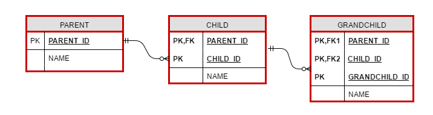

위와 같은 관계는 부모, 자식, 손자까지 기본키를 전달하는 식별 관계이다.

이러한 관계는 `@IdClass` 또는 `@EmbeddedId`로 식별자 매핑을 할 수 있다.

> 일대일 관계는 살짝 다르다.

##### @IdClass

`@IdClass`에서 위 그림과 같은 식별관계는 아래와 같이 표현할 수 있다.

``` java
@Entity
public class Parent {
    
    @Id
    @Column(name = "PARENT_ID")
    private String id;
    private String name;
}

public class ChildId implements Serializable {
    private String parent;
    private String childId;
    
    (equals and hashCode)
}

@Entity
@IdClass(ChildId.class)
public class Child {
    @Id
    @ManyToOne
    @JoinColumn(name = "PARENT_ID")
    private Parent parent;	// 책에선 public인데, 이유를 모르겠다.
    
    @Id
    @Column(name = "CHILD_ID")
    private String childId;
    
    private String name;
}

public class GrandChildId implements Serializable {
    private ChildId childId;
    
    private String id;
    
    (equals and hashCode)
}
@Entity
@IdClass(GrandChildId.class)
public class GrandChild {
    
    @Id
    @ManyToOne
    @JoinColumns({
    		@JoinColumn(name="PARENT_ID")
        	@JoinColumn(name="CHILD_ID")
    })
    private Child child;
    
    @Id
    @Column(name = "GRANDCHILD_ID")
    private String id;
    
    private String name;
}
```

식별 관계는 기본 키와 외래 키를 같이 매핑해야 하기 때문에 엔티티에서 `@Id` 필드에 `@ManyToOne`을 사용했다.

> 즉, 식별자 클래스는 그냥 선언하고 엔티티에서만 명시된다.

##### @EmbeddedId

`@EmbeddedId`로 식별 관계를 구성할 때엔 `@MapsId`를 사용할 수 있다.

``` java
@Entity
public class Parent {
    
    @Id
    @Column(name = "PARENT_ID")
    private String id;
    private String name;
}

@Embeddable
public class ChildId implements Serializable {
    private String parentId;
    
    @Column(name = "CHILD_ID")
    private String id;
    
    (equals and hashCode)
}

@Entity
public class Child {

    @MapsId("parendId")		// ChildId.parentId와 매핑
    @ManyToOne
    @JoinColumn(name = "PARENT_ID")
    private Parent parent;	// 책에선 public인데, 이유를 모르겠다.
    
    @Id
    @Column(name = "CHILD_ID")
    private String childId;
    
    private String name;
}

@Embeddable
public class GrandChildId implements Serializable {
    private ChildId childId;
    
    @Column(name="GRANDCHILD_ID")
    private String id;
    
    (equals and hashCode)
}

@Entity
public class GrandChild {
    
    @EmbeddedId
    private GrandChildId id;
    
    @MapsId("childId")
    @ManyToOne
    @JoinColumns({
    		@JoinColumn(name="PARENT_ID")
        	@JoinColumn(name="CHILD_ID")
    })
    @Column(name = "GRANDCHILD_ID")
    private Child child;
    
    private String name;
}
```

> 여기서 `@MapsId`는 외래 키 이자 기본 키 인 컬럼을 지정해주는 어노테이션 이다.
>
> 위에서 사용한대로 `@MapsId("parendId")`와 같이 사용하면 해당 엔티티의 기본 키 필드(parentId)와 반대쪽 엔티티와 매핑시켜 준다.

#### 비식별 관계로 구현

이전에 만들었던 식별 관계를 비식별 관계로 변경해 보자.

비식별 관계이기 때문에 **복합키를 포함할 필요가 없어졌다**

``` java
@Entity
public class Parent {
    @Id
    @GenerataedValue
    private Long id;
    
    private String name;
}

@Entity
public class Child {
    @Id
    @GeneratedValue
    @Column(name = "CHILD_ID")
    private Long id;
    
    private String name;
    
    @ManyToOne
    @JoinColumn(name = "PARENT_ID")
    private Parent parent;
}

@Entity
public class GrandChild {
    
    @Id
    @GeneratedValue
    @Column(name = "GRANDCHILD_ID")
    private Long id;
    
    private String name;
    
    @ManyToOne
    @JoinColumn(name = "CHILD_ID")
    private Child child;
}
```

코드 길이나 클래스 개수만 봐도, **훨씬 간단**해진걸 볼 수 있다.

외래 키 매핑이 없어졌기 때문이다.

> 이러한 외래 키 매핑이 점점 더 많아지면 많아질수록 엔티티는 복잡해질 것이다.
>
> 그렇기 때문에 **대리 키 사용을 권장한다.**

### 일대일 식별관계

일대일은 식별관계가 조금 특이하다.


일대일 식별 관계는 부모의 기본 키를 그대로 가져오기 때문에 **부모 테이블의 기본 키가 복합 키가 아니라면 자식도 복합 키가 아니다.**

``` java
@Entity
public class Board {
    @Id
    @GeneratedValue
    @Column(name = "BOARD_ID")
    private Long id;
    
    private String title;
    
    @OneToOne(mappedBy = "board")
    private BoardDetail boardDetail;
}

@Entity
public class BoardChild {
    @Id
    private Long boardId;
    
    @MapsId
    @OneToOne
    @JoinColumn(name = "BOARD_ID")
    private Board board;
    
    private String content;
}
```

> 식별자가 단순 하나라면 `@MapsId`의 속성값을 비워두면 된다.

### 식별 관계의 단점

| 식별 관계                                                    | 비식별 관계                                                  |
| ------------------------------------------------------------ | ------------------------------------------------------------ |
| 부모 테이블의 기본 키가 자식으로 전파되면서 계속해서 기본 키 컬럼이 늘어난다.<br />그렇기 때문에**SQL이 복잡해지고, 기본 키 인덱스가 커진다.** | 기본 키가 자식으로 전파되거나 늘어나지 않아서 항상 일정하다.<br />그렇기 때문에 **통일성이 있고, SQL이 복잡해지지 않는다.** |
| 식별 관계는 **복합 기본 키를 만들어야 하는 경우가 많다.**    | **기본 키가 간단하다.**                                      |
| 자연 키를 사용하기 때문에 **비지니스 요구사항이 바뀌면 변경되어야 한다.**<br />이러한 자연 키가 자식까지 전파되면 변경이 힘들다. | 반영구적으로 PK를 사용할 수 있다.                            |
| 테이블 구조를 변경하기 어렵다. 즉 **테이블 구조가 유연하지 않다.**<br />부모 테이블의 키가 수정되면 자식 테이블도 수정되어야 하기 때문이다. | 테이블 구조가 식별관계보단 유연하다                          |
| 복합 기본 키 클래스를 사용해야 하는데, 복합 키 클래스를 따로 만들어야 한다.<br />그렇기 때문에 **엔티티가 복잡해 진다** | 단순 `@Id` 어노테이션을 붙이면 된다.                         |

### 식별 관계의 장점

기본 키 인덱스가 부모 키 + 자식 키 이기 때문에, 따로 인덱스를 생성할 필요가 없다.

> 웬만하면 **식별 관계를 쓰지 않는걸 추천**한다.
>
> 하지만 꼭 필요하거나 식별 관계의 장점을 잘 잘릴 수 있는 상황에선 사용하는게 좋을수도 있다.

### 조인

#### 조인 컬럼

테이블의 연관 관계를 갖는 방법중 하나로, JoinColumn 이라고 부르는 외래 키 컬럼으로 관리한다.

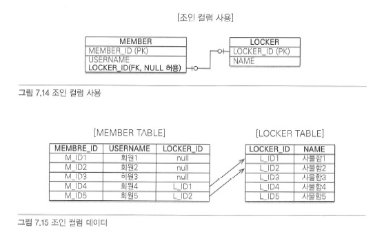

MEMBER 테이블에서 LOCKER 테이블과 **연결되는 컬럼을 만들고, 해당 컬럼을 통해 다른 테이블과 연결된다.**

위와 같이 LOCKER_ID, 즉 **외래 키 컬럼에 null을 허용하는 관계를 선택적 비식별 관계라고 한다.**

선택적 비식별 관계는 **INNER JOIN을 했을 때 관계를 갖지 않은 컬럼을 조회되지 않는다.**

> 위 상황에선 M_ID1, M_ID2, M_ID3 이라는 튜플이 관계를 갖지 않기 때문에, 다음과 같은 결과가 나온다.
>
> | MEMBER_ID | USERNAME | LOCKER_ID | NAME    |
> | --------- | -------- | --------- | ------- |
> | M_ID4     | 회원4    | L_ID1     | 사물함1 |
> | M_ID5     | 회원5    | L_ID2     | 사물함2 |
>
> 만약 MEMBER에 LOCKER의 목록을 추가해서 출력하고 싶은데, INNER JOIN을 사용한다면 회원4와 회원5밖에 안나오는 문제가 생긴다

그렇기 때문에 **선택적 비식별 관계는 OUTER JOIN을 사용해야 한다.**

#### 조인 테이블

> [챕터6](./chapter6#@JoinTable)에서 다대다를 설명할 때 `@JoinTable`에 대해 설명했었다.

조인 테이블이란, **조인을 위한 별도의 테이블** 로 조인을 관리하는 것이다.

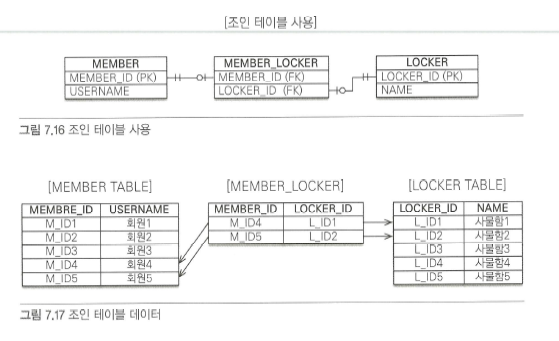

> 관계형 데이터베이스에서 다대다 매핑이 대표적인 조인 테이블 관계다.

관계를 관리하는 조인 테이블을 추가하고 여기서 테이블의 외래 키를 가지고 연관 관계를 관리한다.

조인 테이블은 FK에 null이 저장되지 않는다는 장점이 있지만, **테이블을 따로 추가해야 한다는 단점이 있다.**

이렇게 테이블이 늘어나면 복잡해지기 때문에 웬만하면 Join Column을 사용하고, 필요하다 판단되면 Join Table을 사용하는걸 추천한다.

> 조인 테이블을 연결 테이블 또는 링크 테이블 이라고도 부른다.

##### 일대일

일대일 관계도 조인 테이블을 이용할 수 있다.

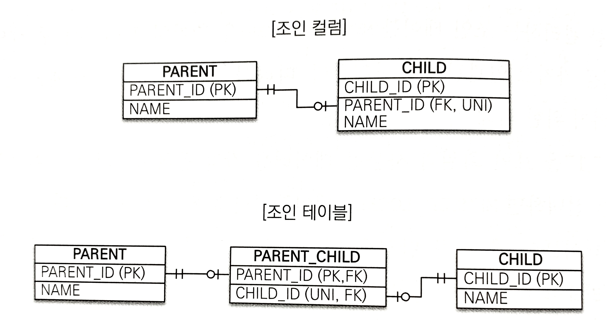

PARENT_ID와 CHILD_ID는 모두 UNIQUE 제약조건을 추가해야 한다.

위에서 조인 테이블을 코드로 짜면 아래와 같다.

``` java
@Entity
public class Parent {
    @Id
    @GeneratedValuue
    @Column(name = "PARENT_ID")
    private Long id;
    
    private String name;
    
    @OneToOne
    @JoinTable(name = "PARENT_CHILD",
              joinColumns = @JoinColumn(name = "PARENT_ID"),
              inverseJoinColumns = @JoinColumn(name = "CHILD_ID"))
    private Child child;
}

@Entity
public class Child {
    @Id
    @GeneratedValue
    @Column(name = "CHILD_ID")
    private Long id;
    
    private String name;
    
    @OneToOne(mappedBy = "child")
    private Parent parent;
}
```

부모 엔티티를 보면 `@JoinColumn`도 사용되었지만 `@JoinTable`을 사용하는 특이한 구조다.

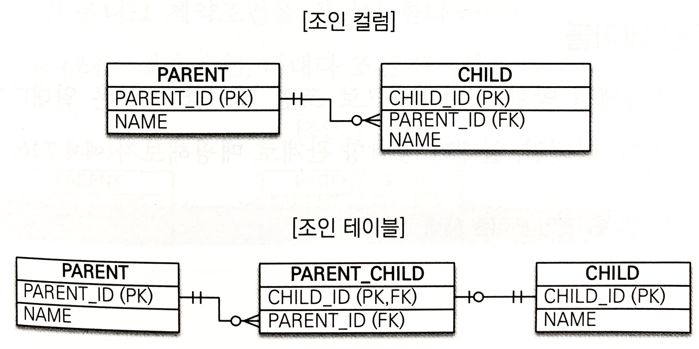

위 그림에서 볼 수 있듯이, 조인 테이블에서 자식쪽에서 UNIQUE 제약조건을 사용해야 한다.

> 하나의 CHILD 엔티티가 여러 PARENT 엔티티를 가질 수 없기 때문이다.

``` java
@Entity
public class Parent {
    @Id
    @GeneratedValuue
    @Column(name = "PARENT_ID")
    private Long id;
    
    private String name;
    
    @OneToMany
    @JoinTable(name = "PARENT_CHILD",
              joinColumns = @JoinColumn(name = "PARENT_ID"),
              inverseJoinColumns = @JoinColumn(name = "CHILD_ID"))
    private List<Child> child;
}

@Entity
public class Child {
    @Id
    @GeneratedValue
    @Column(name = "CHILD_ID")
    private Long id;
    
    private String name;
}
```

> 보다싶이, 일대일 관계와 굉장히 비슷하다.

##### 다대일

일대다 관계에서 방향만 바꾸어 주면 된다.

``` java
@Entity
public class Parent {
    @Id
    @GeneratedValuue
    @Column(name = "PARENT_ID")
    private Long id;
    
    private String name;
    
    @OneToMany(mappedBy = "parent")
    private List<Child> child;
}

@Entity
public class Child {
    @Id
    @GeneratedValue
    @Column(name = "CHILD_ID")
    private Long id;
    
    private String name;
    
    @ManyToOne(optional = false)
	@JoinTable(name = "PARENT_CHILD",
              joinColumns = @JoinColumn(name = "PARENT_ID"),
              inverseJoinColumns = @JoinColumn(name = "CHILD_ID"))
    private Parent parent;
}
```

##### 다대다

다대다 조인 테이블의 두 컬럼을 합쳐서 하나의 유니크 제약 조건을 걸어야 한다.

``` java
@Entity
public class Parent {
    @Id
    @GeneratedValuue
    @Column(name = "PARENT_ID")
    private Long id;
    
    private String name;
    
	@ManyToMany
    @JoinTable(name = "PARENT_CHILD",
              joinColumns = @JoinColumn(name = "PARENT_ID"),
              inverseJoinColumns = @JoinColumn(name = "CHILD_ID"))
    private List<Child> child;
}

@Entity
public class Child {
    @Id
    @GeneratedValue
    @Column(name = "CHILD_ID")
    private Long id;
    
    private String name;
}
```

> 만약 조인 테이블에 컬럼을 추가하면 `@JoinTable`을 사용할 수 없고 따로 엔티티를 매핑해 주어야 한다.

### @SecondaryTable

~~잘 사용되진 않는다.~~

하나의 엔티티에 여러 테이블을 매핑시킬 수 있다.

이렇게 말하니 무슨 뜻인지 모르겠으니 먼저 코드를 보자.

``` java
@Entity
@Table(name = "BOARD")
@SecondaryTable(name = "BOARD_DETAIL",
               pkJoinColumns = @PrimaryKeyJoinColumn(name = "BOARD_DETAIL_ID"))
public class Board {
    
    @Id
    @GeneratedValue
    @Column(name = "BOARD_ID")
    private Long id;
    
    private String title;
    
    @Column(table = "BOARD_DETAIL")
    private String content;
}
```

위와 같이 **하나의 엔티티가 BOARD 테이블과 BOARD_DETAIL 테이블에 매핑**된다.

두 테이블은 일대일 관계로 매핑된 상태이다.

`@SecondaryTable`의 속성은 다음과 같다.

| 속성          | 설명                                            |
| ------------- | ----------------------------------------------- |
| name          | 해당 엔티티에서 추가적으로 관리할 테이블의 이름 |
| pkJoinColumns | 다른 테이블의 기본 키 컬럼 속성                 |

`@Column`에서는 속성중에서 table 속성을 지정해서 어떤 테이블과 매핑될지 정한다.

> 지정하지 않으면 그냥 본래 테이블과 매핑된다.

이러한 방법은 **추천되지 않는다.**

차라리 엔티티를 하나 더 만들어서 1대1 매핑을 하는편이 최적화에 유리하다.

> 항상 두 테이블을 조회해야 하기 때문이다.