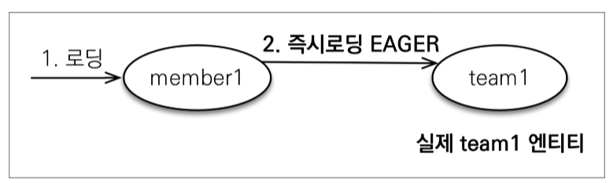
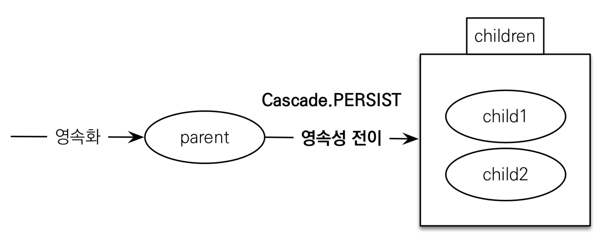

# 챕터8 프록시와 연관관계 관리

### 프록시

객체 그래프 탐색을 할 때, 정보들은 데이터베이스에 있기 때문에 모든 객체들을 자유롭게 탐색하긴 어렵다.

객체 그래프 탐색을 자유롭게 하려면 연관된 모든 객체를 가져와야 한다. 즉, 한번 DB에 접속했을 때 모든 정보를 가지고 와야 하는데, 서버에 큰 부담이 된다.

> 게다가 연관된 모든 엔티티들을 항상 사용하진 않는다.


그렇기 때문에 JPA는 엔티티가 실제 사용될 때 까지 조회를 미루는 지연 로딩을 지연하는데, 지연 로딩에서 사용되는 객체가 프록시 객체 이다.

> **JPA 표준은 지연 로딩의 구현을 JPA구현체에게 위임했다.**
>
> 즉, 지연 로딩의 구현은 JPA 구현체에 따라 바뀔 수 있다는 의미로, 여기선 **하이버네이트 구현체**를 사용한다.

### 프록시 기초

> 참고로 지연 객체는 프록시가 아니라 바이트 코드를 수정해서 사용할 수 있는데, 복잡하기 때문에 프록시만 사용한다.

JPA에서는 식별자로 엔티티를 조회할 때 `EntityManager.find()`를 사용한다.

이런 방식으로 조회하게 되면 영속성 컨텍스트에 값이 없으면 DB를 조회한다.


프록시를 사용해서 엔티티 사용 시점까지 조회를 미루고 싶다면 `EntityManager.getReference()`를 사용하면 된다.

이 메소드를 호출할 때 JPA는 DB를 조회하지 않고, 실제 엔티티 객체를 생성하지도 않는다. 단지 DB 접근을 위임한 프록시 객체를 반환한다.

#### 프록시 특징


프록시 클래스는 실제 클래스를 상속받아 만들기 때문에 겉모습은 똑같다.

그렇기 때문에 신경쓰지 않고 사용하면 된다.


**프록시 객체는 실제 객체에 대한 참조를 보관한다.**


그렇기 때문에 프록시 객체의 메소드를 호출하면 프록시 객체는 실제 객체의 메소드를 호출한다.

> Proxy.getId() -> Proxy.Entity.getId()


##### 특징

- 프록시 객체는 처음 한번만 초기화 된다.

  즉 하나의 프록시 객체를 여러번 사용해도 DB 접근은 한번이다.

- 프록시 객체가 초기화 되어도 프록시 객체가 바뀌는건 아니다.

  즉 프록시 객체가 초기화 되었어도 우리는 실제 엔티티에 직접 접근하는게 아니라 프록시 객체를 통해 접근한다.

- 프록시 객체는 원본을 상속받은 객체이기 때문에 타입 체크를 할 때 조심해야 한다.

- 영속성 컨텍스트에 해당 객체가 이미 있으면 em.getReference()를 호출해도 실제 엔티티가 반환된다.

- 초기화는 영속성 컨텍스트의 도움이 필요하다.

  즉 준영속 상태의 프록시를 초기화 하면 Exception이 발생한다.

#### 프록시 객체의 초기화

프록시 객체는 실제 사용될 때 DB에 접근해서 초기화 한다.

``` java
Member member = em.getReference(Member.class, "id1");
member.getName();		// 이 시점에서 DB에 접근한다.
```


1. 프록시 객체의 메소드를 호출한다.

2. 초기화 여부를 확인한다. 초기화 되었다면 5번으로 간다.

3. 프록시 객체가 **영속성 컨텍스트에게 초기화를 요청**한다

4. DB에 **조회해서 실제 엔티티**를 만든다.

5. **프록시 객체에서 실제 엔티티로 접근**해서 해당 메소드를 호출한다.

   > 프록시 객체는 실제 객체에 대한 참조를 가지고 있어서 실제 엔티티의 메소드에 접근이 가능하다.

#### 식별자

엔티티는 프록시로 조회할 때 식별자 값을 파라미터로 전달하고, 저장된다.

그렇기 때문에 `@Access(AccessType.PROPERTY)`로 했다면 `getId()` 메소드는 호출해도 프록시 객체가 초기화되지 않는다.

> 프록시 객체가 이미 식별자를 가지고 있기 때문이다.

`@Access(AccessType.FIELD)`로 설정하면 JPA가 해당 메소드가 id만 조회하는지 제대로 확인이 불가능하기 때문에 초기화해 버린다.

##### 활용

``` java
Member member = EntityManager.find(Member.class, "member1");
Team team = EntityManager.getRefeerence(Team.class, "team1");
member.setTeam(team);
```

위와 같은 방법으로 team을 조회하지 않고도 member의 참조를 변경할 수 있다.

> 여기선 AccessType이 FIELD여도 프록시가 초기화되지 않는다.

#### 확인

JPA에서 `PersistenceUnitUtil.isLoaded(entity)` 메소드를 통해 프록시의 초기화 여부를 확인할 수 있다.

> 초기화 되지 않았다면 false를 반환한다.

조회한 엔티티를 프록시로 확인해 보고 싶다면 직접 출력해봐도 된다.

> 프록시 클래스는 클래스명 뒤에 ..javassist..이라고 되어있다.

##### 강제 초기화

`initialize()` 메소드를 통해 프록시를 강제로 초기화할 수 있다.

JPA 표준에는 따로 강제 초기화 메소드가 없고, `getName()`과 같이 메소드를 호출해야 한다.

#### JPA 조인 전략

JPA가 SQL을 생성할 때, INNER JOIN과 OUTER JOIN으로 나뉘게 된다.

- OUTER JOIN일 경우

  외래 키가 NULL을 허용할 때에는 참조되지 않았을 경우가 있기 때문에 **INNER JOIN이 아닌 OUTER JOIN이 발생한다.**

  > 기본적으로 JPA에선 join에서 null을 허용하는걸 기본값으로 갖는다.

- INNER JOIN일 경우

  `@JoinColumn` 또는 `@ManyToOne`에서 null을 허용하지 않았다면 INNER JOIN이 발생한다.

  > `@JoinColumn(nullable = false)`
  >
  > `@ManyToOne(optional = false)`

  INNER JOIN이 최적화에 더 좋기 때문에 가능하면 null을 허용하지 않아서 **INNER JOIN을 만드는게 좋다.**

### 즉시 로딩

즉시 로딩을 사용하려면 `@ManyToOne`의 fetch 속성을 EAGER로 바꿔준다.

> 기본값이 EAGER이다.



이런식으로 하면 **member를 불러올 때 JOIN을 통해 team을 함께 불러온다.**

즉, DB에 한번만 접근해도 된다는 의미다.

그렇기 때문에 member1.getTeam()을 하면 이미 영속성 컨텍스트에 저장되어 있던 team1 엔티티가 호출된다.

### 지연 로딩

지연 로딩은 연관된 객체가 사용되기 전까지 로딩을 미루는 것이다.

그렇기 때문에 member1.getTeam()을 한다면 DB에 다시 접근해서 team을 불러와야 한다.

즉 DB에 여러번 접근해야 한다는 것이다.

이렇게만 보면 비효율적인 것 처럼 보이지만 만약 엔티티가 훨씬 복잡할 때 즉시로딩으로 한다면, 연결된 모든 엔티티를 불러오게 될 것이다.

하지만 이런건 현실적으로 힘들기 때문에 지연 로딩을 사용해야 한다.

> 특히 엔티티가 매우 복잡한 실무에선 대부분 LAZY 방식을 이용해야 한다.


지연 로딩을 사용하고 싶다면 `@ManyToOne`의 fetch 속성을 FetchType.LAZY로 설정해 주면 된다.

> `@OneToMany`는 기본적으로 LAZY이기 때문에 굳이 설정하지 않아도 된다.


처음에 member1을 로딩할 때에는 MEMBER 테이블에서 member 엔티티를 찾아온다.

그 후에 member1.getTeam()을 했을 때 **다시 DB에 접근해서 team을 조회한다.**

> 만약 조회 대상이 이미 영속성 컨텍스트에 있으면 프록시 객체를 사용하지 않는다.

##### 결론

지연 로딩과 즉시 로딩 모두 장단점이 있으니 상황에 따라 알맞게 사용해야 한다.

### 컬렉션 래퍼

엔티티에 컬렉션이 포함된다면 엔티티를 **영속 상태로 만들 때 하이버네이트의 내장 컬렉션으로 변경한다.**

이것을 **컬렉션 래퍼** 라고 부르는데, class 이름을 출력하면 `org.hibernate.collection.internal.PersistentBag`인것을 확인할 수 있다.


엔티티를 지연로딩 하면 프록시 객체를 통해 지연 로딩을 하지만, `List<>`와 같은 컬렉션은 **컬렉션 래퍼가 지연 로딩 처리를 한다.**

> 컬렉션 래퍼 또한 프록시의 기능을 하기 때문에 프록시 라고 부른다.

`member.getOrders()`를 호출해도 order 들을 초기화 하진 않는다. `member.getOrders().get(0)`과 같이 사용했을 때 DB를 조회하게 된다.

### 컬렉션에 즉시 로딩 사용시 주의점

**컬렉션을 하나 이상 즉시 로딩하는 것은 권장되지 않는다.**

컬렉션을 조인 시킨다는 의미는 일대다 조인 이라는 의미인데, 일대다 조인은 다 쪽의 수만큼 데이터가 증가하게 된다.

서로 다른 컬렉션을 2개 이상 조회할 때에는 (조인 테이블1) * (조인 테이블2)...와 같이 계속해서 증가하게 된다.

따라서 **성능은 저하되고 그만큼 즉시 로딩을 권장하지 않는다.**


**컬렉션 즉시 로딩은 항상 OUTER JOIN을 이용한다.**

다대일 관계에서 다 쪽에 NOT NULL을 걸어두게 되면 INNER JOIN을 사용할 수 있지만,

만약 INNER JOIN을 하게되면 일대다 관계를 조인하게 되면 일 쪽에서 다를 하나도 가지지 않은 데이터는 조회하지 않게 된다.

> 쉽게 말해서 팀 - 멤버 관계일 때, 팀에 멤버가 없다면 팀이 조회되지 않는다.

그렇기 때문에 JPA는 일대다 관계를 즉시로딩할 때 항상 OUTER JOIN을 이용한다.

> OUTER JOIN은 최적화에 좋지 않다.


- `@ManyToOne`, `@OneToOne`
  - optional = false: 내부 조인
  - optional = true: 외부 조인
- `@OneToMany`와 `@ManyToMany`
  - optional = false: 외부 조인
  - optional = true: 외부 조인

즉 `@ManyToOne`이나 `@OneToOne`의 optional = false가 아니라면 무조건 외부 조인이 발생한다.

### CASCADE

특정 엔티티를 영속 상태로 만들 때 **연관된 엔티티를 함께 영속 상태로 만들고 싶다면** 영속성 전이`Transitive Persistence`를 사용하면 된다.

JPA는 **CASCADE 옵션**을 통해 영속성 전이를 지원한다.


부모 엔티티가 여러 자식 엔티티를 가지고 있을 때, 각각의 entity를 persist 하는건 굉장히 귀찮다.

그렇기 때문에 **CASCADE 옵션을 통해 부모가 가지고 있는 연관관계들을 한번에 영속화 할 수 있다.**


JPA에서 엔티티를 저장할 때 연관된 모든 엔티티는 영속 상태여야 한다.

그래서 우리는 원래 부모 엔티티, 자식 엔티티 모두 각각 영속화 시켜준 후에 부모 엔티티에 자식 엔티티를 추가해 왔다.

#### 저장

영속성 전이를 활성화 하는 옵션중 하나이다.

`CascadeType.PERSIST`로 설정해 주면, **부모 엔티티만 영속화 하면 자식 엔티티들도 영속화** 된다.

``` java
Child child1 = new Child();
Child child2 = new Child();

Parent parent = new Parent();

child1.setParent(parent);
child2.setParent(parent);
parent.getChildren().add(child1);
parent.getChildren().add(child2);
```



**영속성 전이는 단순히 persist를 하는 편리함만 제공할 뿐이다**

즉 양방향 연관관계 추가 같은 작업은 직접 해주어야 한다.

> Spring Data Jpa의 경우에는 아래와 같다.
>
> ``` java
> Parent parent = Parent.builder
>     .name("aa")
>     .build();
> 
> Child child = Child.builder
>     .name("aaaa")
>     .type("aaaa")
>     .parent(parent)
>     .build();
> 
> parentRepository.save(parent);
> ```
>
> 위와 같이 하면 child는 자동으로 영속화 된다.

메소드 실행 시에 전이가 발생하진 않고 **플러시를 호출할 때 전이가 발생**한다.

#### 삭제

방금 저장했던 것 처럼, 부모와 관련된 모든 엔티티들을 제거하려면 하나하나 `EntityManager.remove()` 메소드를 실행시켜야 한다.

게다가 그냥 부모 객체를 지워버리면, 외래 키 제약조건으로 인해 외래  키 무결성 예외가 발생한다.

> 자식과 연결되어 있던 부모 객체가 사라져서 외래 키로 엔티티를 찾을 수 없기 때문이다.

그렇기 때문에 `CascadeType.REMOVE`는 **편하고 효율적**이다.

> 하지만 실제 프로그래밍에선 부모 엔티티를 삭제하고 외래 키를 null로 바꾸는 것이 일반적이다.


`CascadeType.REMOVE`는 **자식 엔티티 뿐만 아니라 자식의 자식과 같이 쭈욱 삭제하게 된다.**

> 자식중 하나라도 외래 키 무결성 예외가 발생하면 안되기 때문이다.


REMOVE 또한 실행 시에 전이가 발생하진 않고 **플러시를 호출할 때 전이가 발생**한다.

#### ETC

`CascadeType`에는 여러 종류가 있다.

1. ALL
   모든 영속성 전이를 실행한다.
2. PERSIST
   영속화
3. MERGE
   병합을 전이한다.
4. REMOVE
   삭제
5. REFRESH
   부모가 refresh() 메소드를 호출했을 때 전이
6. DETACH

이 중에서 `ALL`은 나도 모르는 영속성 전이가 일어나기 쉽기 때문에, 보통 다음과 같이 필요한걸 직접 정의한다.

`cascade={CascadeType.PERSIST, CascadeType.REMOVE}`와 같이 여러개를 정의해 준다.

### 고아 객체

JPA에서 **부모 엔티티와 연결 관계가 끊어진 자식 엔티티**를 자동으로 삭제하는 기능을 제공한다.

여기서 부모 엔티티와 연결이 끊어진 자식 엔티티를 **고아 객체**라고 한다.


이 기능을 사용해서 부모 엔티티의 컬렉션에서 자식 엔티티 참조만 제거하면 자식 엔티티가 삭제된다.

또한 CascadeType.REMOVE와 같이 부모 엔티티가 삭제되면 자식 엔티티가 삭제된다.

#### 사용

단순히 부모 엔티티에서 `orphanRemoval` 옵션을 `True`로 바꿔주면 된다.

``` java
@OneToMany(mappedBy = "parent", orphanRemoval = true)
private List<Child> children;
```

만약 `parent.getChildren().remove(0)`을 호출하면 `DELETE FROM CHILD WHERE ID=?`와 같이 DELETE 쿼리가 발생한다.

고아 객체 제거 기능은 플러시될 때 적용되고, 모든 자식을 삭제하려면 `parent.getChildren().clear();`로 모두 삭제하면 된다.


고아 객체 제거 기능은 **부모에서 참조가 제거된 엔티티**를 **다른 곳에서 참조하지 않는다고 판단**하고 **삭제**하는 기능이다.

즉, 자식이 다른 엔티티와 참조가 되어 있더라도 그냥 지워버린다.

그렇기 때문에 이 기능은 조심해서 사용해야 한다.

완전히 한 엔티티에만 종속되어 있고, 해당 엔티티와 라이프사이클이 같을때만 사용해야 한다.

### 고아 객체 제거 + 영속성 전이

고아 객체 제거 기능과 영속성 전이 모두 **자식 엔티티를 부모와 함께 지우고/만드는 기능이다.**

그렇기 때문에 이 둘 모두를 적용하면 자식 엔티티의 라이프사이클을 조절할 필요가 없다.


부모 엔티티만 지우면 자식 엔티티들은 모두 사라지게 되고,

자식 엔티티와 부모 엔티티가 관계를 가지게 하고 부모 엔티티를 영속화 하면 자식 엔티티는 알아서 영속화 된다.

