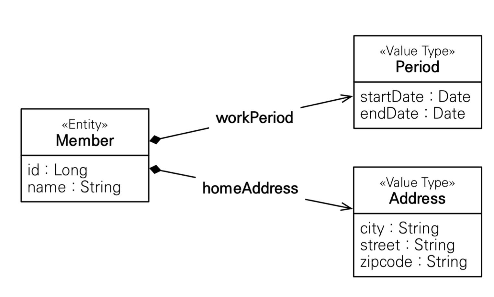
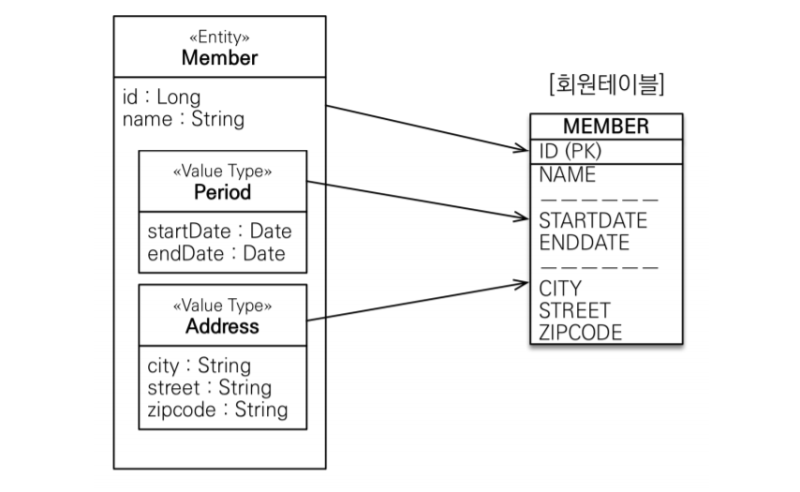

# 챕터9 값 타입

JPA는 **엔티티 타입**과 **값 타입**으로 나눌 수 있다.

쉽게 말하면 엔티티 타입은 **`@Entity`로 정의된 객체**이고, 값 타입은 int나 String 같은 **자바 기본 타입이나 객체**를 의미한다.


엔티티와 값 타입의 가장 큰 차이점은 **식별자의 존재 여부**이다.

엔티티는 값이 변경되어도 식별자를 통해 계속해서 같은 회원이 수정된다.

하지만 값 타입은 변경되는 아예 다른 것으로 인식된다.

> 예를 들어 회원 엔티티에서 나이, 이름 등 값을 수정해도 식별자만 잘 존재한다면 항상 같은 회원이다.
>
> 하지만 값 타입은 나이를 10에서 20으로 바꾸게 되면 완전히 다른 값이 되어버린다.

## 값 타입

### 기본값 타입

우선 알기 쉽게 단순한 엔티티를 만들어 보자

``` java
@Entity
public class Member {
    
    @Id
    @GeneratedValue
    private Long id;
    
    private String name;
    private int age;
}
```

해당 엔티티에서 값 타입은 name과 age다.

Member 엔티티는 생명주기를 갖고, 식별자를 갖는다.

하지만 name과 age는 식별자도 없고 생명주기도 엔티티에 의존하게 된다.


또한 값 타입은 **공유되면 안된다.**

값 타입을 공유하게 되면 A 엔티티를 수정했을 때 B도 함께 수정되는 일이 발생하게 된다.

> 자바의 기본 타입들은 공유되지 않는다.
>
> int b = 10;
>
> int a = b;
>
> 를 하면 10 이라는 값이 새로 생겨서 a에 저장된다

### 임베디드 타입(복합 값 타입)

**사용자가 직접 정의한 값 타입**을 JPA에서 임베디드 타입 이라고 한다.

> 값 타입 이란걸 기억해 두자.

``` java
@Entity
public class Member {
    
    @Id
    @GeneratedValue
    private Long id;
    
    private String name;
    
    private LocalDateTime startDate;
    
    private LocalDateTime endDate;
    
    private String city;
    
    private String street;
    
    private String zipCode;
}
```

이렇게 Member에 집 주소와 이름, 시작/끝 날짜가 저장되게 된다.

하지만 이렇게 전무 늘여놓는건 객체지향적이지 않고, 응집력을 떨어뜨린다.

근무 기간이나 주소같이 묶을 수 있는건 묶는편이 좋다.

``` java
@Embeddable
@NoArgsConstructor
public class Period {

    private LocalDateTime startDate;
    
    private LocalDateTime endDate;
    
}

@Embeddable
@NoArgsConstructor
public class Address {
    
    @Column(name = :"city")
    private String city;
    
    private String street;
    
    private String zipCode;
}

@Entity
public class Member {
    
    @Id
    @GeneratedValue
    private Long id;
    
    private String name;
    
    @Embedded Preiod workPeriod;
    @Embedded Address address;
}
```

위와 같이 하면 훨씬 간결하고 가독성이 좋아진다.

또한 Embedded 타입에서도 관계 매핑이 가능하다.

> `@Embeddable`을 붙여줘야 한다.



위와 같이 엔티티가 응집력 있게 변하게 된다.

이런식으로 값 타입을 의미 있게 만들어줄 수 있는데다가, 재사용도 가능하다.

> `@Embeddable`이 붙은 클래스는 기본 생성자가 필수다.

이러한 관계를 UML로 표현하면 **Composition 관계** 라고 한다.

> hibernate는 임베디드 타입을 components 라고 부른다.



임베디드 타입은 위와 같이 매핑된다.

임베디드 타입은 테이블의 기준에서 단순히 값 타입일 뿐이다. 그렇기 때문에 모든 속성을 늘여썼을 때와 같은 구조를 갖는다.

> 테이블에 점선은 그냥 구분 표시라서 무시해도 된다.

이러한 이유들 때문에 JPA에선 실제 테이블보다 클래스가 많은 경우가 많다.


##### @MappedSuperclass와 @Embeddable의 차이

설명만 들었을 때에는 `@MappedSuperclass`와 `@Embeddable`은 거의 동일한 기능을 제공한다.

하지만 `@MappedSuperclass`와 `@Embeddable`는 목적이 전혀 다르다.

- @MappedSuperclass

  `@MappedSuperclass`는 공통된 엔티티에서 사용하는 속성들을 모아둔 것으로, PK 속성이나 생성일 등이 포함된다.

​	공통된 엔티티에서 사용되는 속성들의 모임이기 때문에 **중복 제거**를 위해 사용된다.

​	그리고 `@MappedSuperclass`는 상속을 통해 가져온다.

- `Embeddable`

  `Embeddable`은 엔티티의 **일부 속성을 클래스로 추출**해 내는 것이다.

  그렇기 때문에 **엔티티 클래스의 가독성을 높히기 위해** 사용되며, 재사용성과는 크게 관련이 없다.

  그리고 `Embeddable`은 엔티티의 필드로써 동작하기 때문에 가독성을 높이는게 목적이다.

  

### AttributeOverride

만약 임베디드 타입의 매핑 정보를 재정의 하고 싶다면 `@AttributeOverride`를 사용하면 된다.


우선 임베디드 타입이 재정의 되는 경우부터 살펴보자.

만약 Address 라는 Embedded 타입이 있을 때, 주소를 2개 넣고 싶다.

그러면 Address의 속성들이 똑같이 겹치게 되는데, 따라서 컬럼명이 중복된다.


이때는 `@AttributeOverrides`를 통해 Embedded 타입을 **재정의** 해주면 된다.

``` java
@Entity
pubic class Member {
    @Id @GeneratedValue
    private Long id;
    
    private String name;
    
    @Embedded Address home;
    @Embedded
    @AttributeOverrides({
        @AttributeOverride(name = "city", column = @Column(name = "COMPANY_CITY"))
        @AttributeOverride(name = "street", column = @Column(name = "COMPANY_STREET"))
        @AttributeOverride(name = "zipcode", column = @Column(name = "COMPANY_ZIPCODE"))
    })
    Address company;
}
```

이러한 `@AttributeOverrides`를 사용하면 코드가 굉장히 복잡해 진다.

> 사실 Embedded 타입을 여러번 사용할 경우가 거의 없다.

### 임베디드 타입 null

임베디드 타입이 null이 들어가게 되면, 해당 임베디드 타입의 속성들은 모두 null이 들어간다.

## 값 타입과 불변객체

임베디드 같은 **값 타입들을 여러 엔티티에서 공유하게 되면 안된다.**


예를 들어, 회원 엔티티가 주소 라는 임베디드 타입을 가진다고 가정하자.

``` java
member1.setHomeAddress(new Address("old"));
Address address = member1.getHomeAddress();

address.setCity("new");
member2.setHomeAddress(address);
```

여기서 만약 회원 1, 2가 모두 하나의 임베디드 타입을 참조하게 되면, 해당 임베디드 타입을 수정했을 때 DB에서 회원 1,2 모두 수정된걸 볼 수 있다.

영속성 컨텍스트는 회원1 회원2 모두 address가 수정된걸로 판단해서 둘 다 UPDATE SQL을 실행하게 된다.


이러한 공유 참조로 발생하는 오류는 찾기 매우 힘들다.

이러한 예상치 못한 곳에서 생기는 오류를 **부작용** 이라고 한다.

### 값 타입 복사

이런 문제가 발생하지 않으려면, 해당 인스턴스를 바로 사용하는게 아니라 복사해서 사용하면 된다.

``` java
member1.setHomeAddress(new Address("old"));
Address address = member1.getHomeAddress();

Address newAddress = address.clone();
newAddress.setCity("new");
member2.setHomeAddress(newAddress);
```

이렇게 인스턴스를 복사하면 의도대로 member2만 UPDATE 된다.


자바의 기본 타입들은 이러한 부작용을 피할 수 있지만, 임베디드 타입과 같이 객체 타입은 문제가 발생한다.

> 자바의 기본 타입들은 아래와 같은 코드에서 알아서 값 복사를 한다.
>
> ``` java
> int a = 10;
> int b = a;
> b = 4;
> System.out.println(a);		// 10
> ```

객체의 공유 참조는 막거나 피할 수 없다. 가장 원초적인 방법은, **setter와 같이 값을 변경하는 메소드를 모두 지우자**

이렇게 하면 공유참조가 발생해도 부작용의 발생을 막을 수 있다.

> `@Builder`나 생성자로 새로 만들어야만 원하는 값의 객체가 만들어지게 한다.

### 불변 객체

값 타입의 부작용 걱정을 없애기 위해, **객체의 값을 변경할 수 없는 객체**를 불변 객체라고 부른다.

따라서 값 타입은 웬만하면 불변 객체로 설계해야 한다.

> 불변 객체는 한마디로 한번 만들면 절대 수정이 불가능한 객체를 말한다.

물론 불변 객체로 만든다고 해서, 공유참조를 막을 수 있는건 아니다.

하지만 참조가 공유되어도 어차피 수정을 못하기 때문에 상관 없다.

### 값 타입 컬렉션

하나 이상의 값 타입을 저장하려면 컬렉션에 저장하고 `@ElementCollection`과 `@CollectionTable` 을 사용하면 된다.

``` java
@Entity
public class Member {
    @Id @GeneratedValue
    private Long id;
    
    @Embedded
    private Address homeAddress;
    
    @ElementCollection
    @CollectionTable(name = "테이블명",
                    joinColumns = @JoinColumn(name = "MEMBER_ID"))
    @Column(name="FOOD_NAME")
    private Set<String> favoriteFoods = new HashSet<String>();
}
```

이렇게 하면 MEMBER_ID를 FK로 가지는 일대다 관계의 테이블이 알아서 생기게 된다.

이렇게 하면, `favoriteFoods`에 add를 하게 되면 알아서 INSERT 쿼리가 발생하게 된다.


값 타입 컬렉션은 당연히 부모 엔티티가 지워지면 사라지게 된다.

즉, 값 타입 컬렉션은 엔티티에 **완전히 종속**되어 있기 때문에 항상 영속성 전이 + 고아 객체 제거 기능을 가지고 있다.

> 컬렉션은 지연 로딩이 기본값이다.

### 값 타입 컬렉션의 단점

엔티티는 식별자가 있어서 쉽게 원본 데이터를 찾아서 수정할 수 있다.

하지만 값 타입은 식별자가 없기 때문에 변경되면 원본 데이터를 찾기 어렵다.


특정 엔티티에 소속된 값 타입은 변경되어도 자신이 속해있는 엔티티를 통해 찾을 수 있지만, 값 타입 컬렉션은 별도 테이블에 저장되기 때문에 찾을 수 없다.

그렇기 때문에 값 타입 컬렉션에 변경 사항이 발생하면 값 타입 컬렉션이 **매핑된 테이블에 연관된 모든 데이터를 삭제**하고 **현재 컬렉션의 값을 모두 DB에 저장한다.

따라서 웬만하면 값 타입 컬렉션의 사용을 **지양**해야 한다.