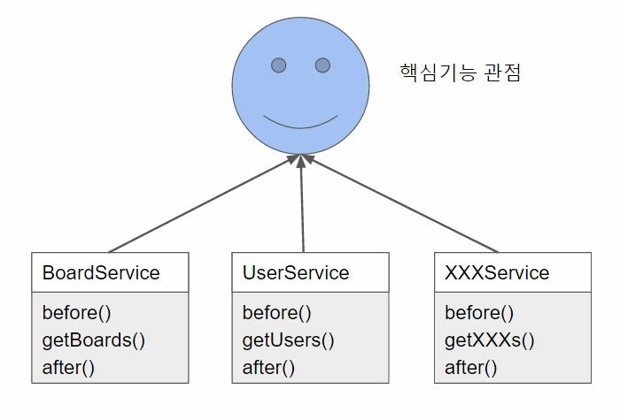

# AOP

### AOP란

- 해석

> Aspect-Oriented Programming의 약자로, 해석하면 관점 지향 프로그래밍 이다.

- 의미

> 아래와 같이 기능을 중심적으로 바라보는 것이 아니라,
>
> 
>
> 
>
> 아래와 같이 부가 기능의 관점에서 바라봤을 때 공통된 요소를 추출하라는 것이다.
>
> 
>
> 가로 영역의 공통 부분을 자르는 것 이라는 의미로, Cross-Cutting 이라고도 부른다.

- 예제

> 로깅처리, 트랜잭션등에 사용된다.

- 장점

> 어플리케이션 전체에 흩어져 있는 공통 기능을 하나의 장소에서 관리하게 된다.

> 서비스 모듈들이 본인의 목적에만 충실하면 된다.