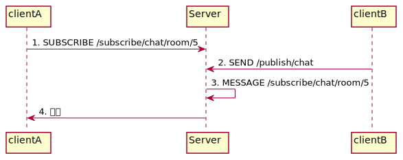

# STOMP

Simple Text Oriented Message Protocol의 약자로, 번역하면 간단한 텍스트 지향 프로토콜이다.

주로 Spring Boot에서 사용하며, SockJS를 사용한다.

> SockJs는 WebSocket이 호환되지 않는 브라우저나 클라이언트도 처리할 수 있도록 해주는 JS 라이브러리 이다.

<br>

메세지 전송을 간단하게 하기 위해서 등장하였으며, WebSocket 위에서 동작한다.

이름에 걸맞게 다른 프로토콜과 다른 텍스트 기반 프로토콜로, 바이너리 기반 프로토콜이 아니기 때문에 사용하기 편하다.

<br>

STOMP는 pub/sub 모델을 따른다.

> pub/sub 모델
>
> pub/sub 모델에서 publisher는 발행을 하되, 특정한 수신자가 존재하지 않는다.
>
> subscriber는 발행된 메세지중 원하는 메세지를 consume한다.
>
> 결합도를 낮출 때 도움이 된다.

STOMP에서 채팅방을 생성하면 Topic이 생성된다.

채팅방에 입장했을 때 Topic을 구독을 하고, Topic으로 메세지를 publish하고 subscribe 할 수 있다.

<br>

STOMP에서는 다음과 같은 Frame을 보내준다.

```http
COMMAND
header1:value1
header2:value2

payload
```

여기서 COMMAND는 SEND, SUBSCRIBE와 같은 동작의 정이이고, header는 Websocket에서는 사용이 불가능하지만 STOMP가 이를 가능하게 해준다.

<br>

일반적으로 destination에는 여러가지 종류가 있는데, `/topic/**`은 1:N으로 연결시키고, `/queue/**`은 1:1로 연결해 준다.

채팅방을 예제로 들면 우선 메세지를 보낼때는 다음과 같다.

``` http
SEND
destination: /pub/chat
content-type: application/json

{
	"chatRoomId": 1,
	"type": "MESSAGE"
}
```

그리고 채팅방 참가는 다음과 같다.

``` http
SUBSCRIBE
destination: /topic/chat/room/5
```

전체적인 flow는 다음과 같다.



<br>

## 구조


- **SimpleAnnotationMethod: **`@MessageMapping`과 같은 어노테이션을 통해 client의 요청을 받는다.

- **SimpleBroker: **In-Memory에 client 정보들을 가지고 있다 Client에게 메세지를 보내준다.

- **Channel**

  1. clientInboundChannel

     Client로 부터 오는 Message를 전달해 준다.

  2. clientOutboundChannel

     Server에서 Client로 메세지를 내보내 준다.

  3. brokerChannel

     코드 내에서 브로커에게 메세지를 전달하는 역할을 한다.

- **Message Broker: **MQ에 연결된 모든 client에게 메세지를 전송해 준다.

