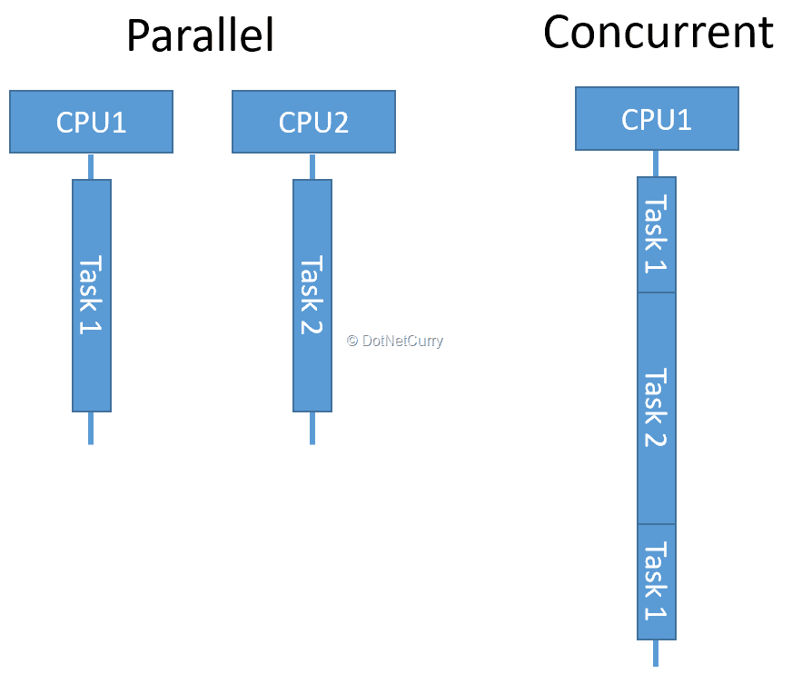

# Concurrent Programming

Concurrent Programming이란 [동시성](#동시성) 프로그래밍 이다.

주로 Parallel Programming과 비교되는데, Parallel Programming은 [병렬성](#병렬성) 프로그래밍 이다.




Concurrent API는 JDK 1.5 버전에서 등장 하였으며 JDK 버전이 올라감에 따라 함께 좋아지고 있다.

이는 **Concurrent API가 이전 버전에서도 동작**한다는 의미이다.

> 하지만 Lambda Expression은 사용이 불가능하다.

## 동시성과 병렬성을 사용해야 하는 상황

### CPU Bound

CPU를 올리기만 해도 성능이 향상되는 작업들이 있다.

예를 들어, 단순 반복작업이 많은 서비스는 CPU를 업그레이드 함으로써 성능을 올려줄 수 있다.

### IO Bound

IO는 **입출력 장치에 의존**하는 알고리즘이다.

예를 들어 파일을 열어 저장하거나, 네트워크를 통해 다른 서비스에 요청을 보내는 등이 있다.

### 언제 동시성을 사용해야 할까

CPU Bound의 경우, 병렬성을 사용하면 성능을 향상시킬 수 있지만 **동시성을 구현하면 성능이 저하될수도 있다.**

동시성 프로그래밍은 Context Switch, 즉 쓰레드를 전환하는 데에 계속해서 비용이 발생하게 된다.

<br>

반대로 IO Bound는 외부 입출력 장치에 의존하기 때문에 **항상 동시성 프로그래밍이 좋다.**

외부 입출력 장치의 작업을 하염없이 기다리는게 아니라, 그동안에도 계속해서 다른 작업을 할 수 있기 때문이다.


## 문제점

### Visibility(가시성)

[가시성](#가시성)문제란 **공유되는 자원을 수정**하는걸 의미한다.

A가 자원을 수정하고 B가 조회하게 되면 **B는 A의 수정에 대해 알 수 없다.**

따라서 다음과 같은 문제를 일으킨다.

- 같은 자원을 동시에 요구하면 **교착 상태**의 위험이 있다.
- **이상한 데이터 생성**으로 인한 오류가 발생한다.

## Java에서의 Concurrenct Programming

### Process와 Thread

Java 프로그램은 기본적으로 **하나의 프로세스**와 **하나의 쓰레드**를 가진다.

하지만 Java에서는 Thread를 통해 새로운 thread를 생성할 수 있도록 해준다.

### Thread Synchronization

Visibility 문제의 해결을 위해 Java에선 Synchronization을 지원한다.

Synchronization은 **오직 한 스레드 에서만 실행되도록 보장**한다.

### Threads And Runnable

자바는 JDK 1.0 이후부터 Thread를 지원했다.

Thread를 생성하기 전에 어떤 코드를 새로운 Thread에서 실행할 지 결정해야 하고, 이 코드는 **Task**라고 부른다.

Thread를 생성하고 task를 실행하는 것은 **Runnable** 인터페이스를 구현 함으로써 가능하다.

``` java
// 미리 Runnable을 구현한 경우
Thread t1 = new Thread(new Runnable구현체);

// 익명 객체로 사용(비추)
Thread t2 = new Thread(new Runnable() {
    @Override
    public void run() {
        구현 코드
    }
});

// 람다 사용
Thread t3 = new Thread(() -> {
    구현 코드
})
```

### Runnable 이용

Runnable은 **함수형 인터페이스**로, **람다식**을 통해 간단하게 구현할 수 있다.

> Runnable은 run()이라는 추상 메소드를 가지고 있다.

### Thread 이용

Thread는 **Runnable을 구현한 클래스**로, 비슷한 역할을 한다.

하지만 자바는 다중 상속이 불가능하기 때문에 **추천되진 않는다.**

## 용어

### 동시성

동시성이란, 사용자가 느끼기에 **동시에 실행되는 것 처럼 보이는 방식**이다.

**싱글 코어에서 멀티 쓰레드를 실행**시킬 때 사용된다.

> 멀티 코어에서도 동시성 사용이 가능하다.

멀티 테스킹 처럼 작업하기 위해 **여러 쓰레드들의 작업을 번갈아 가면서 처리**한다.

작업을 바꾸기 위한 **오버헤드**가 존재한다.

예를 들면 다음과 같다.

1. 1번 쓰레드를 5만큼 실행한다.

2. 2번 쓰레드를 5만큼 실행한다.

3. 3번 쓰레드를 5만큼 실행한다.

4. 1번 쓰레드를 5만큼 실행한다.

   > 반복..

이렇게 하나의 CPU 코어를 번갈아 가면서 사용하게 된다.

> 만약 CPU 코어가 여러개 라면 각각의 CPU 코어에서 똑같이 작동한다.

### 병렬성

병렬성 이란, **작업들을 여러 CPU 코어에서 동시에 실행시키는 것**을 의미한다.

즉 **CPU의 코어가 여러 개인 환경**에서만 가능하다.

### 가시성

Thread는 자신만의 고유한 Stack을 가지지만, 같은 프로세스끼리 공유되는 자원 또한 존재한다.

가시성이란, **자원이 공유되는 정도**를 의미한다.