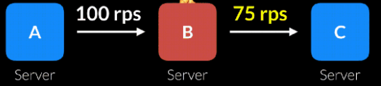
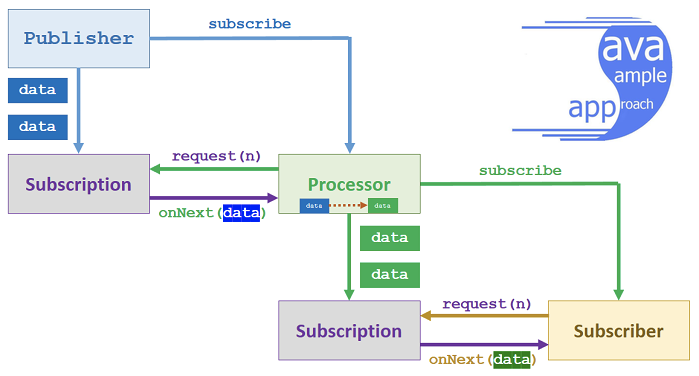

# Reactive Stream 기초

## Reactive Stream

---

Reactive Stream는 **non-blocking과 backPressure을 이용한 비동기 스트림 처리를 위한 표준**이다.

> Reactor와 RXJava는 Reactive Stream의 구현체 이다.

간단하게 기존의 시스템과 비교하면 아래와 같다.

기존의 시스템은 위와 같이 한번에 모든 데이터를 payload에 적재 후 response로 반환해 주었다.

하지만 이러한 방식은 모든 응답이 서버에 적재되어야 하기 때문에 서버가 감당하지 못할만큼의 payload라면 OutOfMemory가 발생하게 된다.

하지만 Stream Processing은 계속해서 하나씩 데이터를 처리하게 되면 많은 양의 데이터를 빠르게 반환해 줄 수 있다.

#### BackPressure란

> 앞으로의 설명을 요약 하면, 하나의 컴퍼넌트에 과도한 부하가 발생하게 되었다고 모든 컴퍼넌트에서 치명적인 버그가 발생하거나 메세지를 잃어버리면 안된다. 따라서 다른 컴퍼넌트 들에게 **자신의 상태를 알려 과부하를 막는 것**을 BackPressure(역압) 이라고 한다.

여기서 backPressure란, Input 작업에서 Output 작업으로, Output 작업에서 Input 작업으로 변환될 때 **어떠한 방법으로 변환에 저항하는 것**이라고 할 수 있다.

이렇게 변환에 저항하는 일은 주로 **input이 들어오는 속도가 Output만큼 빠를 때** 일어난다.

아직도 BackPressure에 대한 개념은 감을 잡기 힘들다. 그렇기 때문에 간단한 예제를 들어 설명해 보자

한 사람이 컨베이어 벨트에서 물건을 골라, 포장하는 일을 맡고 있다.

굉장히 쉬운 작업이지만, 컨베이어 벨트의 속도가 그 사람이 따라잡을 수 있을 정도의 속도였을 때의 이야기 이다.

만약 속도를 따라잡을 수 없는데 특별한 처리를 하지 않으면, 컨베이어 벨트 뒤쪽 작업들이 꼬이면서 공장 전체가 멈춰버릴 수도 있다.

> 역압의 정의는 여기까지 이고, 아래쪽은 역압의 해결 이다.

그래서 그 사람은, 2가지 방법을 채택해서 해결하려 했다.

- 물건을 컨베이어 벨트에서 꺼내, 옆에 올려두어 나중에 처리한다.
- 물건을 부수어서 처리할 일을 줄였다.

이렇게 2가지 방법은 각각 **Buffering**과 **Dropping**에 비유될 수 있다.

하지만 공장에서 이러한 작업은 허용될 수 없다.

따라서 사람은 컨베이어 벨트의 속도를 조정하는 방법이 최선이다.

이제 예제를 소프트웨어 세계로 돌려보자.

최근에 많이 사용되고 있는 MSA에서는 서버간의 통신이 잦다.

BackPressure는 하나의 서버가 다른 서버가 처리할 수 있는 속도보다 빠른 속도로 요청을 보내면 발생한다.

만약 한 서버에서 다른 서버로 초당 100개의 요청을 보내지만 요청을 받는 서버는 초당 75개의 요청만 처리할 수 있다면 초당 25개의 요청 만큼 손실이 발생한다.

> rps는 Request Per Second의 약자이다.

위와 같이 100개의 요청을 받는 서버는 계속해서 뒤쳐질 수도 있다.

위에서 예제로 들었듯이, 2가지 방법으로 대처할 수 있다.

- Buffering

  초당 25개의 요청을 Buffer시켜서 손실을 발생시키게 된다.

  하지만 계속해서 쌓이게 되면 OutOfMemory가 발생해서 down될 우려가 있다.

- Dropping

  요청을 계속해서 없애버리면 된다.

  하지만 요청을 아예 Drop하는건 허용될 수 없다.

따라서 위 두 방법들은 좋은 방법이 될 수 없다.

그렇다면 가장 이상적인 방법은 요청을 받는 서버에서 요청을 보내는 서버의 **요청 속도를 조절**하는 것이다.

하지만 이것은 항상 가능한 방법이 아니다.

만약 요청을 보내는 서버가 사용자를 대신해 요청을 보내는 것이라면, 계속 기다리라고 할 수 없다.

하지만 상황에 따라 속도를 늦출 수 있다.

웬만하면 Buffer를 두는게 좋은 상황이 많다.

### Reactive Stream의 목적

Reactive Stream의 목적은 **동기와 비동기의 경계를 명확히**하여 **Stream 데이터 교환을 효과적으로 관리**하는데에 있다.

즉, 어느정도의 data가 특정 시스템에 들어오는지 **예측 가능**하게 하는것이 목적인데, backPressure가 중요한 역할을 한다.

### Reactive Stream의 표준 및 사양

1. 잠재적으로 무한한 데이터의 처리
2. 순서대로의 처리
3. 컴퍼넌트 간의 데이터를 비동기로 전달
4. BackPressure를 통한 데이터 흐름제어

### Reactive Stream  API

Reactive Stream API는 다음과 같이 구성되어 있다.

- Publisher
- Subscriber
- Subscribtion
- Processor

여기서 Publisher는 무한한 데이터를 제공하게 된다.

제공된 데이터는 Subscriber가 구독하여 연결을 가지게 된다.

onNext를 통해 계속해서 데이터를 전달받으며 오류가 발생한다면 onError, 모든 데이터를 성공적으로 받았다면 onComplete 신호가 발생한다.

> 해당 신호들은 올수도, 오지 않을수도 있다.

이러한 작업은 **Subscribe가 풀릴 때 까지 유지**된다.

여기서 Subscribtion은 **Subscriber와 Publisher 간의 인터페이스를 제공**한다.

request() 메소드는 통해 요청의 개수를 의미하고, cancel() 메소드를 통해 연결을 끊을 수 있다.

그림으로 표현하면 다음과 같다.

1. Publisher는 자신이 사용할 Subscription을 생성한다.

2. publishing을 위한 data를 생성한다.

3. Publisher는 publish() 메소드를 통해 Subscriber를 등록한다.

4. Subscriber는 onSubscribe() 메소드를 통해 Publisher를 구독한다.

   > 해당 작업은 Publisher의 Subscription에 의해 일어난다.

5. Subscription의 request를 호출하게 되면 data 구독이 시작된다.

6. Subsriber는 request() 메소드와 cancel() 메소드로 데이터의 흐름을 제어할 수 있다.

7. Subscription의 Request는 상황에 따라 onNext/onError/onComplete를 알맞게 호출하게 된다.

8. Subscriber의 메소드에 따라 request() 또는 cancel()을 통해 데이터를 제어한다.