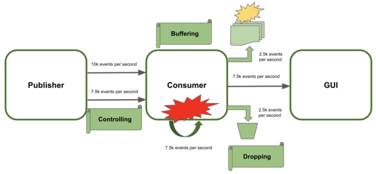

# 	네트워크 상에서 Backpressure

> 여기서 Consumer는 Subscriber로 해석하면 된다.

## 소개

Backpressure는 [Reactive Basic](./1.reactive_basic.md)에서 말했듯이 **감당이 불가능할 정도로 많은 커뮤니케이션을 처리하는 능력**을 의미한다.

> 자세한 이론은 Reactive Basic 글을 읽는걸 추천한다.

 

## Control Systemic Failures

어플리케이션 전체적인 오류(Systemic Failure)를 예방하기 위한 방법엔 3가지 방법 정도가 있다.

- **Controlling the data steam sent**

  데이터를 보내는 속도를 조절하는 방법이 있다.

  하지만 항상 가능한 방법은 아니기 때문에 다른 방법들을 고려해 봐야할 수도 있다.

- **Buffering the extra amount of data**

  자신이 처리할 수 없을 정도의 데이터를 버퍼에 저장하는 방법도 있다.

  하지만 Buffer의 수용량을 초과하게 될 수 있다.

- **Dropping the extra events**

  그냥 요청 자체를 Drop시키는 방법이 있다.

기본적으로 Backpressure 에서는 **요청 속도를 제어**하는 방법을 이용한다.

 

## Backpressure의 제어

Backpressure에서 요청 속도를 제어하는 방법에는 3가지가 있다.

- **Send new events when the subscriber request**

  pull 전략으로, Subscriber가 요청을 했을 때에만 Publisher가 요청을 보낸다.

  > 빵집에서 어떤 "빵을 주세요" 라는 손님의 요청이 혼 후에 빵을 주는 것

- **Limiting the number of events to receive at the client-side**

  push 전략으로, 클라이언트 즉, Consumer(Subscriber)가 제한한 만큼만 보내준다.

- **Canceling the data streaming when the consumer cannot process more events**

  이 경우에는 요청을 버리고 조금 이따 다시 시도한다.

 

## Webflux에서의 Backpressure

기본적으로 하나의 Webflux Application 내에서는 **효율적인 Backpressure 작업**이 일어나게 된다.

하지만 만약 여러 Application 사이에서 통신이 발생하게 되면 기본적으로 TCP 통신을 이용하게 된다.

 

TCP는 한가지 특징이 있는데 **Logical Element 추상화 대신 Bytes 추상화를 사용**한다는 것이다.

하지만 Backpressure에서 필요한건 **여러 Logical Element들을 제어해서 보내고/받는 것**이다.

 

Micro Service 간의 TCP 통신 Flow는 다음과 같다.

왼쪽의 Service가 오른쪽의 Service로 data stream을 보내는 diagram이다.

> acknoledge: 정보를 정상적으로 받았음을 알리는 신호

1. Webflux의 Logical Element를 Byte로 적절하게 바꾸고, 그걸 보내거나 받는다.
2. 긴 작업을 시작한다.
3. 비지니스 로직에서 데이터를 요청하지 않으면, **그 데이터들을 queue에 담는다.**
4. TCP 흐름제어 이기 때문에 A는 계속해서 데이터를 전송할 수 있다.

즉 **기대와는 달리 TCP 통신에서 Webflux의 Backpressure는 큰 의미가 없다.**

10개의 제한을 걸면 요구하지 않은 모든 데이터들이 Queue에 쌓이며, 그중 10개만 빼서 쓰는게 된다.

물론 Byte 단위의 Backpressure는 구현될 수 있지만, Webflux에서의 진정한 Backpressure를 구현하기 위해서는 Logical Element 단위의 Backpressure가 구현되어야 한다.

 

## RSocket을 통한 공정한 Backpressure

Network 계층에서 Logical Element들의 공정한 Backpressure를 위해서는 특정한 프로토콜을 이용해야 한다.

RSocket 이라는 프로토콜이 **Logical Element 단위의 Backpressure를 가능하게 해준다.**

 

RSocket은 TCP, 웹 소켓 등의 byte Stream 전송 프로토콜 위에서 동작하기 때문에 byte 단위의 Backpressure가 불가능해지는건 아니다.

TCP 계층에서의 byte 단위의 Backpressure는 계속해서 일어날 수 있고, Logcal Element의 Backpressure가 가능해질 뿐이다.

 

### 특징

- **Message-Driven**

  비동기 방식이다.

  하나의 커넥션을 통해 Multi-Plexing Message Stream 형태로 통신하며, 결과를 기다리기 위해 Blocking되지 않는다.

  > Multi-Plexing이란 하나의 통신 채널에서 여러 데이터를 전송할 때에 사용되는 기술이다.
  >
  > 기본적으로 Multi-Plexing은 여러개를 묶어서 다중화(하나로 합침) 시킨다는 것이다.
  >
  > Multi-Plexing은 Non-Blocking 으로 동작하게 된다.

- **Interaction Models**

  기존의 http는 request/response Model 이지만, 때에 따라 여러가지 종류의 model이 필요할 수 있다.

  예를 들어 request는 있지만 response는 필요 없는 상황이 있을 수 있다.

  그래서 RSocket에서는 4가지 Model을 제공한다.

  * Fire-and-Forget

    Request만 있고 Response는 필요 없는 형태.

    response를 스킵하기 때문에 성능이 향상된다.

  * Request/Response

    기존에 사용하던 Request/Response Model도 사용 가능하다.

    물론 내부는 절대 Blocking되지 않는다.

  * Request/Stream

    Request/Response를 확장한 형태

    하나의 Request에서 여러 메세지가 존재할 수 있다.

  * Channel

    양방향 Message Stream

- **Single-Response vs Multi-Response**

  두 Response의 차이는 RSocket Stack이 Application에게 데이터를 전달하는 방식의 차이에 있다.

  Single Response는 여러 Frame을 지나 전달되고, RSocket Connection에 의해 여러 Message들을 Multi-Plexing 형태로 합쳐져서 전달될 것이다.

  `single-response might be carried across multiple frames, and be part of a larger RSocket connection that is streaming multiple messages multiplexed.`

  하지만 Single Response는 모든 Response가 와야지 Application에서 데이터를 받는다.

  Multi Response가 조금씩 가져와서, 바로 처리할 수 있는 것과는 반대이다.

- **Bi-Direction**

  RSocket은 클라이언트와 서버 둘 다 request를 보낼 수 있고, Response를 보낼 수 있도록 해준다.

- **Cancellattion**

  RSocket은 Stream의 취소를 지원한다.

  초기에 작업을 중단할 수 있도록 지원한다.

- **Resumability**

  RSocket은 연결되어 있던 Connection이 네트워크 불안정으로 인해 해제되어도 간단한 Handshake만으로 다시 Connection을 살릴 수 있다.

- **Application Level Flow Control**

  RSocket에서 지원하는 Flow Control은 2가지가 있다.

  1. Request(n)

     서버와 서버 사이, 서버와 디바이스 사이에서 적합한 흐름제어 이다.

     n개의 요청이 들어와야지만 Data Stream을 보내준다.

  2. Leasing

     주로 데이터센터에서 서버와 서버 사이의 흐름제어로 사용된다.

     요청 속도 조절을 위해 적절한 lease 신호를 보내줄 수 있다.