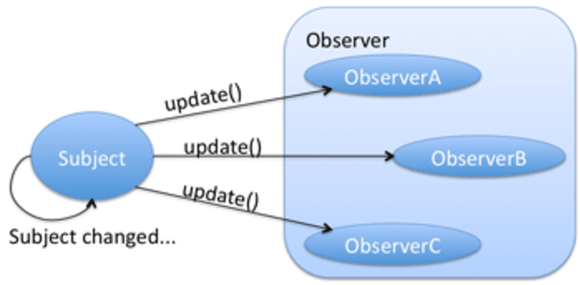
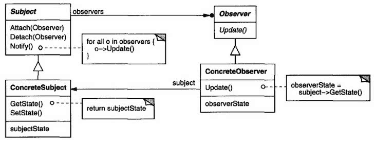

# Observer Pattern

Observer Pattern이란, **객체 사이에 일대다 관계**를 두어, 어떤 **객체의 상태가 변할 때** 그 객체의 **의존성을 가지고 있는 객체들**이 **변화를 통지**받고 **자동으로 갱신**될 수 있게 하는 패턴이다.

Observer Pattern은 **Reactive Programming의 기본**이 되는 디자인 패턴이다.



## 구조

---



### Subject

---

여러가지 **객체들을 등록(Attach)** 시켜두고, Notify()가 실행되면 **Attach된 모든 객체들을 순회**하며 **Update**하는 형태이다.

여기서 Subject와 Observer는 **느슨한 결합**을 하고 있어야 하며, **특정 로직에 종속되면 안된다.**

> Observer라는건 관찰 이라는 뜻을 가지고 있다.
>
> 하지만 Observer 패턴은 관찰 이라기 보단 Subject에 등록된 객체가 변경되면 등록된 객체들에게 **알림**을 하는것에 가깝다.
>
> 그래서 게시-구독(pub/sub) 패턴과 비슷한 형태를 가지고 있지만, pub/sub 패턴은 중간에 이벤트를 처리하는게 하나 있다.

Subject는 여러개의 Observer를 가질 수 있다.

> Observable 이라고 표현되도 Subject 라고 생각하면 된다.
>
> Observable은 **지속적으로 흐름을 파악할 수 있는 데이터**를 의미한다.


### Observer

---

Observer 객체는 Subject의 변화에 관심을 가진다.

Observer 인터페이스는 다음과 같이 생겼다.

``` java
public interface Observer {
    public void update(Subject theChangedSubject);
}
```

Subject가 변화했을 때 실행시킬 update 메소드를 가진다.

여러 Observer가 하나의 Subject에 붙을 수 있다.


### 구현시 고려해야 할 점

---

- Observer는 상태를 저장하지 않아도 된다.

- Notify의 호출

  Notify 메소드의 호출은 두 방법중 하나를 택하는걸 권장한다.

  - 변경을 저장하는 메소드가 호출
  - main 등 사용자가 적절한 시기에 호출

  > 개인적으로는 전자를 선호한다.