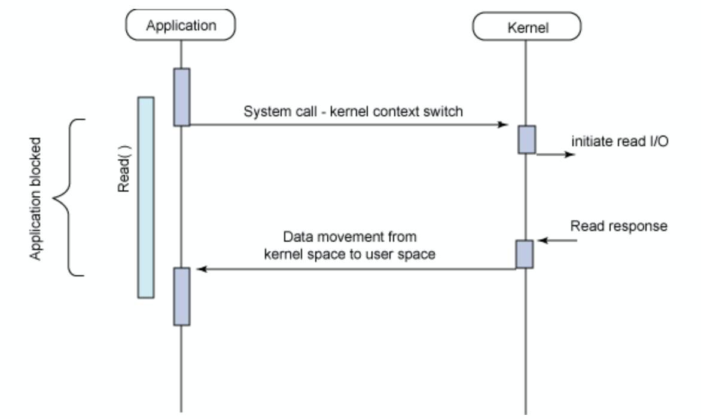
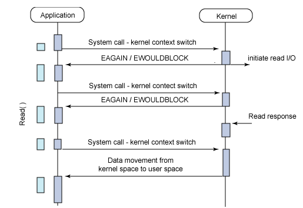
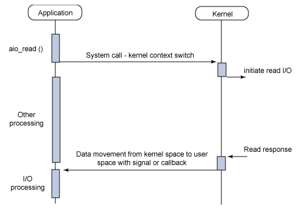
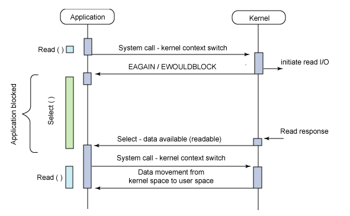

## Blocking I/O

---

기존의 Blocking I/O 방식은 **작업이 수행될 때까지 프로세스나 스레드가 작업을 멈추게**된다.

> 직접 제어할 수 없는 작업을 해야할 때, 작업이 끝날때까지 제어권을 넘겨두지 않게 된다.

**호출한 함수가 return 하지 않고 작업을 완료**한다.

## Non-Blocking I/O

---

Non-blocking I/O는 위와 같은 문제를 해결하기 위해 **I/O 이벤트 발생 시 유저 프로세스의 작업을 중단하지 않는다.**

즉 유저 프로세스가 I/O 작업을 요청하게 되면 함수는 **I/O를 요청한 후 바로 return 해줘서 다음 작업을 하도록 한다.**

## 비동기 I/O

---

I/O 처리가 완료된 시점에 결과를 회신하는 모델이다.

어플리케이션은 결과가 반환될때까지 다른 작업을 할 수 있다.

반환될때까지 결과를 신경쓰지 않는다.

## 동기 I/O

---

I/O 작업이 끝날 때 까지 시간을 맞춘다.

> A와 B가 있을 때, A의 끝나는 시간과 B의 시작시간을 맞추는 방법이다.

즉 **I/O 작업이 끝날 때 까지 다른 작업을 할 수 없다.**

### Synchronous Block I/O (동기 블록 I/O)

이러한 방식은 하나의 스레드에서 여러 요청을 처리할 수 없다.

위 예제와 같이 여러 요청을 동시에 처리하려면 **매 요청마다 스레드를 생성해서 처리**해야 한다.

매번마다 스레드를 생성하는건 부하가 크기 때문에 보통 Thread Pool을 통해 스레드를 관리하게 된다.

하지만 Thread Pool을 이용하더라도, 여전히 오버헤드는 크다.

### Synchronous Non-Block I/O(동기  논블록 I/O)

요청이 오면 커널의 완료 여부와 무관하게 **바로 반환한다.**

만약 완료되지 않았으면 **오류를 반환**하고, 완료되었으면 **값을 반환**한다.

즉 사용자 프로세스는 계속해서 작업을 할 수 있다.

계속해서 완료되었는지 확인을 하며, 완료되지 않았으면 완료되지 않았다는 신호를 반환한다.

이렇듯 확인하는데에 Overhead가 발생한다.

### Asynchronous Non-Block I/O(비동기 논 블록 I/O)

요청이 들어오면 **즉시 반환**한다.

따라서 유저 프로세스는 **하던 작업을 계속할 수 있다.**

I/O 처리가 끝난다면 **커널에서 유저 프로세스로 신호**를 보내게 된다.

> 동기 논 블록과의 차이점이다.
>
> 비동기 논 블록은 커널 -:> Application으로 요청을 보낸다.
>
> 동기 논 블록은 Application -> 커널로 요청을 보내게 된다.

### Asynchronous Block I/O(비동기 블록 I/O)

I/O 작업중 제어권을 넘겨두지 않아서 다른 작업이 불가능하다.

