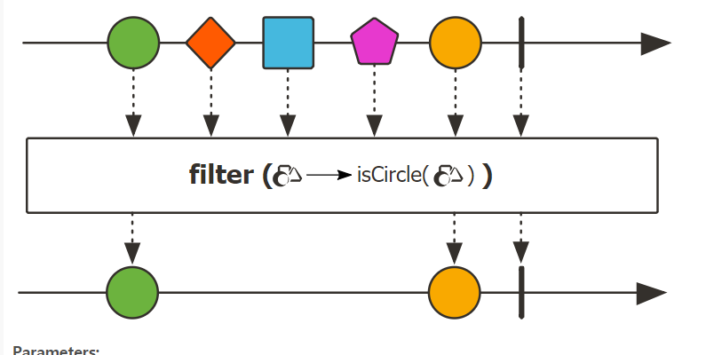
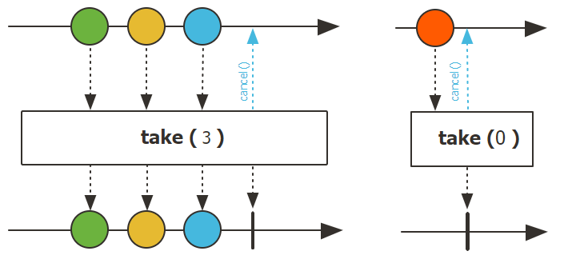
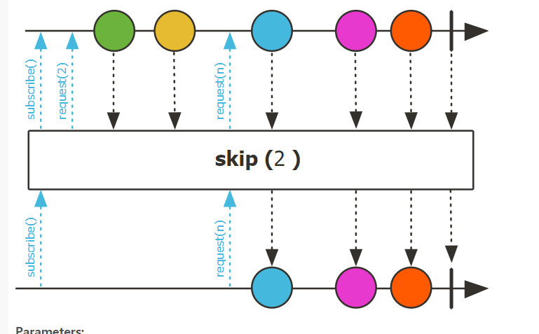
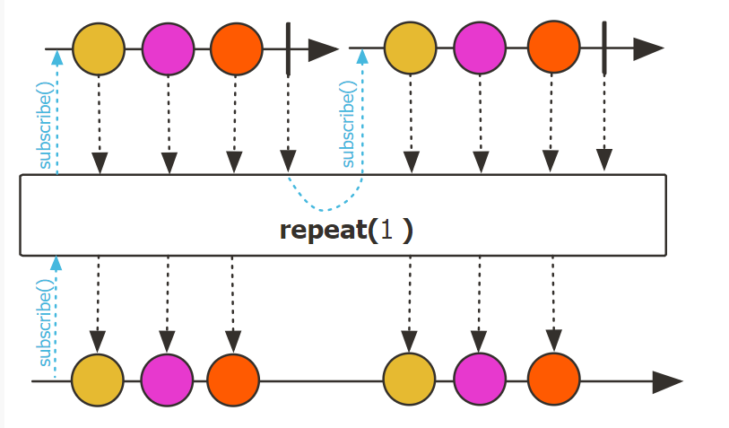
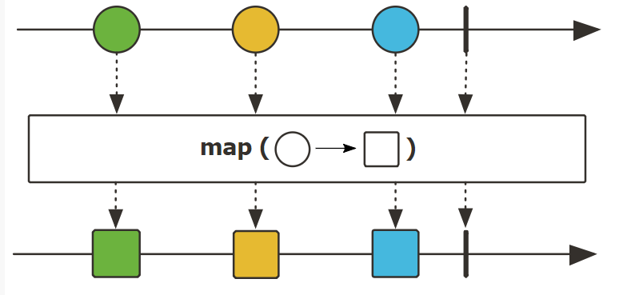

# Reactor

##  소개

Reactor는 JVM 기반의 언어에서 **Non-Blocking으로 개발**할 수 있도록 하는 프로그래밍 기법이다.

**효율적으로 요청을 처리**하기 위해 등장했다.

Reactor는 Java8의 함수형 프로그래밍을 포함하고 있으며, 특히 [CompletableFuture](./8.future.md)와 [Stream](./5.stream_api.md), Duration을 사용하여 **완전한 논 블로킹**으로 동작한다.

이러한 것들을 사용할 수 있도록 **Flux와 Mono를 지원**한다.

또한 reactor-netty 프로젝트를 통해 **논 블록킹 프로세스끼리의 통신을 지원**하며, **MSA에 적합**하다.

또한 Reactor는 **Backpressure가 준비된 네트워크 엔진을 지원**한다.

- HTTP(Web Socket)
- TCP
- UDP

> 참고로 안드로이드는 공식적으로 지원하지 않는다.
>
> 안드로이드라면 RxJava의 사용을 고려해 보아야 한다.

## 사용

> Gradle 5.0 이후 기준이다.

dependency에 아래 내용을 추가해 주면 된다.

``` groovy
dependencies {
     implementation platform('io.projectreactor:reactor-bom:2020.0.7')
     implementation 'io.projectreactor:reactor-core'
}
```

## 기존 시스템

기존에는 Callback이나 Future를 통해 비동기적인 작업을 지원했다.

하지만 Callback은 **가독성이 떨어지고 유지보수성이 좋지 않다.**

또한 Future는 CompletableFuture로 개선이 이루어졌음에도 **여러 Future 객체의 조합은 어렵고, 지연 실행을 지원하지 않는다.**

이에 비해 reactor는 **여러 메소드를 지원**하고, 더 **깔끔하고 가독성이 좋은 코드**를 짜도록 한다.

## Reactive 라이브러리

Reactive 라이브러리들(reactor, RX Java 등)은 몇가지 관점에 집중해서 JVM 위에서 고전적인 관점으로의 비동기적 접근을 돕는다.

### 결합성과 가독성

결합성은 **여러 비동기 작업들의 조율**을 의미한다.

예를 들어 한 작업의 반환 값이 다른 작업의 input 값이 되는 경우를 의미하거나, fork-join model에서 여러 작업을 동시에 실행할 수 있다.

> fork-join model이란 병렬 컴퓨팅에서 병렬 프로그램들을 설정하고 실행하는 방법이다.

게다가 우리는 더 높은 Level에서 작업들을 개별적인 Component로서 사용할 수 있다.

이러한 작업들을 관리하는 능력은 **가독성과 유지보수성에 큰 영향**을 준다.

비동기 프로세스가 늘어남에 따라 복잡도가 함께 증가하기 때문에 코드를 짜고, 읽는 것은 점점 더 어려워 진다.

<br>

알다싶이 Callback 방법은 간단하지만 읽기 어렵고 Callback이 Callback을 실행하고 또 그 Callback을 Callback이 실행하는 복잡한 일이 발생하게 된다.

이러한 일은 **CallBack 지옥**이라는 이름으로 유명하다.

 <br>

Reactor는 **여러가지 옵션**들을 제공하는데, 이러한 옵션들은 Callback처럼 중첩되는 일을 최대한 방지해 주게 된다.

<br>

### 조립 라인에 비유

Reactor의 데이터 처리는 공장에서 조립되는 물건에 비유할 수 있다

Reactor는 컨베이어 벨트 이면서 동시에 작업대이다.

가공이 되기 전의 물건이 Reactor에 들어가게 되면, 소비자에게 전달할 수 있는 완제품으로 전달된다.

물건이 들어가는걸 Publisher가 데이터를 publish 한다고 생각할 수 있고, 소비자는 Subscriber라고 할 수  있다.

<br>

### 연산자

Reactor에서 각각의 연산자는 Publisher의 동작을 하고, 이전 단게 Publisher를 새로운 instance로 감싼다.

이것은 **모든 chain들이 연결되어 있다는 의미**이며, **기존의 데이터가 다음 체인으로 내려가서 변경**된다는걸 의미한다.

결국 **하나의 Subscriber가 프로세스를 종료**시킨다는걸 의미한다.

> 이러한 연산자는 Reactive Stream 표준에 명시되어 있지 않다.

<br>

### subscribe()

Reactor에서 Publisher chain을 사용하게 되면 **데이터가 기본적으로 들어가지 않는다.**

대신, **비동기 프로세스에 대한 설명**을 생성한다.

이렇게 하면 재사용성을 높일 수 있다.

Subscribing이라는 동작은 **Publisher와 Subscriber를 연결**시켜줌으로써 **전체 Chain 데이터의 흐름을 시작**한다.

<br>

### BackPressure

Upstream 으로의 신호 전파는 또한 backpressure 를 구현하곤 한다.

backpressure 는 조립 라인에서 워크스테이션이 upstream 워크스테이션에게 라인을 조금 천천히 보내달라고 요청을 보내는 것이다.  

<br>

Reactive Stream 이 정의하고 있는 Backpressure 의 실제 메커니즘에서 Subscriber 는 unbounded 모드로 실행될 수 있다.

> unbounded 는 **Backpressure 없이 모든 데이터를 전송**하도록 한다.

그리고 publisher 에게 보낼 수 있는 데이터는 최대한 빨리 보내달라고 요청할 수 있다.

또는 최대 N 개의 요소 까지 처리할 수 있는 양 만큼만 Publisher 에게 요청하는 Request 메커니즘을 사용할 수 있다.

 <br>

이 방법은 push 모델에서 push-pull 하이브리드 모델로 변경하여 downstream 이 수용가능한 원소 갯수 만큼만 pull 할 수 있게 해준다.

그러나 요소가 준비되지 않은 경우 생성될때마다 업스트림에 의해 푸쉬된다.

<br>

### Hot vs Cold

Rx에서 사건들은 2개의 큰 카테고리로 분류된다.

주로 **Subscriber가 어떻게 반응 하는지**를 기준으로 분류된다.

<br>

#### Cold

Cold 데이터는 **각각의 Subscriber마다 data를 포함해서 모두 새로 전송**된다.

즉 **Subscriber가 구독하는 순간부터 전송을 시작**한다.

우리가 1부터 10까지의 데이터를 Publisher가 전송한다고 가정했을 때, 우리가 구독한 이후부터 1부터 10까지의 데이터가 온다.

<br>

#### Hot 

Hot 데이터는 **Subscriber마다 새로 전송되지 않는다.

몇몇 Hot Reactive Stream은 신호를 보낸 기록 전체 혹은 일부분을 캐싱하거나 다시 실행할 수 있다.

Hot 시퀀스는 **Subscriber가 듣고 있지 않아도 신호를 보낼 수 있다.**

쉽게 말하면 실시간 스트리밍처럼 **우리가 구독하고 있지 않아도 그 데이터는 계속해서 전송된다.**

하지만 우리가 실질적으로 데이터를 받는건 **구독한 후이다**

1부터 10까지의 데이터를 Publisher가 전송한다고 가정했을 때, 우리가 5 데이터를 전송하고 있을 때 구독을 했다면 5~10까지의 데이터를 받을 수 있다.

<br>

## Reactor Core의 특징

Reactor의 메인 구조는 Reactive Stream 표준에 집중한 reactor-core이다.

reactor-core는 JDK8 부터  지원된다.

Reactor는 Publisher를 구현하였고, 많은 연사자들을 지원하는 **Reactive 자료형**을 소개했다.

Flux와 Mono인데 Flux 객체는 0 ~ N개의 Reactive 데이터를 발행하는 반면에, Mono 객체는 0~1개의 데이터를 발행한다.

<br>

이런 차이는 **비동기 처리의 대략적인 갯수**를 나타내 준다.

예를 들어 하나의 HTTP request는 하나의 HTTP Response만을 반환한다. 따라서 count 연산 같은걸 할 필요가 없다.

HTTP Response를 Mono<HttpResponse> 와 같이 사용하는 이유는 **0개 또는 1개의 데이터를 처리하는 연산만을 제공**하기 때문이다.

<br>

연산자는 **원소의 개수를 변경**할 수 있다.

예를 들어, Flux에서 count를 수행했을 때 결과는 Mono<Long>이다.

<br>

#### Flux


Flux는 **0~N개의 발행된 데이터에 대한 비동기 시퀀스를 제공**하는 **기본적인 Publisher**이다

오류가 발생하면 error 신호, 성공하면 Completion 신호를 보내게 된다.

신호들은 Subscriber의 onNext, onComplete, onError 메소드를 호출하게 된다.

<br>

#### Mono


Mono는 **하나의 신호를 처리하는데 특화**된 Publisher 이다.

onNext 신호를 통해 최대 하나의 item을 보낸 후 onComplete 신호 또는 onError 신호를 통해 종료한다.

값은 있을수도, 없을수도 있다

대부분의 Mono 구현체들은 **onNext() 직후 onComplete()가 호출되기를 바란다.**

> Mono.never 은 예외이다.

Mono는 다른 신호를 보내는게 기술적으로 막혀있다.

<br>

Mono는 Flux의 연산자들을 몇개 지원한다.

몇몇 연산자는 Mono를 Flux로 반환하기도 한다.

<br>

Mono는 **값이 없는 비동기 프로세스**를 표현할 수 있다.

`Mono<Void>` 처럼 사용해서 Runnable과 비슷한 비동기 프로세스를 표현할 수 있다.

<br>

### Flux와 Mono 생성

Flux와 Mono 객체를 만드는건 **무수히 많은 Factory 메소드**를 통해 가능하다.

예를 들어 여러개의 String들로 이루어진 Sequence를 만들고 싶다면 다음과 같이 사용하면 된다.

``` java
Flux<String> test = Flux.just("aa","bb","cc");
```

또는 Iterator를 사용할 수도 있다.

``` java
List<String> list = Arrays.asList("aa","bb","cc");
Flux<Integer> numbers = Flux.fromIterator(list);
```

다음과 같이 빈 Mono도 생성할 수 있다.

``` java
Mono<String> noData = Mono.empty();
```

혹은 range()를 사용할수도 있다.

``` java
Flux<Integer> numberFiveToSeven = Flux.range(5,3);	// 5 부터 3개. 즉 5,6,7
```

<br>

### Subscribe

Flux와 Mono는 구독할 때, **lambda를 사용**하는데, `.subscribe()` 메소드를 호출할 때에 여러가지 종류가 있다.

``` java
subscribe(); // 구독하고 시퀀스를 동작시킨다.

subscribe(Consumer<? super T> consumer); 	// 각각의 값마다 어떠한 작업을 수행한다.

subscribe(Consumer<? super T> consumer,
          Consumer<? super Throwable> errorConsumer); // 값의 처리 뿐만 아니라 에러에 대한 처리도 한다.

subscribe(Consumer<? super T> consumer,
          Consumer<? super Throwable> errorConsumer,
          Runnable completeConsumer); 					// 시퀀스가 성공적으로 완료되었을 때의 코드

subscribe(Consumer<? super T> consumer,
          Consumer<? super Throwable> errorConsumer,
          Runnable completeConsumer,
          Consumer<? super Subscription> subscriptionConsumer); // 이 subscribe 호출로 인해 생성된 Subscription으로 어떠한 작업을 한다.
```

<br>

**예제**

``` java
Flux<Integer> ints = Flux.range(1, 3);
ints.subscribe();
```

위 예제는 정상적으로 3개의 값을 보낸다.

하지만 output이 존재하지 않기 때문에 어떤 동작을 했는지는 볼 수 없다.

그렇기 때문에 각각의 값 마다 print문이 수행되게 하면 볼 수 있다.

``` java
Flux<Integer> ints = Flux.range(1, 3);
ints.subscribe(i -> System.out.println(i));
```

각각의 값 마다 print를 실행하기 때문에 1,2,3 이라는 결과가 출력된다.

``` java
Flux<Integer> ints = Flux.range(1, 4)
      .map(i -> {
        if (i <= 3) return i;
        throw new RuntimeException("Got to 4");
      });
ints.subscribe(i -> System.out.println(i),
      error -> System.err.println("Error: " + error));
```

위 예제는 range로 1~4까지를 만든 후, 4 이상의 값에서는 Exception이 발생하는 예제이다.

위와 같이, 예외에 대해서 print 하도록 처리를 시켜줄 수 있다.

output은 다음과 같다.

``` java
1
2
3
Error: java.lang.RuntimeException: Got to 4
```

다음으로 Complete에 관한 처리는 3번째 매개변수로 줄 수 있다.

```java
Flux<Integer> ints = Flux.range(1, 4); 
ints.subscribe(i -> System.out.println(i),
    error -> System.err.println("Error " + error),
    () -> System.out.println("Done")); 
```

위와 같이 Complete 신호의 경우에는 Done이 출력되도록  할 수 있다.

#### subscribe() 취소

lambda 기반의 subscribe() 메소드들은 **Disposal 이라는 반환 타입**을 가지게 된다.

Disposal 타입은 `disposal()`메소드를 통해 **해당 Subscription이 취소될 수 있음**을 의미한다.

Cancellation 이라는 신호는 **Flux와 Mono가 보내는 데이터를 멈춰야 한다**는걸 의미한다.

하지만 **즉시 멈추는걸 보장하진 않는다.**

몇몇 소스들은 **보내는게 매우 빨라서, Cancellation 이라는 신호가 도착하기 전에 전송이 끝나게 되면 멈추지 않을 수 있다.**

<br>

Disposable의 몇몇 utilities들은 Disposables 에서도 가능하다.

이 중에서 Disposables.swap() 메소드는 Concrete Disposable을 생성하게 되는데, 기존의 Disposable을 대체할 수 있고 **취소를 Atomic하게 할 수 있게 한다.**

> 즉 한번에 모두 취소시켜 준다.

Wrapper를 닫게 되면 **Sequence 전체가 닫히게 된다.**

#### Lambda의 대안

subscribe()를 사용하는 것 보다 **더 범용적이고 Subscriber의 특색을 가진 함수**가 있다.

Subscriber를 작성하는걸 쉽게 하기 위해서 **BaseSubscriber**라는 상속 가능한 클래스를 제공한다.

<br>

BaseSubscriber을 상속한 클래스들은 **한번만 사용할 수 있다.**

즉 하나를 Publisher를 구독하고 다른 Publisher를 구독하려 하면 **첫 번째 구독을 끊고 두 번째 Publisher를 구독한다.**

왜냐하면 **하나의 인스턴스를 여러번 사용하게 되면 Reactive Stream의 규칙을 깰 수 있기 때문이다.**

Subscriber의 **onNext() 메소드는 병렬로 호출되면 안된다** 라는 규칙이 깨어질 수 있다.

<br>

``` java
SampleSubscriber<Integer> ss = new SampleSubscriber<Integer>();
Flux<Integer> ints = Flux.range(1, 4);
ints.subscribe(ss);
```

위와 같이 subscribe의 매개변수로 넣어주면 된다.

SampleSubscribere를 만들어 주자.

``` java
import org.reactivestreams.Subscription;
import reactor.core.publisher.BaseSubscriber;

public class SampleSubscriber<T> extends BaseSubscriber<T> {
    
    @Override
    public void hookOnSubscribe(Subscription subscription) {
        System.out.println("Subscribed");
        request(1);
    }

    @Override
    public void hookOnNext(T value) {
        System.out.println(value);
        request(1);
    }
}
```

사용자 정의 Subscriber를 만들기 위한 추상 클래스인 BaseSubscriber를 상속 받아서 메소드를 오버라이딩 한다.

해당 클래스는 **subscriber가 하는 행동을 재정의**할 수 있다.

기본적으로 subscribe()와 똑같이 동작한다.

하지만 BaseSubscriber를 상속받는 것이 Request의 양을 커스텀할 때 훨씬 유용하다.

<br>

요청 양의 커스텀을 위해선 최소한 hookOnSubscribe()와 hookOnNext()를 구현한다.

hookOnSubscribe() 메소드는 print를 하고 난 다음 첫번째 request를 생성한다.

그리고 OnNext() 메소드가 각각의 value를 출력하고 새로운 request를 생성하게 된다.

<br>

위 예제의 결과는 다음과 같다.

```
Subscribed
1
2
3
4
```

> 우리가 구독할 때 따로 print를 한적이 없지만, **BaseSubscriber에서 Overriding한 onNext()에 의해 출력**된다.

또한 BaseSubscriber는 requestUnbounded()를 통해 Unbounded Mode로 변환할 수 있다.

> request(Long.MAX_VALUE)와 같다.

또한 hookOnComplete(), hookOnError(), hookOnCancel(), hookOnFinally() 와 같은 메소드들을 지원한다.

hookOnFinally() 메소드는 **시퀀스가 종료될 때 SingleType 파라미터를 줬다면 항상 실행**되는 메소드 이다.

<br>

## 시퀀스 생성

Flux나 Mono를 **재정의**하고 이와 관련된 이벤트(onNext나 onComplete, onError)들을 정의 하는 것에 대해 본다.

이런 작업은 **이벤트를 작동시킬 수 있는 API를 제공**하고 있고, 이것을 **sink**라고  부른다.

<br>

### 동기적으로 생성

가장 간단한건 generate 메소드를 이용하는 것인데, **1:1 동기**를 위한 것이다.

**SynchronousSink**라는 의미이고, next() 메소드는 **Callback마다 한 번 까지만 호출**가능하다.

추가로 `error()`나 `complete()` 메소드도 호출 가능한데, 선택사항이다.

generate 함수는 `BiFunction<S, SynchronousSink<T>, S>`의 형태이다.

`S` 타입은 **상태 객체**로, 초기 값으로 `Supplier<S>`를 줘야 한다.

그리고 `SynchronousSink<T>`에는 **매번마다 다른 값은 반환**하는 함수를 넣어줘야 한다.

<br>

## 연산자

Webflux는 **수많은 연산자들을 지원**한다.

이러한 연산자들은 우리가 복잡하게 구현할 필요를 없게 해주어서 **코드가 가독성이 좋고 깔끔해진다.**

<br>

### Filter()

우리가 Flux를 사용할 때, 특정 데이터만 추출하고 싶을 때가 있다.

그럴때 filter를 사용해서 우리가 원하는 데이터만 추릴 수 있다.



위 그림을 보면 **원 인 것만 추출**한다.

``` java
Flux<String> test = Flux.just("circle","square", "etc");
test.filter(shape -> shape.equals("circle"));
```

<br>

### Take()

우리가 원하는 갯수 만큼만 데이터를 전달하고 싶을 때에는 take()를 사용하면 된다.



원하는 개수 만큼만 가져간 후에 **cancel()을 이벤트를 발생**시켜서 데이터 전송을 멈춘다.

<br>

### Skip



원하는 갯수만큼 데이터를 건너뛴 뒤부터 받는다.

해당 연산자는 Subscriber에게 skip의 개수만큼 request를 보내고, 받은 데이터를 버린다.

그 후에 다시 데이터를 전달하는 역할을 한다.

<br>

### repeat()



한 번 데이터를 받은 후에 **repeat만큼 다시 subscribe()한다.**

따라서 해당 횟수만큼 데이터를 다시 받을 수 있다.

> 데이터 갯수는 (데이터 수) * (repeat의 매개변수 + 1)이다

<br>

### map()

각각의 데이터에 대한 연산을 해준다.



위와 같이 *동그라미는 네모로 바꿔라* 라는 연산을 하면, 각각 비교해서 동그라미를 네모로 바꿔준다.

이를 통해 각각의 데이터를 소문자로 바꾸거나, 대문자로 바꾸는 등 여러가지 작업을 할 수 있다.

> Java Stream의 map 이라고 생각하면 편하다

하지만 내부 함수에 의해 변형되기 때문에 **동기 - 논 블록 방식**이다. 따라서  **정해진 시간**동안 실행할 연산을 수행해야 한다.

`Function<T, U>` 를 받아서 `Flux<U>`를 반환한다.

flatMap처럼 `Function<T, Publisher<V>>`를 줄 수 있다.

하지만 map은 `Publisher<V>`가 뭔지 알 수 없는데, 그러면 결과는 `Flux<Publisher<V>>`이다.

> 2번째 타입 파라미터가 반환 타입이기 때문이다.

<br>

### flatMap()

map과 같이 **Publisher로부터 받은 데이터를 각각 어떠한 작업 후 다른 형태로 변형해서 반환**하는 것이다.

map과 달리 **1 -> N으로 변형**할 때 사용된다.

> 물론 1 -> 1에서도 사용된다.

**subscribe 시점에 값이 변형**된다.

**비동기 - 논 블록 방식**이고, `Function<T, Publisher<V>>`를 받고, `Flux<V>`를 반환해 준다.

<br>

### map()과 flatMap()

우선 가장 먼저, map()이든 flatMap()이든 **중첩해서 사용하면 안된다.**

> 여기서 말하는 중첩은 map() 안에 map() 이 있는걸 의미한다.
>
> map().map()과 같이 사용하라는 의미다.

이렇게 중첩된 map()은 **가독성을 떨어트리고 단일 책임 원칙에서 벗어난다.**

따라서 최대한 **하나의 map()으로 처리하도록 노력**하거나, **map()을 체이닝**으로 여러번 사용하는게 좋다.

<br>

| map                         | flatMap                               |
| --------------------------- | ------------------------------------- |
| 동기                        | 비동기                                |
| 하나의 신호를 하나의 신호로 | 하나의 신호를 N개의 신호로            |
| 내부  함수에 의해 변형      | subscribe 시점에 값이 변형            |
| <람다, 반환 타입>을 받는다. | <람다, Publisher<반환타입>>를 받는다. |

<br>

## 주의

### 최대한 Reactive Component들을 사용해라

Reactive의 장점은 비동기 작업이 Reactive의 Component로 작성되었을 때 나타난다.

**최대한 동기 작업을 지양**헤야 한다.