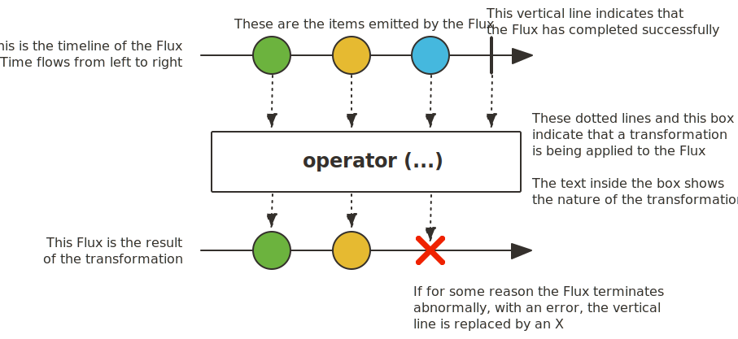
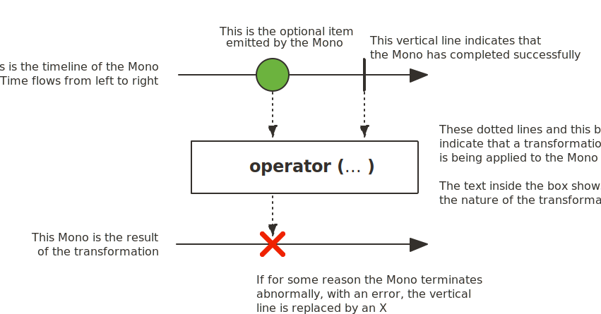

# Reactor

##  소개

Reactor는 JVM 기반의 언어에서 **Non-Blocking으로 개발**할 수 있도록 하는 프로그래밍 기법이다.

**효율적으로 요청을 처리**하기 위해 등장했다.

Reactor는 Java8의 함수형 프로그래밍을 포함하고 있으며, 특히 [CompletableFuture](./8.future.md)와 [Stream](./5.stream_api.md), Duration을 사용하여 **완전한 논 블로킹**으로 동작한다.

이러한 것들을 사용할 수 있도록 **Flux와 Mono를 지원**한다.

또한 reactor-netty 프로젝트를 통해 **논 블록킹 프로세스끼리의 통신을 지원**하며, **MSA에 적합**하다.

또한 Reactor는 **Backpressure가 준비된 네트워크 엔진을 지원**한다.

- HTTP(Web Socket)
- TCP
- UDP

> 참고로 안드로이드는 공식적으로 지원하지 않는다.
>
> 안드로이드라면 RxJava의 사용을 고려해 보아야 한다.

## 사용

> Gradle 5.0 이후 기준이다.

dependency에 아래 내용을 추가해 주면 된다.

``` groovy
dependencies {
     implementation platform('io.projectreactor:reactor-bom:2020.0.7')
     implementation 'io.projectreactor:reactor-core' 
}
```

## 기존 시스템

기존에는 Callback이나 Future를 통해 비동기적인 작업을 지원했다.

하지만 Callback은 **가독성이 떨어지고 유지보수성이 좋지 않다.**

또한 Future는 CompletableFuture로 개선이 이루어졌음에도 **여러 Future 객체의 조합은 어렵고, 지연 실행을 지원하지 않는다.**

이에 비해 reactor는 **여러 메소드를 지원**하고, 더 **깔끔하고 가독성이 좋은 코드**를 짜도록 한다.

## Reactive 라이브러리

Reactive 라이브러리들(reactor, RX Java 등)은 몇가지 관점에 집중해서 JVM 위에서 고전적인 관점으로의 비동기적 접근을 돕는다.

### 결합성과 가독성

결합성은 **여러 비동기 작업들의 조율**을 의미한다.

예를 들어 한 작업의 반환 값이 다른 작업의 input 값이 되는 경우를 의미하거나, fork-join model에서 여러 작업을 동시에 실행할 수 있다.

> fork-join model이란 병렬 컴퓨팅에서 병렬 프로그램들을 설정하고 실행하는 방법이다.

게다가 우리는 더 높은 Level에서 작업들을 개별적인 Component로서 사용할 수 있다.

이러한 작업들을 관리하는 능력은 **가독성과 유지보수성에 큰 영향**을 준다.

비동기 프로세스가 늘어남에 따라 복잡도가 함께 증가하기 때문에 코드를 짜고, 읽는 것은 점점 더 어려워 진다.

   

알다싶이 Callback 방법은 간단하지만 읽기 어렵고 Callback이 Callback을 실행하고 또 그 Callback을 Callback이 실행하는 복잡한 일이 발생하게 된다.

이러한 일은 **CallBack 지옥**이라는 이름으로 유명하다.

   

Reactor는 **여러가지 옵션**들을 제공하는데, 이러한 옵션들은 Callback처럼 중첩되는 일을 최대한 방지해 주게 된다.

### 조립 라인에 비유

Reactor의 데이터 처리는 공장에서 조립되는 물건에 비유할 수 있다

Reactor는 컨베이어 벨트 이면서 동시에 작업대이다.

가공이 되기 전의 물건이 Reactor에 들어가게 되면, 소비자에게 전달할 수 있는 완제품으로 전달된다.

물건이 들어가는걸 Publisher가 데이터를 publish 한다고 생각할 수 있고, 소비자는 Subscriber라고 할 수  있다.

### 연산자

Reactor에서 각각의 연산자는 Publisher의 동작을 하고, 이전 단게 Publisher를 새로운 instance로 감싼다.

이것은 **모든 chain들이 연결되어 있다는 의미**이며, **기존의 데이터가 다음 체인으로 내려가서 변경**된다는걸 의미한다.

결국 **하나의 Subscriber가 프로세스를 종료**시킨다는걸 의미한다.

> 이러한 연산자는 Reactive Stream 표준에 명시되어 있지 않다.

### subscribe()

Reactor에서 Publisher chain을 사용하게 되면 **데이터가 기본적으로 들어가지 않는다.**

대신, **비동기 프로세스에 대한 설명**을 생성한다.

이렇게 하면 재사용성을 높일 수 있다.

Subscribing이라는 동작은 **Publisher와 Subscriber를 연결**시켜줌으로써 **전체 Chain 데이터의 흐름을 시작**한다.

### BackPressure

Upstream 으로의 신호 전파는 또한 backpressure 를 구현하곤 한다.

backpressure 는 조립 라인에서 워크스테이션이 upstream 워크스테이션에게 라인을 조금 천천히 보내달라고 요청을 보내는 것이다.  


Reactive Stream 이 정의하고 있는 Backpressure 의 실제 메커니즘에서 Subscriber 는 unbounded 모드로 실행될 수 있다.

그리고 publisher 에게 보낼 수 있는 데이터는 최대한 빨리 보내달라고 요청할 수 있다.

또는 최대 N 개의 요소 까지 처리할 수 있는 양 만큼만 Publisher 에게 요청하는 Request 메커니즘을 사용할 수 있다.

 

이 방법은 push 모델에서 push-pull 하이브리드 모델로 변경하여 downstream 이 수용가능한 원소 갯수 만큼만 pull 할 수 있게 해준다.

그러나 요소가 준비되지 않은 경우 생성될때마다 업스트림에 의해 푸쉬된다.

### Hot vs Cold

Rx에서 사건들은 2개의 큰 카테고리로 분류된다.

주로 **Subscriber가 어떻게 반응 하는지**를 기준으로 분류된다.

#### Cold

Cold 데이터는 **각각의 Subscriber마다 data를 포함해서 모두 새로 전송**된다.

즉 **Subscriber가 구독하는 순간부터 전송을 시작**한다.

우리가 1부터 10까지의 데이터를 Publisher가 전송한다고 가정했을 때, 우리가 구독한 이후부터 1부터 10까지의 데이터가 온다.

#### Hot 

Hot 데이터는 **Subscriber마다 새로 전송되지 않는다.

몇몇 Hot Reactive Stream은 신호를 보낸 기록 전체 혹은 일부분을 캐싱하거나 다시 실행할 수 있다.

Hot 시퀀스는 **Subscriber가 듣고 있지 않아도 신호를 보낼 수 있다.**

쉽게 말하면 실시간 스트리밍처럼 **우리가 구독하고 있지 않아도 그 데이터는 계속해서 전송된다.**

하지만 우리가 실질적으로 데이터를 받는건 **구독한 후이다**

1부터 10까지의 데이터를 Publisher가 전송한다고 가정했을 때, 우리가 5 데이터를 전송하고 있을 때 구독을 했다면 5~10까지의 데이터를 받을 수 있다.

## Reactor Core의 특징

Reactor의 메인 구조는 Reactive Stream 표준에 집중한 reactor-core이다.

reactor-core는 JDK8 부터  지원된다.

Reactor는 Publisher를 구현하였고, 많은 연사자들을 지원하는 **Reactive 자료형**을 소개했다.

Flux와 Mono인데 Flux 객체는 0 ~ N개의 Reactive 데이터를 발행하는 반면에, Mono 객체는 0~1개의 데이터를 발행한다.


이런 차이는 **비동기 처리의 대략적인 갯수**를 나타내 준다.

예를 들어 하나의 HTTP request는 하나의 HTTP Response만을 반환한다. 따라서 count 연산 같은걸 할 필요가 없다.

HTTP Response를 Mono<HttpResponse> 와 같이 사용하는 이유는 **0개 또는 1개의 데이터를 처리하는 연산만을 제공**하기 때문이다.


연산자는 **원소의 개수를 변경**할 수 있다.

예를 들어, Flux에서 count를 수행했을 때 결과는 Mono<Long>이다.

#### Flux



Flux는 **0~N개의 발행된 데이터에 대한 비동기 시퀀스를 제공**하는 **기본적인 Publisher**이다

오류가 발생하면 error 신호, 성공하면 Completion 신호를 보내게 된다.

신호들은 Subscriber의 onNext, onComplete, onError 메소드를 호출하게 된다.

#### Mono



Mono는 **하나의 신호를 처리하는데 특화**된 Publisher 이다.

onNext 신호를 통해 최대 하나의 item을 보낸 후 onComplete 신호 또는 onError 신호를 통해 종료한다.

값은 있을수도, 없을수도 있다

대부분의 Mono 구현체들은 **onNext() 직후 onComplete()가 호출되기를 바란다.**

> Mono.never 은 예외이다.

Mono는 다른 신호를 보내는게 기술적으로 막혀있다.


Mono는 Flux의 연산자들을 몇개 지원한다.

몇몇 연산자는 Mono를 Flux로 반환하기도 한다.


Mono는 **값이 없는 비동기 프로세스**를 표현할 수 있다.

`Mono<Void>` 처럼 사용해서 Runnable과 비슷한 비동기 프로세스를 표현할 수 있다.

### Flux와 Mono 생성

Flux와 Mono 객체를 만드는건 **무수히 많은 Factory 메소드**를 통해 가능하다.

예를 들어 여러개의 String들로 이루어진 Sequence를 만들고 싶다면 다음과 같이 사용하면 된다.

``` java
Flux<String> test = Flux.just("aa","bb","cc");
```

또는 Iterator를 사용할 수도 있다.

``` java
List<String> list = Arrays.asList("aa","bb","cc");
Flux<Integer> numbers = Flux.fromIterator(list);
```

다음과 같이 빈 Mono도 생성할 수 있다.

``` java
Mono<String> noData = Mono.empty();
```

혹은 range()를 사용할수도 있다.

``` java
Flux<Integer> numberFiveToSeven = Flux.range(5,3);	// 5 부터 3개. 즉 5,6,7
```

### Subscribe

Flux와 Mono는 구독할 때, **lambda를 사용**하는데, `.subscribe()` 메소드를 호출할 때에 여러가지 종류가 있다.

``` java
subscribe(); // 구독하고 시퀀스를 동작시킨다.

subscribe(Consumer<? super T> consumer); 	// 각각의 값마다 어떠한 작업을 수행한다.

subscribe(Consumer<? super T> consumer,
          Consumer<? super Throwable> errorConsumer); // 값의 처리 뿐만 아니라 에러에 대한 처리도 한다.

subscribe(Consumer<? super T> consumer,
          Consumer<? super Throwable> errorConsumer,
          Runnable completeConsumer); 					// 시퀀스가 성공적으로 완료되었을 때의 코드

subscribe(Consumer<? super T> consumer,
          Consumer<? super Throwable> errorConsumer,
          Runnable completeConsumer,
          Consumer<? super Subscription> subscriptionConsumer); // 이 subscribe 호출로 인해 생성된 Subscription으로 어떠한 작업을 한다.
```

**예제**

``` java
Flux<Integer> ints = Flux.range(1, 3);
ints.subscribe();
```

위 예제는 정상적으로 3개의 값을 보낸다.

하지만 output이 존재하지 않기 때문에 어떤 동작을 했는지는 볼 수 없다.

그렇기 때문에 각각의 값 마다 print문이 수행되게 하면 볼 수 있다.

``` java
Flux<Integer> ints = Flux.range(1, 3);
ints.subscribe(i -> System.out.println(i));
```

