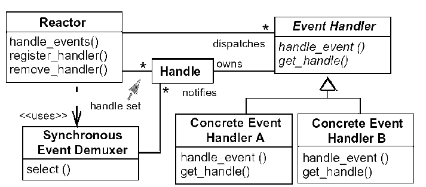

# Reactor Pattern

## 소개

---

**동시성**을 다루는 프로그래밍 기법 중 하나로, **이벤트 기반 아키텍처**의 일종이다.

동시에 들어오는 여러 클라이언트들의 요청을 처리한다.

> 나중에 알게되었지만, Project Reactor과는 별 관계가 없다.
>
> 초기 모델에서 Reactor Pattern의 장점들을 모아서 만들긴 했다고 한다.

## 구성

---

### Reactor

Reactor는 개별 Thread에서 실행되며, 이벤트 루프를 돌며 받은 이벤트를 Dispatcher에게 전달한다.

Event Queue에 이벤트를 등록/삭제 한다.

위 그림에서 Reactor를 의미한다.

### Dispatcher

요청이 오면 맞는 이벤트 핸들러에게 넘기게 된다.

Demultiplexing 역할을 맡게 된다.

### Event Handler

실질적으로 Event를 처리하는 역할이다.

### Event Queue

Event와 그에 맞는 Handler가 저장되는 Queue이다.

### Event Handler Map

Event Handler를 담고있는 객체이다.