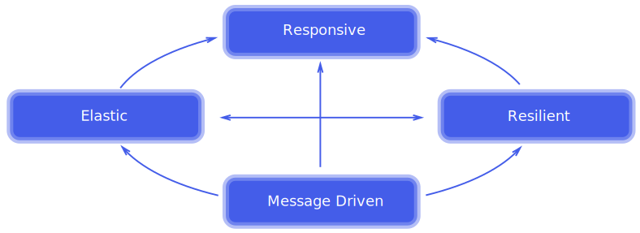
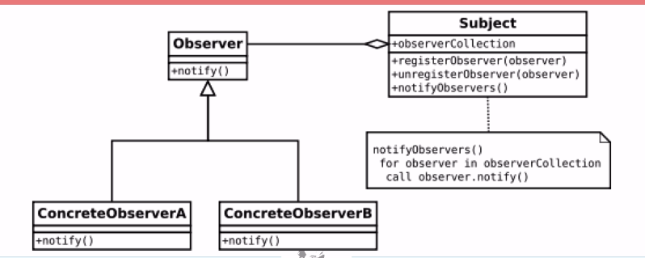
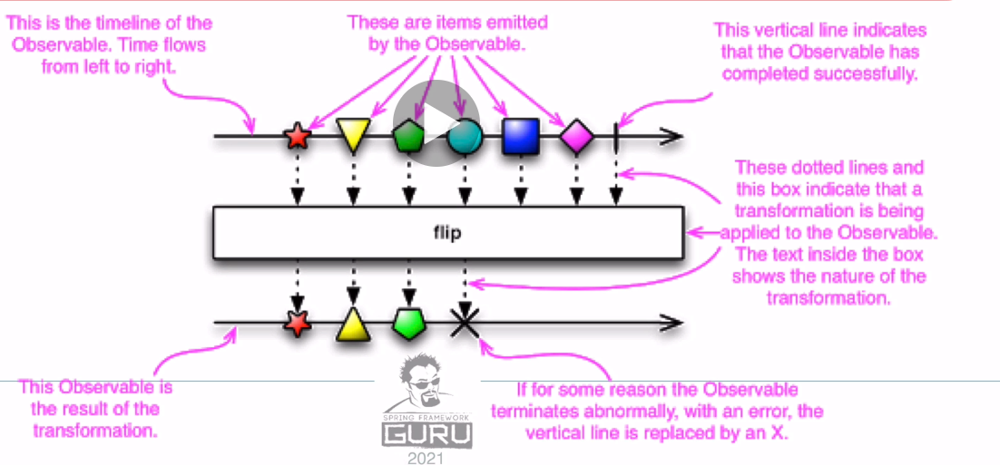
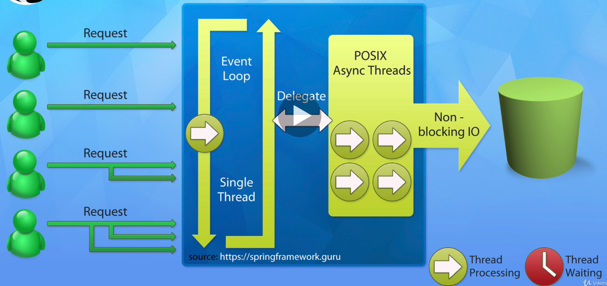
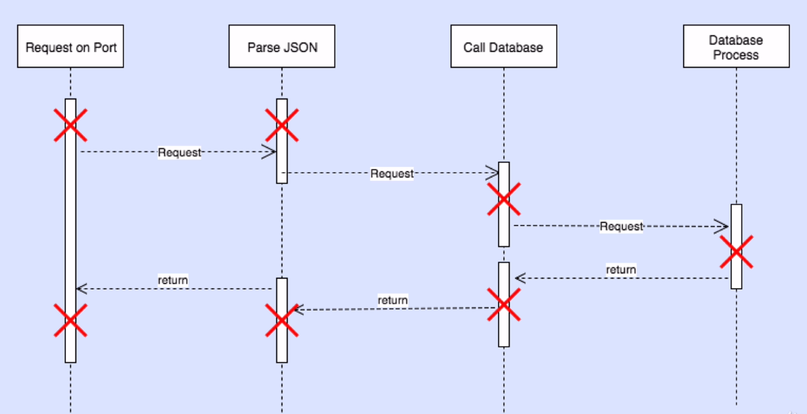

# Reactive Programming

## 1-1 Reactive Manifesto

Reactive Manifesto는 **리엑티브 애플리케이션 개발의 핵심 원칙에 대한 정의**를 의미한다.

먼저 Reactive Programming에 대한 오해가 있는데, **Reactive는 빠른 속도를 의미하지 않는다.**

Reactive Programming은 **더 효율적인 처리**를 할 뿐이지, 더 빠르지는 않다.

 

다음 그림과 같은 특징들을 가지고 있다.

Reactive Application은 **반응성**, **탄력성**, **유연성**, **메세지 주도**와 같은 특성이 있다.

 

- **Responsive**

  리엑티브 애플리케이션은 일정하고 예상할 수 있는 반응 시간을 제공해야 한다.

  또한 반응성은 문제가 빠르게 발견되고 효율적으로 처리되어야 한다.

  이러한 웹 어플리케이션들은 빠르고 일정한 반환시간을 제공하고, 일정함은 에러 핸들링을 간단하게 해 준다.

  사용성과  호용성의 초석이 된다.

 

- **Resilient**

  장애가 발생해도 시스템은 반응해야 한다.

  Replication(동일한 서버를 다른 서버에도 배포), containment(억제), isolation(격리), delegation(위임)을 통해 달성할 수 있다.

  높은 사용성은 Replication에 의해 보장되며, 각각의 컴포넌트의 회복은 다른 컴포넌트에게 위임한다.

 

- **Elastic**

  리액티브 애플리케이션에서는 서버마다 각각 다른 부하를 받게 된다.

  따라서 다양한 부하가 발생했을 때 자동으로 관련 컴포넌트의 할당한 자원 수를 늘려야 한다.

  넷플릭스를 예로 들었을 때, 만약 너무 많은 사람들이 한꺼번에 접근하게 되면 Netflix 서버는 Scale-Up을 자동으로 한다.

 

- **Message Driven**

  탄력성과 회복성을 위해서는 약한 결합, 고립 등을 지원하도록 컴포넌트간의 경계를 명확히 해야 한다.

  이를 위해서 비동기 메세지를 전달하는데, 이에 따라 컴포넌트끼리의 통신이 발생하게 되고, 이로 인해 회복성과 탄력성을 얻을 수 있다.

  또한 명시적인 메세지 전달 방식을 하면 부하관리, 탄력성, 흐름 제어를 가능하게 해준다.

 

## What is Reactive Programming

> 리액티브 프로그래밍이란?

### 소개

리액티브 프로그래밍이란 **데이터의 흐름에 초점을 둔 비동기 프로그래밍 패러다임**이다

 

"리액티브 프로그래밍은 **그들의 환경과 지속적인 상호작용을 유지**해 주지만, 프로그램이 아닌 **환경에 의해 결정**된다.

Interactive 프로그램은 고유의 페이스를 가지며, 주로 Communication을 다루는 반면 Reactive 프로그램은 외부의 요청에 응답하고 정확한 interrupt handling을 한다.

실시간 프로그램은 주로 Reactive다"

` -Gerad Berry-`

`Reactive programs also maintain a continuous interaction with their environmen, but at a apeed which is determined by the environmen, not the program itself. Interactive programs work at their own pace and mostly deal with communication, while reactive programs only work in response to external demands and mostly deal with accurate interrupt handling. Real-time programs are usually reactive.`

**매우 중요한 개념**이기 때문에 이해하면 좋지만, 이해하지 못해도 Reactive의 이해를 시작하는 수준이기 때문에 천천히 해도 된다.

앞으로의 설명에서 충분히 이해할 수 있다.

 

### Reactive Programming이 주로 사용되는 곳

- 외부 서비스 호출
- 높은 수준의 도시성 메세지 발행
- SpreadSheet
- 비동기 프로세스를 통한 추상화
- 프로그램이 동기인지 비동기인지 추상화

### Reactive Programming 특징

- Data Streams
- Asynchronous
- Non Blocking
- Backpressure
- Failures as Messages

기존 애플리케이션에서 **Exception을 발생시키는 것은 많은 비용이 발생**했다.

throw가 발생할 뿐만 아니라 application을 interrupt 시켜야 했기 때문이다.

하지만 Reactive Programming에서는 이를 개선하여서 Exception이 발생하면 이를 **메세지로 변환**한다.

그리고 나서 **구독자에게 해당 메세지를 핸들링**하게 되는데,

이는 시스템의 인터럽트가 존재하지 않기 때문에 **훨씬 효율적인 처리** 라고 할 수 있다.

 

### 비동기(Asynchronous)

Reactive Programming에서 Event는 비동기적으로 할당되게 된다.

하나의 함수는 **하나의 Event(data)가 발산되었을 때 실행되도록 정의**된다.

다른 함수는 **에러가 발생했을 때 정의**된다.

다른 함수는 **완료 신호가 발생했을 때 정의**된다.

평소에 하던 방식과는 많은 차이가 있기 때문에 적응하기 힘들 수 있다.

 

### 4개로 구성된  옵저버 패턴(Gang of Four Observer Pattern)

여기서 Observer는 Subject에게 "나 이 객체들을 관찰하고 싶다" 라고 요청할 수 있다.

이것이 **Observer 패턴에서 다른 객체들의 변화를 알아차리는 방법**이다.

 

Reactive Programming은 Event를 등록할 때 이러한 방식의 접근법을 사용한다.

예시로 ReactiveX에서의 Observer Pattern을 보면 다음과 같다.

이것은 Observable 이라고 불리는데, **Observer Pattern의 구현체** 이다.

### Non-Blocking

Non-Blocking의 개념은 굉장히 중요하다.

Blocking 에서는 만약 파일을 읽거나, DB에서 정보를 읽는 등의 작업을 한다면 코드는 그 자리에 멈춰서 데이터를 기다린다.

하지만 Non-Blocking은 추가적인 데이터가 있다면 **계속 진행하며 끝나면 알려달라고 요구**한다.

 

우선 Blocking Web Application의 동작 방식은 아래와 같다.

Blocking 작업을 하는 요청이 한번에 여러개가 들어오게 되면, 한 번에 하나씩 밖에 처리할 수 없다.

따라서 Thread는 자동적으로 Sleep 상태가 되고, 반환 시간은 느려지게 된다.

게다가 Thread를 일시적으로 중단하는건 연산을 요구한다.

물론 굉장히 크게 잡아먹는건 아니지만, 여전히 요구되고 있다.

 

이에 반해 비동기 Non-blocking으로 유명한 Node.js 서버의 동작 방식을 보면 다음과 같다.

이러한 Node.js 서버 방식은 **절대 Blocking이 발생하지 않는다.**

만약 요청을 완료할 수 없게 된다면 **실패했다는 신호를 보내주게 된다.**

이러한 신호를 보내는 연산은 훨씬 적은 연산만 사용한다.

 

또한 Non-Blocking I/O를 POSIX 비동기 쓰레드에게 위임하는 것을 확인할 수 있다.

따라서 Blocking과는 다르게 **Sleep 상태의 쓰레드들이 존재하지 않고**, 그에 따라 **Thread를 관리하는 비용**이 존재하지 않는다.

또한 이러한 방식은 많은 요청이 들어왔을 때 **추가적인 쓰레드 생성이 없다.**

따라서 훨씬 효율적이다.

 

예를 들어서 간단하게 생각해 보자

교통 체증이 심한 날, 길거리에 빨간 불 앞에서 기다리고 있는 많은 차들이 있다.

그럼 또 빨간 불로 인해서 교통체증이 생기게 된다.

모든 차들은 **멈춰서 신호등의 신호를 기다리게 된다.**

이러한 시스템을 Blocking System이라고 이해하면 된다.

 

Java의 전통적인 Application에서 요청을 처리하는 방식은 다음과 같다.

한 눈에 보다싶이 **굉장히 많은 Blocking이 발생**하게 된다.

따라서 우리는 Blocking을 없애고 요청을 처리할 방법을 갈구해야 한다.

Blocking을 없애갈수록 **확장성**이 증가하게 된다.

Thread의 Blocking을 없애게 되면 CPU의 사용량을 줄일 수 있고, 하나의 요청일 때에는 몰라도 수천 수만개의 요청에서는 큰 차이를 보이게 될 것이다.

반대로 말하면 각각의 요청들 에서는 큰 효율을 보기 어렵다.

 

### BackPressure

BackPressure란 **처리할 수 없을 정도로 많은 데이터가 한번에 오는 것을 예방하는 능력** 이다.

그래서 기본적으로 Subscriber는 "천천히 보내 줘 데이터를 처리하는 데에 시간이 걸려" 라는 말을 할 수 있다

이러한 Backpressure는 **라이브러리에 의해 추상화 되어 있다.**

우리는 Backpressure에 대해 볼 일이 잘 없지만, 라이브러리의 Low level에서 이루어지는 작업이다.

 

### Failures as Messages

먼저 **우리가 다룰 것은 failures as  message 이다.**

예전에 하던 것 처럼 Exception을 throw하게 되면 **Stream 처리를 break**해버린다.

그래서 try-catch 구문을 사용하는 것 보다는 처리를 위한 함수를 만들 것이다.