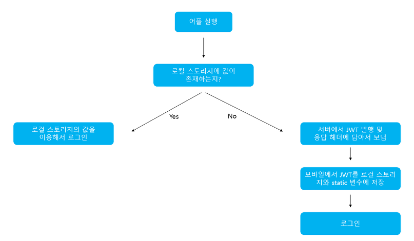

# JWT

> jwt 토큰은 <a href = "http://jwt.io">jwt.io</a>란 사이트를 통해 파싱해볼 수 있다.

### JWT 토큰이란?

Json Web Token의 약자로, **웹 표준** 이다.

두 개체 사이에서 **JSON 객체** 를 통해 객체를 가볍고 안정성 있게 전달해 주는 것.

전자 서명을 통해 변조를 체크할 수 있고, 서버는 **별도의 인증 없이** 헤더의 JWT 정보를 통해 인증할 수 있다.

> 토큰 자체를 정보로 이용하는 Self-Contained 방식으로 전달한다.



### JWT 토큰의 구성

JWT 토큰은 3가지 파트(header, payload, signature) 로 나뉘며, 각 파트는 **.** 으로 구분된다.


**Base64를 통해 각각의 부분을 인코딩** 한다.

> Base64는 단순히 정보를 잘 전달하기 위한 것이다.
>
> 같은 문자열에 대해 같은 문자열을 반환한다.

#### Header

| 이름 | 설명                          | 영어      |
| ---- | ----------------------------- | --------- |
| alg  | 암호화 알고리즘의 종류를 지정 | algorithm |
| typ  | 토큰 타입을 지정한다. ex) JWT | type      |

#### Payload

토큰에서 사용할 정보들의 조각들이 담겨있다.

JSON의 **key-value 형태** 로 여러개의 정보를 담을 수 있다.

##### 등록된 클레임

토큰 정보를 표현하기 위해 정해진 종류의 데이터들

> 선택적으로 작성하지만, 작성하기를 권장한다.

이름은 모두 3글자로 이루어져 있다.

| 이름 | 설명                                                         | 영어       |
| ---- | ------------------------------------------------------------ | ---------- |
| iss  | 토큰 발급자                                                  | issuer     |
| sub  | 토큰 제목(내용)<br />unique 한 값을 사용하는데, 보통 사용자 이메일을 사용한다. | subject    |
| aud  | 토큰 대상자                                                  | audience   |
| exp  | 만료시간. NumericDate 형식                                   | expiration |
| nbf  | 토큰 활성일<br />현재 날짜가 이 날 이전이라면 활성화되지 않음 | not before |
| iat  | 발급 시간(발급 이후 얼마나 지났는지 모름)                    | issued at  |
| jti  | JWT 토큰 식별자                                              | JwT Id     |

##### 공개 클레임

사용자 정의 클레임.

공개용 정보를 위해 사용되는데, 충돌 방지를 위해 **URI 포맷**을 이용한다.

``` json
{
    "http://test.com/aaa": true
}
```

##### 비공개 클레임

당사자 간의 정보 공유를 위한 **사용자 지정 클레임**

이름이 중복되어 **충돌이 일어날 수 있기 때문에 조심해야 한다.**

``` json
{
    "username": "name",
    "ssss": "ssss"
}
```

### Signature

서명은 토큰을 인코딩 하거나 **유효성 검증에 사용되는 암호화 코드**이다.

다음과 같은 순서를 통해 생성된다.

1. Header와 Payload를 Base64로 인코딩 한다.
2. 그 값을 secret key를 통해 header에서 정의한 알고리즘으로 해싱한다.
3. 값을 다시 Base64로 인코딩 한다.

### JWT의 장단점

#### 장점

- 별도의 인증 저장소가 필요없다.
- 데이터베이스에 의존하지 않는 쉬운 인증/인가 방법
- URL  파라미터와 헤더 이용
- 디버깅 관리 용이
- REST 서비스 제공 가능
- 만료가 내장됨

#### 단점

- DB에서 사용자 정보가 수정되도, 토큰 정보는 바뀌지 않음

  > 토큰 정보가 클라이언트에 저장되기 때문

- 필드 추가시 토큰이 커질 수 있다.

- 토큰은 거의 모든 요청에서 전송되므로, 데이터 트래픽에 영향을 끼칠 수 있다.

  > 토큰은 인증이 필요한 모든 요청에서 헤더에 정보가 담겨서 간다.